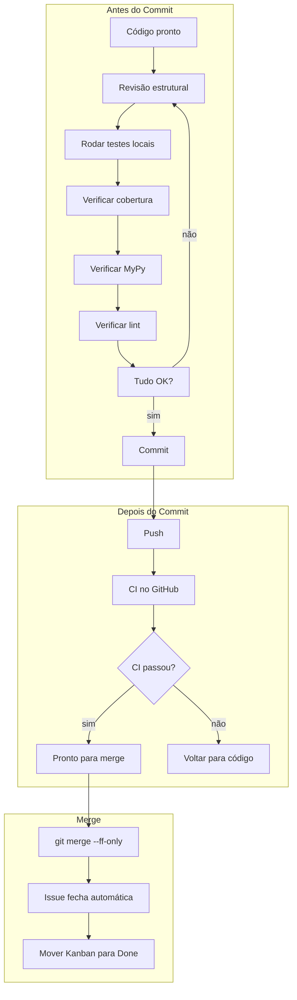

## 📚 **FLOW 2: CODE REVIEW FLOW - SHOWTRIALS**

<div align="center">

**Guia completo para auto-revisão de código antes de merge**

</div>

## 📅 **Informações do Documento**

| Item | Descrição |
|------|-----------|
| **Data** | 20 de Fevereiro de 2026 |
| **Autor** | Thiago Ribeiro |
| **Versão** | 1.0 |
| **Relacionado a** | Git Flow, Quality Flow, Telemetry Flow |

---

## 🎯 **OBJETIVO**

Estabelecer um checklist sistemático de auto-revisão para garantir que cada merge mantenha a qualidade do projeto, mesmo trabalhando sozinho.

### **Por que revisar seu próprio código?**

| Motivo | Explicação |
|--------|------------|
| **Evitar erros bobos** | Um par de olhos fresco pega o que a mente cansada deixou passar |
| **Manter consistência** | Garantir que todos os arquivos sigam o mesmo padrão |
| **Documentar decisões** | Commits e PRs contam a história do projeto |
| **Acelerar debugging** | Erros encontrados agora são mais baratos que depois |
| **Profissionalismo** | Código revisado transmite cuidado |

---

## 📋 **CHECKLIST COMPLETO DE AUTO-REVISÃO**

### **Antes de abrir o PR (ou fazer o merge)**

```markdown
## ✅ CHECKLIST PRÉ-MERGE
```

### **📁 1. ESTRUTURA DO CÓDIGO**

- [ ] A branch segue o padrão de nomenclatura?
  - `type/classificar-documento` (fases)
  - `fix/tipo-documento-keyerror` (correções)
  - `feat/modo-escuro-cli` (melhorias)
  - `docs/atualizar-readme` (documentação)

- [ ] O escopo é **único**? (apenas uma responsabilidade por branch)

- [ ] Removeu código comentado?
  ```bash
  grep -r "#.* código antigo" src/
  ```

- [ ] Removeu prints de debug?
  ```bash
  grep -r "print(" src/
  grep -r "console.print" src/  # só onde não deveria estar
  ```

- [ ] Nomes de variáveis são claros e auto-documentados?
  ```python
  # Ruim
  x = repo.listar()
  for i in x:
      y = i.nome

  # Bom
  documentos = repo.listar()
  for documento in documentos:
      nome_autor = documento.nome
  ```

- [ ] Funções/métodos são pequenos (< 50 linhas)?

- [ ] Evitou repetição de código (DRY)?

---

### **🧪 2. TESTES**

#### **Testes de lógica (`test_*.py`)**
- [ ] Criou testes para cobrir o arquivo modificado?
- [ ] Testes passam localmente?
  ```bash
  task test-file --path src/tests/test_classificar_documento.py
  ```
- [ ] Testou casos de **sucesso**?
- [ ] Testou casos de **erro esperado**? (formatos inválidos, documentos não encontrados)
- [ ] Testou **casos limite**? (listas vazias, valores None, strings vazias)
- [ ] Usou fixtures para evitar repetição?
  ```python
  @pytest.fixture
  def repo_mock(self):
      return Mock()
  ```

#### **Testes de telemetria (`test_*_telemetry.py`)**
- [ ] Criou arquivo de teste de telemetria?
- [ ] Teste de **sucesso** verifica contadores?
  ```python
  mock_telemetry.increment.assert_any_call("modulo.operacao.iniciado")
  ```
- [ ] Teste de **erro** verifica contadores de erro?
- [ ] Teste **sem telemetria** garante que não quebra?
  ```python
  uc_module.configure_telemetry(None)
  # ... execução não deve lançar exceção
  ```
- [ ] `setup_method` zera a telemetria entre testes?
  ```python
  def setup_method(self):
      uc_module._telemetry = None
  ```

#### **Cobertura**
- [ ] Cobertura do arquivo >= 85%?
  ```bash
  task cov-file --path src/application/use_cases/classificar_documento.py
  ```
- [ ] Linhas não cobertas são justificáveis? (ex: except muito raro)

---

### **🔤 3. TYPE HINTS (MYPY)**

- [ ] Todos os parâmetros têm tipo?
  ```python
  # Ruim
  def executar(documento_id):

  # Bom
  def executar(documento_id: int) -> Dict:
  ```

- [ ] Retornos têm tipo?

- [ ] MyPy passa no arquivo?
  ```bash
  task type-file --path src/application/use_cases/classificar_documento.py
  ```
  **Resultado esperado:** `Success: no issues found`

- [ ] Evitou `type: ignore` desnecessário?

---

### **📊 4. TELEMETRIA**

- [ ] Adicionou o template no topo do arquivo?
  ```python
  _telemetry = None

  def configure_telemetry(telemetry_instance=None):
      global _telemetry
      _telemetry = telemetry_instance
  ```

- [ ] Em cada método público:
  - [ ] `iniciado` no começo
  - [ ] `concluido` antes do return
  - [ ] Contadores de erro nos excepts
  - [ ] Parâmetros relevantes registrados? (ex: formato, idioma)

- [ ] Nomes seguem o padrão `modulo.operacao.estado`?

---

### **📚 5. DOCUMENTAÇÃO**

- [ ] Docstrings em métodos públicos?
  ```python
  def executar(self, documento_id: int) -> Dict:
      """
      Exporta um documento para o formato especificado.

      Args:
          documento_id: ID do documento a ser exportado

      Returns:
          Dict com status da operação e caminho do arquivo

      Raises:
          ValueError: Se o formato não for suportado
      """
  ```

- [ ] Atualizou `CHANGELOG.md` (se relevante)?

- [ ] Se for uma nova fase, criou/atualizou `FASE*.md`?

- [ ] README.md ainda está atualizado? (badges, instruções)

---

### **🔧 6. QUALIDADE GERAL**

- [ ] Lint passa?
  ```bash
  task lint-file --path src/application/use_cases/classificar_documento.py
  ```
  **Resultado:** `All checks passed!`

- [ ] `task check` passa no arquivo?
  ```bash
  task check-file --path src/application/use_cases/classificar_documento.py
  ```

- [ ] `task test-cov` local passa? (opcional, mas bom verificar)

---

### **📝 7. COMMIT E MENSAGEM**

- [ ] Mensagem de commit segue o padrão?
  ```bash
  tipo: descrição concisa

  - Item 1
  - Item 2
  - Item 3

  Closes #NUMERO
  ```

- [ ] Tipos permitidos: `feat`, `fix`, `docs`, `style`, `refactor`, `test`, `chore`

- [ ] Incluiu `Closes #N` para fechar a issue automaticamente?

- [ ] Commit é **atômico**? (uma única responsabilidade)

**Exemplo bom:**
```bash
feat: adiciona telemetria e testes em classificar_documento.py

- Adiciona padrão de telemetria com counters
- Cria testes de lógica (8) e telemetria (5)
- Cobertura: 65% → 85%

Closes #3
```

**Exemplo ruim:**
```bash
atualiza arquivos e corrige bugs
```

---

### **🌿 8. BRANCH E MERGE**

- [ ] Branch está atualizada com a `main`?
  ```bash
  git fetch origin
  git rebase origin/main
  # ou
  git merge main  # se preferir
  ```

- [ ] CI está passando no GitHub?
  ```bash
  gh run list
  # Última execução deve estar verde ✅
  ```

- [ ] Resolveu conflitos (se houver)?

- [ ] Merge será fast-forward? (histórico linear)
  ```bash
  git checkout main
  git merge --ff-only type/classificar-documento
  ```

---

## 🔄 **FLUXO COMPLETO DE REVISÃO**



---

## 📋 **TABELA DE COMANDOS PARA REVISÃO**

| O que verificar | Comando |
|-----------------|---------|
| **Cobertura do arquivo** | `task cov-file --path src/.../arquivo.py` |
| **MyPy no arquivo** | `task type-file --path src/.../arquivo.py` |
| **Lint no arquivo** | `task lint-file --path src/.../arquivo.py` |
| **Testes do arquivo** | `task test-file --path src/tests/test_arquivo.py` |
| **Tudo junto** | `task check-file --path src/.../arquivo.py` |
| **Cobertura global** | `task summary` |
| **Status do CI** | `gh run list` |
| **Ver branch atual** | `git branch` |
| **Ver commits recentes** | `git log --oneline -5` |

---

## ✅ **CHECKLIST RESUMIDO (PRINTABLE)**

```markdown
## 📋 CHECKLIST PRÉ-MERGE

### Código
[ ] Branch com nome padrão
[ ] Sem código comentado
[ ] Sem prints de debug
[ ] Funções pequenas (<50 linhas)

### Testes
[ ] Testes de lógica criados
[ ] Testes de telemetria criados
[ ] Todos passando localmente
[ ] Cobertura do arquivo ≥85%

### Type Hints
[ ] Todos parâmetros tipados
[ ] MyPy 0 erros no arquivo

### Telemetria
[ ] Template no topo
[ ] Contadores em métodos públicos

### Documentação
[ ] Docstrings em métodos públicos
[ ] CHANGELOG atualizado (se necessário)

### Qualidade
[ ] Lint 0 erros
[ ] CI verde no GitHub

### Commit
[ ] Mensagem no padrão
[ ] Inclui "Closes #N"

### Branch
[ ] Atualizada com main
[ ] Merge fast-forward
```

---

## 🚨 **O QUE FAZER SE ENCONTRAR PROBLEMAS**

| Problema | Ação |
|----------|------|
| **Teste falhando** | Corrigir antes de prosseguir |
| **Cobertura baixa** | Adicionar testes faltantes |
| **MyPy com erros** | Corrigir types ou adicionar `# type: ignore` justificado |
| **Lint com erros** | Rodar `task format` e corrigir manualmente |
| **CI vermelho** | Não mergear! Investigar e corrigir |
| **Branch desatualizada** | `git rebase main` e resolver conflitos |

---

## 📊 **EXEMPLO PRÁTICO**

### **Situação: FASE 17 concluída**

```bash
# 1. Verificar cobertura
task cov-file --path src/application/use_cases/classificar_documento.py
> 85% ✅

# 2. Verificar MyPy
task type-file --path src/application/use_cases/classificar_documento.py
> Success: no issues found ✅

# 3. Verificar lint
task lint-file --path src/application/use_cases/classificar_documento.py
> All checks passed! ✅

# 4. Verificar testes
task test-file --path src/tests/test_classificar_documento.py
> 12 passed ✅

task test-file --path src/tests/test_classificar_documento_telemetry.py
> 6 passed ✅

# 5. Verificar CI
gh run list
> Última execução: ✅

# 6. Atualizar branch
git fetch origin
git rebase origin/main
> Already up to date.

# 7. Commit final (já foi feito)

# 8. Merge
git checkout main
git merge --ff-only type/classificar-documento
git push origin main

# 9. Issue #3 fechou automaticamente
# 10. Mover no Kanban para "Done"
```

---

## 🏆 **BENEFÍCIOS DESTE FLUXO**

| Antes | Depois |
|-------|--------|
| ❌ "Acho que está pronto" | ✅ Checklist objetivo |
| ❌ Esquecia de rodar mypy | ✅ Passo obrigatório |
| ❌ Cobertura caía sem perceber | ✅ Verificado antes do merge |
| ❌ CI quebrava depois do merge | ✅ Verificado antes |
| ❌ Commits sem contexto | ✅ Padrão estabelecido |
| ❌ Dúvida se esqueceu algo | ✅ Checklist resolve |

---

## 📚 **REFERÊNCIAS**

- [Git Flow](git_flow.md)
- [Quality Flow](quality_flow.md)
- [Telemetry Flow](telemetry_flow.md)
- [Conventional Commits](https://www.conventionalcommits.org/)

---

## 👤 **AUTOR**

**Thiago Ribeiro** - Projeto de TCC

---

<div align="center">
  <sub>Code Review Flow - ShowTrials</sub>
  <br>
  <sub>Versão 1.0 - 20 de Fevereiro de 2026</sub>
  <br>
  <sub>✅ Pronto para uso</sub>
</div>

---

## 📋 **PRÓXIMO FLOW**

**Dependencies Flow** será o próximo! 🚀
