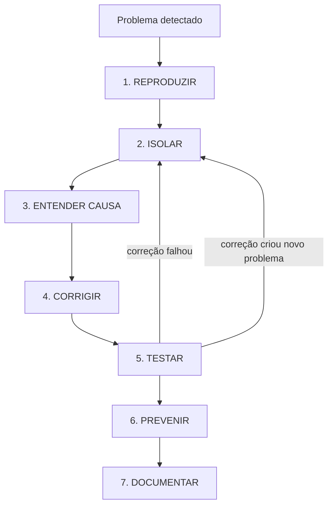

## 📚 **FLOW 4: DEBUG FLOW - SHOWTRIALS**

<div align="center">

**Guia completo para depuração sistemática de problemas no código**

</div>

## 📅 **Informações do Documento**

| Item | Descrição |
|------|-----------|
| **Data** | 20 de Fevereiro de 2026 |
| **Autor** | Thiago Ribeiro |
| **Versão** | 1.0 |
| **Relacionado a** | Quality Flow, Telemetry Flow, Testes, CI/CD |

---

## 🎯 **OBJETIVO**

Estabelecer uma metodologia sistemática para identificar, reproduzir e corrigir problemas no código, evitando "tentativa e erro" e garantindo que as correções sejam definitivas.

### **Por que um fluxo de debug?**

| Motivo | Explicação |
|--------|------------|
| **Economiza tempo** | Tentativa e erro é o método mais lento |
| **Evita regressões** | Correção apressada pode quebrar outras coisas |
| **Aprende com erros** | Entender a causa evita repetição |
| **Documenta soluções** | Fica registrado para o futuro |
| **Profissionalismo** | Debug estruturado é marca de bom desenvolvedor |

---

## 🔍 **ESTRATÉGIA GERAL DE DEBUG**



---

## 📋 **PASSO 1: REPRODUZIR O PROBLEMA**

### **Objetivo:** Conseguir fazer o erro acontecer de forma consistente

### **Ações:**

```bash
# 1. Identificar onde o erro ocorre
- É em teste? → `pytest src/tests/test_arquivo.py -v`
- É na CLI? → `python run.py` e reproduzir passo a passo
- É na Web? → Acessar endpoint específico
- É no CI? → Ver logs: `gh run view <ID> --log`

# 2. Isolar o cenário mínimo
poetry run pytest src/tests/test_arquivo.py -k "nome_do_teste" -v

# 3. Aumentar verbosidade
poetry run pytest -vv --log-cli-level=DEBUG
```

### **Checklist de reprodução:**
- [ ] Consigo reproduzir localmente?
- [ ] Consigo reproduzir sempre ou é intermitente?
- [ ] Qual é o input mínimo que causa o erro?
- [ ] Qual é o output esperado vs real?

---

## 🔬 **PASSO 2: ISOLAR O PROBLEMA**

### **Objetivo:** Encontrar a linha exata onde o erro acontece

### **Técnica 1: Binary Search (comentando código)**

```python
def funcao_complexa():
    parte1()  # ← comentar e testar
    parte2()  # ← comentar e testar
    parte3()  # ← comentar e testar
    return resultado
```

```bash
# Ciclo: comenta metade do código, testa, repete
```

### **Técnica 2: Usar breakpoints**

```python
# No código, adicionar:
breakpoint()  # Python 3.7+

# ou
import pdb; pdb.set_trace()  # versões antigas
```

```bash
# Quando executar, entra no debugger interativo
(Pdb) print(variable)
(Pdb) locals()
(Pdb) up  # sobe no stack trace
(Pdb) down  # desce
(Pdb) continue  # continua execução
```

### **Técnica 3: Logs estratégicos**

```python
import logging
logging.basicConfig(level=logging.DEBUG)

# Adicionar logs temporários
logger.debug(f"Valor de x: {x}")
logger.debug(f"Entrando no loop com {len(lista)} itens")
```

### **Técnica 4: Verificar tipos (quando MyPy não pega)**

```python
print(f"Tipo de x: {type(x)}")
print(f"x tem atributos: {dir(x)}")
```

---

## 🧠 **PASSO 3: ENTENDER A CAUSA RAIZ**

### **Objetivo:** Não apenas corrigir o sintoma, mas entender por que aconteceu

### **Perguntas a fazer:**

| Pergunta | Exemplo |
|----------|---------|
| **O que deveria acontecer?** | O método deveria retornar um DTO |
| **O que realmente aconteceu?** | Lançou AttributeError |
| **Qual a diferença?** | Esperava datetime, recebeu string |
| **Por que essa diferença existe?** | Mock foi criado com string em vez de datetime |
| **Isso acontece em produção ou só em teste?** | Só em teste (mock errado) |

### **Categorias comuns de problemas:**

```python
# 1. Problema de tipo (TypeError, AttributeError)
# 2. Problema de lógica (resultado errado, mas executa)
# 3. Problema de estado (banco, cache, variável global)
# 4. Problema de dependência (import falhou, módulo não encontrado)
# 5. Problema de concorrência (race condition)
```

---

## 🛠️ **PASSO 4: CORRIGIR**

### **Objetivo:** Implementar a correção de forma limpa

### **Regras de ouro:**

1. **NUNCA** corrigir e refatorar no mesmo commit
2. **SEMPRE** adicionar teste que pegaria o erro antes
3. **Mínimo** de código possível para corrigir

### **Exemplo de correção segura:**

```python
# ANTES (causava erro)
data_coleta = documento.data_coleta.isoformat()

# DEPOIS (correção)
if isinstance(documento.data_coleta, str):
    data_coleta = documento.data_coleta  # já é string
else:
    data_coleta = documento.data_coleta.isoformat()
```

### **Checklist da correção:**
- [ ] Código mínimo necessário
- [ ] Não introduziu novas funcionalidades
- [ ] Não removeu funcionalidades existentes
- [ ] Adicionou teste que pegaria o erro (se não existia)

---

## 🧪 **PASSO 5: TESTAR A CORREÇÃO**

### **Objetivo:** Garantir que o problema foi resolvido e nada mais quebrou

### **Testes a rodar:**

```bash
# 1. Teste específico que reproduzia o erro
poetry run pytest src/tests/test_arquivo.py -k "nome_do_teste" -v

# 2. Todos os testes do arquivo
task test-file --path src/tests/test_arquivo.py

# 3. Testes relacionados (mesmo módulo)
poetry run pytest src/tests/test_*_telemetry.py -v

# 4. Todos os testes (se a mudança for crítica)
task test

# 5. Verificar cobertura (não deve cair)
task cov-file --path src/application/use_cases/arquivo.py
```

### **Verificar também:**
- [ ] Lint: `task lint-file --path src/.../arquivo.py`
- [ ] MyPy: `task type-file --path src/.../arquivo.py`

---

## 🛡️ **PASSO 6: PREVENIR QUE OCORRA NOVAMENTE**

### **Objetivo:** Garantir que o mesmo erro não aconteça em outros lugares

### **Ações preventivas:**

```python
# 1. Adicionar teste específico
def test_nao_deve_quebrar_com_data_string():
    """Garante que o método lida com string no lugar de datetime."""
    doc = Mock()
    doc.data_coleta = "2026-01-01"  # string em vez de datetime

    resultado = meu_metodo(doc)
    assert resultado is not None

# 2. Melhorar type hints
def meu_metodo(documento: Documento) -> str:
    # Agora o tipo já indica o esperado
    pass

# 3. Adicionar guard clauses
def meu_metodo(documento):
    if not isinstance(documento.data_coleta, (datetime, str)):
        raise TypeError("data_coleta deve ser datetime ou string")
```

---

## 📝 **PASSO 7: DOCUMENTAR**

### **Objetivo:** Deixar registro para o futuro

### **O que documentar:**

```markdown
## 🐛 Bug #123: Erro ao exportar documento com data string

### Problema
O método `exportar_documento` quebrava quando `data_coleta` era string
em vez de datetime (acontecia em testes com mocks).

### Causa
O mock do documento foi criado com string, mas o código esperava datetime.

### Solução
Adicionada verificação de tipo antes de chamar `.isoformat()`.

### Prevenção
- Adicionado teste específico com string
- Atualizado type hints para aceitar Optional[str] (ver issue #124)
```

### **Onde documentar:**
- [ ] Na issue (comentário de fechamento)
- [ ] No commit message
- [ ] Em `CHANGELOG.md` (se for relevante para usuários)
- [ ] Em comentário no código (se a solução não for óbvia)

---

## 🔧 **FERRAMENTAS DE DEBUG POR CATEGORIA**

### **Para problemas de teste**

```bash
# Ver detalhes do teste
poetry run pytest src/tests/test_arquivo.py -v --pdb

# Ver cobertura detalhada
poetry run pytest --cov=src/application/use_cases --cov-report=html
# Depois abrir htmlcov/index.html

# Ver quais testes estão lentos
poetry run pytest --durations=10
```

### **Para problemas de tipo**

```bash
# MyPy com informações extras
poetry run mypy src/ --show-error-codes

# Verificar tipo de uma expressão (com reveal_type)
from typing import reveal_type
reveal_type(minha_variavel)  # MyPy vai mostrar o tipo
```

### **Para problemas de banco de dados**

```bash
# Ver esquema
sqlite3 data/showtrials.db ".schema documentos"

# Ver dados
sqlite3 data/showtrials.db "SELECT * FROM documentos LIMIT 5;"

# Verificar migrações
python scripts/migrar_dados_existentes.py --check
```

### **Para problemas de rede/API**

```bash
# Testar endpoint local
curl -v http://localhost:8000/documentos/1

# Ver logs do servidor web
poetry run uvicorn src.interface.web.app:app --reload --log-level debug
```

### **Para problemas de CI**

```bash
# Ver logs da última execução
gh run view <ID> --log

# Re-executar um job falho
gh run rerun <ID>

# Simular ambiente CI local
act -j test  # precisa do act instalado
```

---

## 📋 **CHECKLIST RÁPIDO DE DEBUG**

```markdown
## 🔍 Checklist de Debug

### 1. REPRODUZIR
[ ] Erro acontece localmente?
[ ] Consigo reproduzir sempre?
[ ] Qual o input mínimo?

### 2. ISOLAR
[ ] Linha exata do erro?
[ ] Usei breakpoint?
[ ] Usei logs estratégicos?

### 3. ENTENDER
[ ] Qual a causa raiz?
[ ] É erro de tipo, lógica, estado ou dependência?
[ ] Por que não foi pego antes?

### 4. CORRIGIR
[ ] Código mínimo necessário
[ ] Não adicionei funcionalidade extra
[ ] Adicionei teste que pegaria o erro

### 5. TESTAR
[ ] Teste específico passa
[ ] Todos os testes do arquivo passam
[ ] Lint e MyPy ok
[ ] Cobertura não caiu

### 6. PREVENIR
[ ] Teste adicionado ao conjunto
[ ] Type hints melhorados (se aplicável)
[ ] Guard clauses adicionadas (se aplicável)

### 7. DOCUMENTAR
[ ] Comentário na issue
[ ] Mensagem de commit clara
[ ] CHANGELOG atualizado (se necessário)
```

---

## 🎯 **EXEMPLO PRÁTICO: DEBUG DE UM TESTE FALHO**

### **Cenário:** Teste de telemetria falhando

```bash
poetry run pytest src/tests/test_exportar_documento_telemetry.py -v

# Saída:
FAILED test_telemetria_execucao_sucesso - AssertionError: increment('exportar_documento.erro.execucao') call not found
```

### **Passo 1: Reproduzir**
```bash
poetry run pytest src/tests/test_exportar_documento_telemetry.py::TestExportarDocumentoTelemetry::test_telemetria_execucao_sucesso -v
```

### **Passo 2: Isolar com breakpoint**
```python
# No código, antes do erro
breakpoint()

# No teste
resultado = use_case.executar(...)
```

### **Passo 3: Entender causa**
```python
# No debugger
(Pdb) mock_telemetry.increment.call_args_list
# Mostra que 'erro.execucao' NÃO foi chamado
# Mas o teste esperava que fosse
```

**Causa raiz:** A exceção acontece antes de chegar no bloco que registraria o erro. O teste estava com expectativa errada.

### **Passo 4: Corrigir**
```python
# Antes
mock_telemetry.increment.assert_any_call("exportar_documento.erro.execucao")

# Depois
calls = [call[0][0] for call in mock_telemetry.increment.call_args_list]
assert "exportar_documento.erro.execucao" not in calls
```

### **Passo 5: Testar**
```bash
poetry run pytest src/tests/test_exportar_documento_telemetry.py -v
# ✅ PASSED
```

### **Passo 6: Prevenir**
- Adicionar comentário explicando por que o erro NÃO deve ser registrado
- Garantir que outros testes não tenham a mesma expectativa errada

### **Passo 7: Documentar**
```bash
git commit -m "test: ajusta expectativa de telemetria para exceções não capturadas

- O teste esperava erro.execucao, mas exceções não capturadas
  não registram telemetria
- Agora verifica que o erro NÃO foi chamado

Closes #123"
```

---

## 📊 **COMANDOS ÚTEIS PARA DEBUG**

| Comando | O que faz |
|---------|-----------|
| `poetry run pytest -v --pdb` | Entra no debugger ao falhar |
| `poetry run pytest -vv --log-cli-level=DEBUG` | Logs detalhados |
| `poetry run pytest --durations=10` | Mostra os 10 testes mais lentos |
| `poetry run mypy src/ --show-error-codes` | MyPy com códigos de erro |
| `python -m pdb run.py` | Debugger na CLI |
| `breakpoint()` | Breakpoint no código |
| `gh run view <ID> --log` | Ver logs do CI |
| `git bisect start` | Encontrar commit que introduziu bug |
| `sqlite3 data/showtrials.db` | Consultar banco direto |

---

## 🏆 **BENEFÍCIOS DESTE FLUXO**

| Antes | Depois |
|-------|--------|
| ❌ "Vou tentar mudar isso aqui" | ✅ Abordagem sistemática |
| ❌ Correção apressada quebra outra coisa | ✅ Testes garantem |
| ❌ Mesmo erro acontecendo várias vezes | ✅ Prevenção documentada |
| ❌ Horas perdidas em tentativa e erro | ✅ Debug estruturado |
| ❌ Esquece o que aprendeu | ✅ Documentação do problema |

---

## 📚 **REFERÊNCIAS**

- [Quality Flow](QUALITY_FLOW.md)
- [Telemetry Flow](TELEMETRY_FLOW.md)
- [Pytest Documentation](https://docs.pytest.org/)
- [Python Debugger (pdb)](https://docs.python.org/3/library/pdb.html)

---

## 👤 **AUTOR**

**Thiago Ribeiro** - Projeto de TCC

---

<div align="center">
  <sub>Debug Flow - ShowTrials</sub>
  <br>
  <sub>Versão 1.0 - 20 de Fevereiro de 2026</sub>
  <br>
  <sub>✅ Pronto para uso</sub>
</div>

---

## 📋 **PRÓXIMO FLOW**

**Documentation Flow** será o próximo! 🚀
