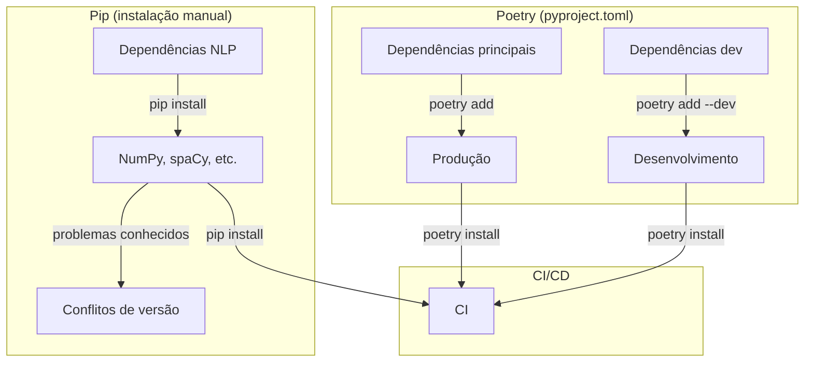
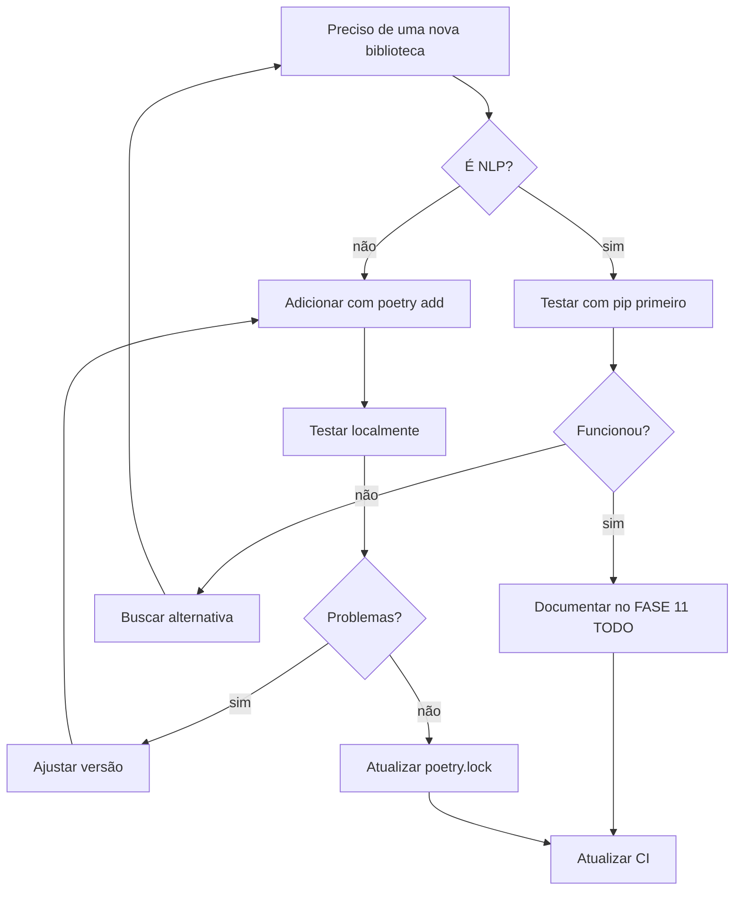

## 📚 **FLOW 3: DEPENDENCIES FLOW - SHOWTRIALS**

<div align="center">

**Guia completo para gerenciamento de dependências com Poetry e pip**

</div>

## 📅 **Informações do Documento**

| Item | Descrição |
|------|-----------|
| **Data** | 20 de Fevereiro de 2026 |
| **Autor** | Thiago Ribeiro |
| **Versão** | 1.0 |
| **Relacionado a** | FASE 8 (NLP), FASE 11 (CI), Poetry, pip |

---

## 🎯 **OBJETIVO**

Padronizar o gerenciamento de dependências do projeto, considerando:

- ✅ Dependências principais gerenciadas pelo Poetry
- ✅ Dependências de desenvolvimento (dev) isoladas
- ✅ Situação especial das bibliotecas NLP (pip)
- ✅ CI/CD com instalação correta
- ✅ Versionamento e lock file

---

## 📊 **ESTRUTURA ATUAL DE DEPENDÊNCIAS**

### **Visão Geral**



### **O que está onde**

| Tipo | Gerenciador | Local | Exemplos |
|------|-------------|-------|----------|
| **Produção** | Poetry | `[tool.poetry.dependencies]` | `requests`, `fastapi`, `rich` |
| **Desenvolvimento** | Poetry | `[tool.poetry.group.dev.dependencies]` | `pytest`, `black`, `mypy` |
| **NLP (especiais)** | pip | Instalação manual | `spacy`, `numpy`, `wordcloud` |

---

## 📦 **COMANDOS BÁSICOS DO POETRY**

### **Adicionar dependências**

```bash
# Dependência principal
poetry add requests

# Com versão específica
poetry add fastapi@^0.129.0

# Dependência de desenvolvimento
poetry add --dev pytest

# Dependência opcional
poetry add --optional black

# A partir de uma fonte específica (git)
poetry add git+https://github.com/user/repo.git
```

### **Remover dependências**

```bash
poetry remove requests
poetry remove --dev pytest
```

### **Atualizar dependências**

```bash
# Atualizar todas dentro das restrições
poetry update

# Atualizar uma específica
poetry update requests

# Ver o que pode ser atualizado
poetry show --outdated
```

### **Instalar dependências**

```bash
# Instalar todas (produção + dev)
poetry install

# Apenas produção (sem dev)
poetry install --no-dev

# Apenas um grupo específico
poetry install --only dev
```

### **Ver dependências**

```bash
# Listar todas
poetry show

# Árvore de dependências
poetry show --tree

# Dependências principais apenas
poetry show --no-dev
```

---

## ⚠️ **CASO ESPECIAL: DEPENDÊNCIAS NLP**

### **Histórico (por que estão no pip?)**

Durante a **FASE 8 (Análise de Texto)**, enfrentamos conflitos de versão:

| Problema | Causa | Solução |
|----------|-------|---------|
| `numpy` incompatível | Poetry tentava versão errada | Instalar manualmente |
| `spacy` com dependências conflitantes | `thinc`, `blis`, etc. | `pip install` |
| Modelos grandes | Não precisam versionar | Download via spacy |

### **Estado atual**

```bash
# Dependências instaladas via pip (dentro do poetry)
poetry run pip install numpy==1.26.0
poetry run pip install spacy==3.7.5
poetry run pip install textblob nltk wordcloud matplotlib

# Modelos (baixados, não versionados)
poetry run python -m spacy download en_core_web_sm
poetry run python -m spacy download ru_core_news_sm
```

### **TODO: Migrar para Poetry (Issue #1)**

```yaml
issue: #1
title: Migrar dependências NLP para Poetry
status: open
prioridade: media
milestone: Melhorias (Semanas 3-4)
```

---

## 🔄 **FLUXO PARA ADICIONAR UMA NOVA DEPENDÊNCIA**



---

## ✅ **CHECKLIST: ADICIONAR NOVA DEPENDÊNCIA**

### **Para dependências normais (não NLP)**

- [ ] `poetry add nome-da-biblioteca`
- [ ] Testar localmente: `poetry run python -c "import modulo"`
- [ ] Verificar se não quebrou nada: `task check`
- [ ] Atualizar `poetry.lock` (já foi atualizado)
- [ ] Commit: `git add pyproject.toml poetry.lock`
- [ ] Mensagem: `chore: adiciona nome-da-biblioteca para [motivo]`

### **Para dependências NLP (caso especial)**

- [ ] Testar com `poetry run pip install nome==versão`
- [ ] Verificar se resolveu o problema
- [ ] **NÃO** adicionar ao `pyproject.toml` ainda
- [ ] Documentar no arquivo `docs/NLP_DEPENDENCIES.md` (criar se não existir)
- [ ] Atualizar CI para instalar a nova dependência
- [ ] Atualizar Issue #1 com o progresso
- [ ] Commit: `chore: adiciona [nome] às dependências NLP (pip)`

---

## 🔧 **MANUTENÇÃO DO CI**

### **Trecho do CI que instala NLP**

No `.github/workflows/ci.yml`:

```yaml
- name: Install NLP dependencies (pip)
  run: |
    poetry run pip install numpy==1.26.0
    poetry run pip install spacy==3.7.5
    poetry run pip install textblob nltk wordcloud matplotlib
    poetry run python -m spacy download en_core_web_sm
    poetry run python -m spacy download ru_core_news_sm
```

**Quando adicionar uma nova dependência NLP:**
1. Adicione a linha no CI
2. Teste com uma execução manual
3. Se funcionar, commit

---

## 📋 **TABELA DE DEPENDÊNCIAS ATUAIS**

### **Produção (Poetry)**

| Biblioteca | Versão | Para que serve |
|------------|--------|----------------|
| `requests` | >=2.32.5 | HTTP requests |
| `beautifulsoup4` | >=4.14.3 | Web scraping |
| `lxml` | >=6.0.2 | Parsing XML/HTML |
| `rich` | >=13.7.0 | CLI bonita |
| `fastapi` | ^0.129.0 | API web |
| `uvicorn` | ^0.40.0 | Servidor ASGI |
| `jinja2` | ^3.1.6 | Templates |
| `aiofiles` | ^25.1.0 | Arquivos assíncronos |

### **Desenvolvimento (Poetry dev)**

| Biblioteca | Versão | Para que serve |
|------------|--------|----------------|
| `black` | ^26.1.0 | Formatador |
| `isort` | ^7.0.0 | Organizador de imports |
| `ruff` | ^0.15.1 | Linter rápido |
| `pytest` | ^9.0.2 | Testes |
| `pytest-cov` | ^7.0.0 | Cobertura |
| `mypy` | ^1.19.1 | Type checking |
| `mkdocs` | ^1.6.1 | Documentação |
| `commitizen` | ^4.13.7 | Commits semânticos |
| `taskipy` | ^1.14.1 | Automação |

### **NLP (pip - temporário)**

| Biblioteca | Versão | Para que serve |
|------------|--------|----------------|
| `numpy` | 1.26.0 | Computação numérica |
| `spacy` | 3.7.5 | NLP |
| `textblob` | latest | Análise de sentimento |
| `nltk` | latest | NLP clássico |
| `wordcloud` | latest | Nuvens de palavras |
| `matplotlib` | latest | Gráficos |

---

## 📝 **ARQUIVO SUGERIDO: `docs/NLP_DEPENDENCIES.md`**

```markdown
# Dependências NLP - ShowTrials

## ⚠️ Situação Especial

Devido a conflitos de versão históricos (documentados na FASE 8), as dependências de NLP são instaladas via `pip` dentro do ambiente Poetry.

## 📦 Dependências Atuais

| Biblioteca | Versão | Instalação |
|------------|--------|------------|
| numpy | 1.26.0 | `poetry run pip install numpy==1.26.0` |
| spacy | 3.7.5 | `poetry run pip install spacy==3.7.5` |
| textblob | latest | `poetry run pip install textblob` |
| nltk | latest | `poetry run pip install nltk` |
| wordcloud | latest | `poetry run pip install wordcloud` |
| matplotlib | latest | `poetry run pip install matplotlib` |

## 🤖 Modelos

```bash
poetry run python -m spacy download en_core_web_sm
poetry run python -m spacy download ru_core_news_sm
```

## 🔄 CI/CD

No GitHub Actions, estas dependências são instaladas em uma etapa separada:

```yaml
- name: Install NLP dependencies (pip)
  run: |
    poetry run pip install numpy==1.26.0
    poetry run pip install spacy==3.7.5
    poetry run pip install textblob nltk wordcloud matplotlib
    poetry run python -m spacy download en_core_web_sm
    poetry run python -m spacy download ru_core_news_sm
```

## 🎯 TODO (Issue #1)

- [ ] Pesquisar versões compatíveis para Poetry
- [ ] Testar migração gradual
- [ ] Remover etapas de pip do CI
- [ ] Atualizar documentação
```

---

## 🚨 **PROBLEMAS COMUNS E SOLUÇÕES**

| Problema | Causa | Solução |
|----------|-------|---------|
| `Lock file not found` | `poetry.lock` deletado ou não gerado | `poetry lock` |
| `Version conflict` | Duas bibliotecas pedem versões diferentes | Ajustar versões manualmente |
| `Package not found` | Nome errado ou fonte não configurada | Verificar nome e adicionar fonte |
| `ImportError no CI` | Dependência não instalada | Verificar CI, adicionar etapa |
| `Spacy model not found` | Modelo não baixado | `poetry run python -m spacy download ...` |
| `NLP quebrando local` | Versão diferente da do CI | Sincronizar versões |

---

## 📋 **COMANDOS ÚTEIS**

```bash
# Ver dependências
poetry show
poetry show --tree
poetry show --outdated

# Adicionar/remover
poetry add requests
poetry remove requests
poetry add --dev pytest

# Atualizar
poetry update
poetry update requests

# Instalar
poetry install
poetry install --no-dev

# Ver ambiente
poetry env info
poetry run pip list

# NLP (caso especial)
poetry run pip install numpy==1.26.0
poetry run python -m spacy download en_core_web_sm
```

---

## ✅ **CHECKLIST: ANTES DE COMMITAR MUDANÇAS DE DEPENDÊNCIAS**

- [ ] `poetry lock` foi executado (se mudou `pyproject.toml`)
- [ ] Testou localmente com `poetry install --no-dev`
- [ ] Testou localmente com `poetry install` (com dev)
- [ ] Verificou que não quebrou `task check`
- [ ] Se for NLP, testou no CI (push para branch)
- [ ] Atualizou documentação (se necessário)
- [ ] Commit com mensagem clara

---

## 🏆 **BENEFÍCIOS DESTE FLUXO**

| Antes | Depois |
|-------|--------|
| ❌ "Instalei aqui e funcionou" | ✅ Procedimento documentado |
| ❌ CI quebrava por falta de dependência | ✅ CI atualizado junto |
| ❌ Esquecia versões exatas | ✅ Tudo versionado (ou documentado) |
| ❌ Dúvida: Poetry ou pip? | ✅ Regra clara: NLP = pip, resto = Poetry |
| ❌ Problemas de NLP se repetiam | ✅ Issue #1 acompanhando |

---

## 📚 **REFERÊNCIAS**

- [Poetry Documentation](https://python-poetry.org/docs/)
- [FASE 8 - Análise de Texto](docs/FASE8_ANALISE_TEXTO.md)
- [FASE 11 - CI](docs/FASE11_CI.md)
- [Issue #1 - Migrar NLP para Poetry](https://github.com/rib-thiago/showtrials-tcc/issues/1)

---

## 👤 **AUTOR**

**Thiago Ribeiro** - Projeto de TCC

---

<div align="center">
  <sub>Dependencies Flow - ShowTrials</sub>
  <br>
  <sub>Versão 1.0 - 20 de Fevereiro de 2026</sub>
  <br>
  <sub>✅ Pronto para uso</sub>
</div>

---

## 📋 **PRÓXIMO FLOW**

**Debug Flow** será o próximo! 🚀
