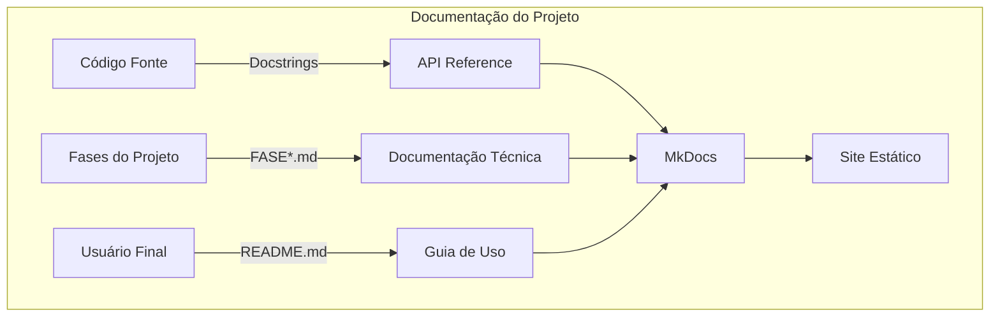
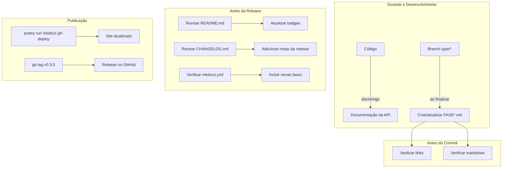

## 📚 **FLOW 5: DOCUMENTATION FLOW - SHOWTRIALS**

<div align="center">

**Guia completo para criação e manutenção da documentação do projeto**

</div>

## 📅 **Informações do Documento**

| Item | Descrição |
|------|-----------|
| **Data** | 20 de Fevereiro de 2026 |
| **Autor** | Thiago Ribeiro |
| **Versão** | 1.0 |
| **Relacionado a** | Git Flow, Quality Flow, MkDocs, Fases do Projeto |

---

## 🎯 **OBJETIVO**

Padronizar a criação e manutenção de toda a documentação do projeto, garantindo:

- ✅ Consistência entre documentos
- ✅ Facilidade de navegação
- ✅ Atualização junto com o código
- ✅ Versionamento adequado
- ✅ Acessibilidade para diferentes públicos

---

## 📊 **TIPOS DE DOCUMENTAÇÃO**



### **Onde cada coisa vive**

| Tipo | Local | Formato | Público |
|------|-------|---------|---------|
| **Docstrings** | No código | Python docstrings | Desenvolvedores |
| **Fases do Projeto** | `docs/` | Markdown (FASE*.md) | Historiadores do projeto |
| **README** | Raiz | Markdown | Usuários/Visitantes |
| **CHANGELOG** | Raiz | Markdown | Todos |
| **Site completo** | `site/` (gerado) | HTML | Todos |

---

## 📝 **PADRÃO DE DOCSTRINGS**

### **Formato: Google Style**

```python
def minha_funcao(param1: str, param2: int = 10) -> Dict:
    """
    Descrição clara do que a função faz.

    Mais detalhes sobre o comportamento, efeitos colaterais,
    e qualquer informação relevante para quem for usar.

    Args:
        param1: Descrição do primeiro parâmetro
        param2: Descrição do segundo parâmetro (default: 10)

    Returns:
        Dicionário contendo os resultados processados

    Raises:
        ValueError: Quando param1 está vazio
        TypeError: Quando param2 não é inteiro

    Examples:
        >>> resultado = minha_funcao("teste", 5)
        >>> print(resultado['status'])
        'sucesso'
    """
```

### **Checklist para docstrings**

- [ ] **O quê** a função faz (não como)
- [ ] **Args**: todos os parâmetros documentados
- [ ] **Returns**: tipo e significado do retorno
- [ ] **Raises**: exceções que podem ser lançadas
- [ ] **Examples**: (opcional, mas útil)

### **Exemplo real do projeto**

```python
# src/application/use_cases/exportar_documento.py

def executar(
    self,
    documento_id: int,
    formato: str = "txt",
    idioma: str = "original",
    diretorio: str = "exportados",
    incluir_metadados: bool = True,
) -> Dict:
    """
    Exporta um documento para o formato especificado.

    O documento pode ser exportado no formato original ou em uma
    das traduções disponíveis. O arquivo é salvo no diretório
    especificado com nome padronizado.

    Args:
        documento_id: ID do documento a ser exportado
        formato: Formato de saída ('txt' ou 'pdf')
        idioma: 'original' ou código do idioma ('en', 'pt', 'es', 'fr')
        diretorio: Pasta onde salvar o arquivo
        incluir_metadados: Se True, inclui cabeçalho com metadados

    Returns:
        Dict com:
            - sucesso: bool indicando se a operação foi bem-sucedida
            - caminho: str com o caminho do arquivo (se sucesso)
            - erro: str com mensagem de erro (se falha)
            - tamanho: int com número de caracteres (se TXT)

    Raises:
        ValueError: Se o formato não for suportado
        RuntimeError: Se houver erro na escrita do arquivo
    """
```

---

## 📚 **DOCUMENTAÇÃO DAS FASES (FASE*.md)**

### **Estrutura padrão**

```markdown
# FASE X - Título Descritivo

<div align="center">

**Breve descrição do que foi feito**

</div>

## 📅 **Informações da Fase**

| Item | Descrição |
|------|-----------|
| **Status** | ✅ Concluída / ⏳ Em andamento |
| **Data de Conclusão** | DD/MM/AAAA |
| **Artefatos** | Lista de arquivos principais |
| **Dependências** | Fases relacionadas |
| **Branch principal** | `type/nome-do-arquivo` |

---

## 🎯 **Objetivo**

Descrição clara do que a fase implementou.

---

## 🔍 **Estado Inicial**

### 📊 **Métricas Antes da Intervenção**

| Métrica | Valor |
|---------|-------|
| **Cobertura** | X% |
| **Testes existentes** | N |
| **Telemetria** | ❌ Ausente / ✅ Parcial |
| **MyPy no arquivo** | ⚠️ N erros |
| **Linhas de código** | N |

---

## 🛠️ **Implementação Realizada**

### **1. Principais mudanças**

Descrição do que foi feito...

### **2. Desafios Encontrados**

| Desafio | Solução |
|---------|---------|
| Problema X | Solução Y |

---

## 🧪 **Testes Criados**

| # | Teste | Descrição |
|---|-------|-----------|
| 1 | `test_exemplo` | Verifica comportamento X |

---

## 📊 **Resultados Finais**

| Métrica | Antes | Depois | Evolução |
|---------|-------|--------|----------|
| **Cobertura** | X% | Y% | 📈 +Z p.p. |
| **Testes** | N | M | ✅ +K novos |

---

## 📝 **Lições Aprendidas**

1. Lição 1
2. Lição 2

---

## 👤 **Autor**

**Thiago Ribeiro** - Projeto de TCC
```

### **Quando criar uma FASE*.md**

- [ ] **SEMPRE** ao finalizar uma branch `type/*`
- [ ] **NUNCA** no meio do desenvolvimento
- [ ] **ATUALIZAR** se houver mudanças significativas depois

---

## 📖 **README.md**

### **Estrutura atual**

```markdown
# ShowTrials - Sistema de Gestão de Documentos Históricos

<div align="center">


**Sistema para coleta, armazenamento, tradução e análise de documentos históricos**

[📚 Documentação](docs/) | [🚀 Instalação](#instalação) | [📊 Estatísticas](#estatísticas) | [🤝 Contribuir](#contribuindo)

</div>
```

### **Checklist de manutenção do README**

- [ ] Badges atualizados (coverage, CI, versão)
- [ ] Instruções de instalação funcionam?
- [ ] Exemplos de uso estão corretos?
- [ ] Links para documentação estão válidos?
- [ ] Autor e contato atualizados?

---

## 📋 **CHANGELOG.md**

### **Formato (Keep a Changelog)**

```markdown
# Changelog

## [0.3.0] - 2026-02-20

### Adicionado
- Telemetria e testes em classificar_documento.py (#3)
- Telemetria e testes em obter_documento.py (#4)
- Telemetria e testes em estatisticas.py (#5)
- Correções de MyPy globais (#6)

### Corrigido
- Erro ao exportar documentos com data em formato string
- Mock de context manager em testes de listar_documentos

### Melhorado
- Cobertura global de 68% para 75%

## [0.2.0] - 2026-02-18

### Adicionado
- CI/CD com GitHub Actions
- Documentação automática com MkDocs
- ...
```

### **Quando atualizar o CHANGELOG**

- [ ] **A cada release** (obrigatório)
- [ ] **A cada feature relevante** (opcional, mas bom)
- [ ] **Correções importantes** (bugs que afetavam usuários)

---

## 🌐 **MKdocs - SITE DE DOCUMENTAÇÃO**

### **Arquivo de configuração (`mkdocs.yml`)**

```yaml
site_name: ShowTrials
site_description: Sistema de Gestão de Documentos Históricos
site_author: Thiago Ribeiro
repo_url: https://github.com/rib-thiago/showtrials-tcc

theme:
  name: material
  language: pt-BR
  features:
    - navigation.tabs
    - navigation.sections
    - toc.integrate

nav:
  - Início: index.md
  - Visão Geral: overview.md
  - Arquitetura: ARCHITECTURE.md
  - Fases do Projeto:
    - FASE 1 - Domain: FASE1_DOMAIN.md
    - FASE 2 - Application: FASE2_APPLICATION.md
    # ... todas as fases
  - Como Contribuir: contributing.md
  - Changelog: changelog.md
```

### **Comandos úteis**

```bash
# Servir localmente (com auto-reload)
task docs
# ou
poetry run mkdocs serve

# Construir site estático
poetry run mkdocs build

# Publicar no GitHub Pages
poetry run mkdocs gh-deploy
```

### **Checklist de manutenção do MkDocs**

- [ ] `nav` no `mkdocs.yml` inclui todas as FASE*.md
- [ ] Links internos funcionam
- [ ] Imagens e assets estão sendo copiados
- [ ] Versão do tema está atualizada

---

## 🔄 **FLUXO COMPLETO DE DOCUMENTAÇÃO**



---

## ✅ **CHECKLIST POR TIPO DE DOCUMENTAÇÃO**

### **Docstrings (a cada função/método público)**

- [ ] Descrição clara do que faz
- [ ] Todos os parâmetros documentados
- [ ] Retorno documentado
- [ ] Exceções documentadas
- [ ] Exemplo de uso (opcional)

### **FASE*.md (a cada fase concluída)**

- [ ] Template seguido
- [ ] Métricas antes/depois
- [ ] Desafios e soluções documentados
- [ ] Links para issues relacionadas
- [ ] Adicionada ao `mkdocs.yml`

### **README.md (a cada release)**

- [ ] Badges atualizados
- [ ] Instruções de instalação testadas
- [ ] Exemplos de uso verificados
- [ ] Link para documentação funcionando

### **CHANGELOG.md (a cada release)**

- [ ] Nova versão adicionada
- [ ] Mudanças categorizadas (Adicionado, Corrigido, etc.)
- [ ] Issues relacionadas linkadas
- [ ] Data da release

### **MkDocs (antes de publicar)**

- [ ] `mkdocs serve` funciona localmente
- [ ] Todas as FASE*.md estão no `nav`
- [ ] Links internos funcionam
- [ ] `mkdocs build` não dá erro

---

## 📋 **COMANDOS ÚTEIS**

```bash
# Documentação
task docs                 # serve localmente
poetry run mkdocs build   # constrói site
poetry run mkdocs gh-deploy  # publica

# Verificar markdown (opcional)
npm install -g markdownlint-cli
markdownlint docs/*.md

# Verificar links quebrados (opcional)
pip install linkchecker
linkchecker http://localhost:8000
```

---

## 🚨 **PROBLEMAS COMUNS E SOLUÇÕES**

| Problema | Causa | Solução |
|----------|-------|---------|
| **Docstring desatualizada** | Mudou código, esqueceu docstring | Revisar sempre que mexer no método |
| **FASE*.md não aparece no site** | Esqueceu de adicionar no `mkdocs.yml` | Adicionar no `nav` |
| **Link quebrado na documentação** | Arquivo movido ou renomeado | Usar links relativos corretos |
| **Badge de cobertura desatualizado** | CI não rodou ou badge errado | Verificar workflow do CI |
| **README muito longo** | Toda documentação no README | Mover para docs/ e deixar apenas essencial |

---

## 📊 **EXEMPLO PRÁTICO: CRIANDO DOCUMENTAÇÃO DE UMA FASE**

### **Situação: FASE 17 concluída**

```bash
# 1. Criar arquivo da fase
cp docs/FASE16_LISTAR_DOCUMENTOS.md docs/FASE17_CLASSIFICAR_DOCUMENTO.md

# 2. Editar com as informações reais
nano docs/FASE17_CLASSIFICAR_DOCUMENTO.md
# - Atualizar título, data, métricas
# - Descrever implementação
# - Listar desafios
# - Colocar resultados

# 3. Adicionar ao mkdocs.yml
nano mkdocs.yml
# Adicionar na seção "Fases do Projeto":
#   - FASE 17 - Classificar Documento: FASE17_CLASSIFICAR_DOCUMENTO.md

# 4. Testar localmente
task docs
# Acessar http://127.0.0.1:8000

# 5. Commit
git add docs/FASE17_CLASSIFICAR_DOCUMENTO.md
git add mkdocs.yml
git commit -m "docs: adiciona documentação da FASE 17

- Documenta implementação de telemetria em classificar_documento.py
- Inclui métricas antes/depois e desafios encontrados

Closes #3"
```

---

## 🏆 **BENEFÍCIOS DESTE FLUXO**

| Antes | Depois |
|-------|--------|
| ❌ Documentação espalhada | ✅ Centralizada no MkDocs |
| ❌ Fases sem registro | ✅ FASE*.md para cada uma |
| ❌ Docstrings inconsistentes | ✅ Padrão Google Style |
| ❌ README desatualizado | ✅ Revisado a cada release |
| ❌ CHANGELOG esquecido | ✅ Atualizado religiosamente |
| ❌ Dúvida sobre o que foi feito | ✅ Histórico completo documentado |

---

## 📚 **REFERÊNCIAS**

- [Google Python Style Guide (docstrings)](https://google.github.io/styleguide/pyguide.html#38-comments-and-docstrings)
- [MkDocs Material](https://squidfunk.github.io/mkdocs-material/)
- [Keep a Changelog](https://keepachangelog.com/)
- [Semantic Versioning](https://semver.org/)

---

## 👤 **AUTOR**

**Thiago Ribeiro** - Projeto de TCC

---

<div align="center">
  <sub>Documentation Flow - ShowTrials</sub>
  <br>
  <sub>Versão 1.0 - 20 de Fevereiro de 2026</sub>
  <br>
  <sub>✅ Pronto para uso</sub>
</div>

---

## 📋 **PRÓXIMO FLOW**

**Refactoring Flow** será o próximo! 🚀
