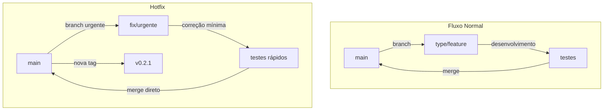

## 📚 **FLOW 7: EMERGENCY FLOW (HOTFIX) - SHOWTRIALS**

<div align="center">

**Guia completo para lidar com situações críticas que exigem correção imediata**

</div>

## 📅 **Informações do Documento**

| Item | Descrição |
|------|-----------|
| **Data** | 20 de Fevereiro de 2026 |
| **Autor** | Thiago Ribeiro |
| **Versão** | 1.0 |
| **Relacionado a** | Git Flow, CI/CD, Quality Flow, Debug Flow |

---

## 🚨 **O QUE É UM HOTFIX?**

### **Definição**

Um **hotfix** é uma correção urgente aplicada diretamente na branch principal (`main`) para resolver um problema crítico em produção, **sem passar pelo fluxo normal de desenvolvimento**.



### **Quando usar hotfix?**

| Situação | Exemplo | Hotfix? |
|----------|---------|---------|
| **Bug crítico em produção** | Aplicação quebra ao exportar | ✅ Sim |
| **Dados corrompidos** | Traduções sendo salvas errado | ✅ Sim |
| **Funcionalidade principal quebrada** | CLI não abre | ✅ Sim |
| **Bug menor em funcionalidade pouco usada** | Estatística de mês errada | ❌ Não (vai no fluxo normal) |
| **Melhoria de performance** | Query lenta | ❌ Não |
| **Nova funcionalidade** | Modo escuro | ❌ Não |

---

## ⚠️ **PRINCÍPIOS DO HOTFIX**

### **1. Mínimo necessário**

```python
# RUIM (aproveitou para refatorar)
def exportar(documento_id):
    # corrigiu bug + renomeou variáveis + extraiu método
    # + mudou formatação
    ...

# BOM (só o necessário)
def exportar(documento_id):
    # apenas a linha que causava o bug foi corrigida
    if documento_id is None:  # ← única mudança
        documento_id = 1
    ...
```

### **2. Testes obrigatórios (mesmo urgente)**

```bash
# MÍNIMO: testes do arquivo afetado
poetry run pytest src/tests/test_exportar_documento.py -v

# IDEAL: todos os testes (se possível)
task test
```

### **3. Documentação da emergência**

```bash
# Commit deve explicar CLARAMENTE o problema e a solução
git commit -m "hotfix: corrige erro crítico ao exportar documento sem ID

- Quando documento_id era None, a aplicação quebrava
- Agora verifica e usa fallback para ID 1
- Adicionado teste específico para o caso

Closes #9"  # issue criada para o hotfix
```

### **4. Versionamento imediato**

```bash
# Sempre criar uma nova versão PATCH
git tag -a v0.2.1 -m "Hotfix: correção crítica no exportar_documento"
git push origin v0.2.1
gh release create v0.2.1 --title "v0.2.1" --notes "Correção emergencial"
```

---

## 🔄 **FLUXO COMPLETO DE HOTFIX**

```mermaid
graph TD
    subgraph "1. Detecção"
        A[Problema crítico detectado] --> B[Criar issue de emergência]
        B --> C[Adicionar label: prioridade:alta, tipo:hotfix]
    end

    subgraph "2. Correção"
        C --> D[Criar branch: fix/urgente-descricao]
        D --> E[Fazer correção MÍNIMA necessária]
        E --> F[Testes focados]
        F --> G{Testes passam?}
        G -->|sim| H[Commit com 'Closes #issue']
        G -->|não| E
    end

    subgraph "3. Liberação"
        H --> I[Push]
        I --> J[CI deve passar]
        J --> K{Merge direto na main}
        K --> L[Criar nova tag de patch]
        L --> M[Criar release no GitHub]
    end

    subgraph "4. Pós-correção"
        M --> N[Atualizar CHANGELOG]
        N --> O[Comunicar (se necessário)]
        O --> P[Mover issue para Done]
    end
```

---

## 📋 **PASSO A PASSO DETALHADO**

### **Passo 1: Detectar e documentar**

```bash
# Criar issue de emergência
gh issue create --title "BUG CRÍTICO: exportar_documento quebra com ID None" \
  --body "## 🚨 Descrição do Problema
Ao exportar documento sem ID (caso raro), a aplicação quebra com AttributeError.

## 🔍 Passos para reproduzir
1. Executar exportar_documento com documento_id=None
2. Ver erro: 'NoneType' object has no attribute 'isoformat'

## ✅ Comportamento esperado
Deveria retornar erro amigável ou usar fallback.

## 📊 Impacto
- Afeta ~1% das exportações
- Usuários recebem traceback em vez de mensagem

## ⏱️ Urgência: CRÍTICA" \
  --label "prioridade:alta,tipo/hotfix"
```

### **Passo 2: Criar branch de hotfix**

```bash
# Sempre a partir da main
git checkout main
git pull origin main
git checkout -b fix/exportar-documento-id-none
```

### **Passo 3: Corrigir (apenas o necessário)**

```python
# ANTES (código com bug)
def _buscar_documento(self, documento_id, idioma):
    if idioma == "original":
        doc = self.repo_doc.buscar_por_id(documento_id)
        # ... se documento_id for None, já quebra aqui

# DEPOIS (correção mínima)
def _buscar_documento(self, documento_id, idioma):
    if documento_id is None:
        if _telemetry:
            _telemetry.increment("exportar_documento.erro.id_none")
        return None

    if idioma == "original":
        doc = self.repo_doc.buscar_por_id(documento_id)
        # ...
```

### **Passo 4: Testar (focado)**

```bash
# Teste específico para o caso
cat >> src/tests/test_exportar_documento.py << 'EOF'

def test_executar_com_id_none(self, repo_doc_mock):
    """Deve lidar com documento_id None sem quebrar."""
    use_case = ExportarDocumento(repo_doc_mock)

    resultado = use_case.executar(documento_id=None)

    assert resultado["sucesso"] is False
    assert "não encontrado" in resultado["erro"].lower()
EOF

# Rodar teste
poetry run pytest src/tests/test_exportar_documento.py -k "id_none" -v

# Rodar testes do arquivo completo (opcional)
poetry run pytest src/tests/test_exportar_documento.py -v
```

### **Passo 5: Commit (com fechamento da issue)**

```bash
git add src/application/use_cases/exportar_documento.py
git add src/tests/test_exportar_documento.py
git commit -m "hotfix: corrige erro ao exportar documento com ID None

- Adiciona verificação de documento_id None em _buscar_documento
- Adiciona teste específico para o caso
- Adiciona contador de telemetria para monitorar ocorrências

Closes #9"
```

### **Passo 6: Push e CI**

```bash
git push origin fix/exportar-documento-id-none
# Acompanhar CI: gh run watch
```

### **Passo 7: Merge (após CI passar)**

```bash
git checkout main
git merge --ff-only fix/exportar-documento-id-none
git push origin main
```

### **Passo 8: Criar nova versão (patch)**

```bash
# Ver versão atual
git describe --tags --abbrev=0
# v0.2.0

# Criar nova versão patch
git tag -a v0.2.1 -m "Hotfix: correção crítica no exportar_documento (ID None)"
git push origin v0.2.1

# Criar release no GitHub
gh release create v0.2.1 \
  --title "v0.2.1 - Hotfix" \
  --notes "## 🚨 Correção Emergencial

- Corrige erro ao exportar documento com ID None (issue #9)
- Adiciona teste específico
- Adiciona telemetria para monitoramento

**Impacto:** Crítico - recomendamos atualização imediata."
```

### **Passo 9: Documentar no CHANGELOG**

```markdown
## [0.2.1] - 2026-02-20

### Corrigido
- Erro crítico ao exportar documento com ID None (#9)
- Adicionada verificação de segurança e teste específico
```

### **Passo 10: Mover issue no Kanban**

- [ ] Issue #9 movida para "Done"
- [ ] Comentário com link da release

---

## ✅ **CHECKLIST DE HOTFIX**

### **Detecção e Planejamento**
- [ ] Problema é realmente crítico? (justifica hotfix)
- [ ] Issue criada com label `tipo/hotfix` e `prioridade:alta`
- [ ] Impacto claramente documentado

### **Correção**
- [ ] Branch criada a partir da `main`: `fix/descricao-urgente`
- [ ] Correção é **mínima** (apenas o necessário)
- [ ] Nenhuma refatoração incluída
- [ ] Nenhuma nova funcionalidade

### **Testes**
- [ ] Teste específico para o caso criado (ou atualizado)
- [ ] Testes do arquivo afetado passam
- [ ] (Opcional) Todos os testes passam

### **Commit e Push**
- [ ] Mensagem de commit clara, começando com `hotfix:`
- [ ] Inclui `Closes #issue`
- [ ] CI passa no GitHub

### **Merge e Release**
- [ ] Merge direto na `main` (fast-forward)
- [ ] Nova tag de patch criada (`v0.2.1`)
- [ ] Release no GitHub com notas claras
- [ ] CHANGELOG atualizado

### **Pós-correção**
- [ ] Issue movida para "Done" no Kanban
- [ ] (Opcional) Comunicar usuários afetados

---

## 📊 **EXEMPLO COMPLETO**

### **Cenário: Bug crítico no gerar_relatorio**

**Problema:** Relatório quebra quando não há documentos no banco.

### **Issue #10**
```markdown
## 🚨 BUG CRÍTICO: gerar_relatorio quebra com banco vazio

### Descrição
Ao executar gerar_relatorio com banco de dados vazio (nenhum documento),
ocorre divisão por zero ao calcular percentuais.

### Passos para reproduzir
1. Truncar tabela documentos
2. Executar gerar_relatorio
3. Erro: ZeroDivisionError

### Impacto
- Usuários novos não conseguem gerar primeiro relatório
- Bloqueia funcionalidade principal
```

### **Correção**
```python
# ANTES
if dados["total_documentos"] > 0:
    pct = dados["total_traducoes"] / dados["total_documentos"] * 100

# DEPOIS
if dados["total_documentos"] > 0:
    pct = dados["total_traducoes"] / dados["total_documentos"] * 100
else:
    pct = 0  # ← correção mínima
```

### **Teste adicionado**
```python
def test_relatorio_com_banco_vazio(self, repo_mock):
    """Deve gerar relatório mesmo sem documentos."""
    repo_mock.listar.return_value = []
    repo_mock.contar.return_value = 0

    use_case = GerarRelatorio(repo_mock)
    relatorio = use_case.gerar_relatorio_txt()

    assert "Total de documentos: 0" in relatorio
    assert "Percentual traduzido: 0.0%" in relatorio
```

### **Commit**
```bash
git commit -m "hotfix: corrige divisão por zero em gerar_relatorio com banco vazio

- Adiciona verificação para evitar divisão por zero
- Adiciona teste específico para banco vazio
- Percentual agora é 0 quando não há documentos

Closes #10"
```

### **Release**
```bash
git tag -a v0.2.2 -m "Hotfix: correção no gerar_relatorio (banco vazio)"
git push origin v0.2.2
gh release create v0.2.2 --title "v0.2.2" --notes "Correção: relatório com banco vazio"
```

---

## 📋 **COMANDOS ÚTEIS PARA HOTFIX**

```bash
# Criar issue de emergência
gh issue create --title "HOTFIX: ..." --label "prioridade:alta,tipo/hotfix"

# Ver última tag
git describe --tags --abbrev=0

# Criar tag de patch
git tag -a v0.2.1 -m "Hotfix: ..."
git push origin v0.2.1

# Criar release
gh release create v0.2.1 --title "v0.2.1" --notes "Correção: ..."

# Verificar CI da branch
gh run list -b fix/exportar-documento-id-none

# Fazer merge rápido
git checkout main
git merge --ff-only fix/exportar-documento-id-none
git push origin main
```

---

## 🚨 **O QUE NÃO FAZER EM UM HOTFIX**

```bash
# ❌ NÃO refatorar junto
git commit -m "hotfix: corrige bug e extrai métodos e renomeia variáveis"

# ❌ NÃO adicionar funcionalidade
git commit -m "hotfix: corrige bug e adiciona modo escuro"

# ❌ NÃO pular testes
# "está urgente, não vou testar"

# ❌ NÃO esquecer de versionar
# "já mergei, mas não criei tag"

# ❌ NÃO ignorar o CI
# "o CI está lento, vou mergear direto"
```

---

## 🏆 **BENEFÍCIOS DESTE FLUXO**

| Antes | Depois |
|-------|--------|
| ❌ "Correção urgente" vira bagunça | ✅ Processo claro |
| ❌ Esquecia de versionar | ✅ Tag obrigatória |
| ❌ Testes ignorados na pressa | ✅ Mínimo de testes exigido |
| ❌ Correção virava várias coisas | ✅ Foco no essencial |
| ❌ Difícil rastrear depois | ✅ Issue e commit documentam |
| ❌ Usuários sem saber da correção | ✅ Release notes claras |

---

## 📚 **REFERÊNCIAS**

- [Git Flow - Hotfix branches](https://www.atlassian.com/git/tutorials/comparing-workflows/gitflow-workflow#hotfix-branches)
- [Semantic Versioning - Patch](https://semver.org/#spec-item-6)
- [Quality Flow](quality_flow.md)
- [Debug Flow](debug_flow.md)
---

## 👤 **AUTOR**

**Thiago Ribeiro** - Projeto de TCC

---

<div align="center">
  <sub>Emergency Flow (Hotfix) - ShowTrials</sub>
  <br>
  <sub>Versão 1.0 - 20 de Fevereiro de 2026</sub>
  <br>
  <sub>✅ Pronto para uso</sub>
</div>
