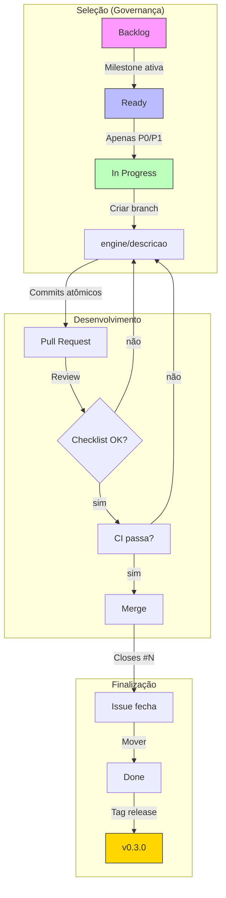

# 📚 **DOCUMENTO: GIT FLOW OFICIAL - SHOWTRIALS**

<div align="center">

**Estratégia formal de gerenciamento de branches, versões e releases integrada à governança do projeto**

</div>

## 📅 **Informações do Documento**

| Item | Descrição |
|------|-----------|
| **Data** | 22 de Fevereiro de 2026 |
| **Autor** | Thiago Ribeiro |
| **Versão** | 2.0 |
| **Relacionado a** | [GOVERNANCA.md](GOVERNANCA.md), Quality Flow, Issues, Milestones, Kanban |

---

## 🎯 **OBJETIVO**

Formalizar o fluxo de trabalho com Git em **total aderência à governança do projeto**, garantindo:

- ✅ Foco arquitetural durante milestones estratégicas
- ✅ Rastreabilidade técnica entre issues e código
- ✅ Disciplina de execução (1 issue por vez)
- ✅ Versionamento semântico alinhado a entregáveis estruturais
- ✅ Redução de dispersão e feature creep
- ✅ Evolução incremental controlada

---

## 📊 **PRINCÍPIOS FUNDAMENTAIS**

| Princípio | Descrição |
|-----------|-----------|
| **1** | Nunca trabalhar diretamente na `main` |
| **2** | Toda alteração relevante deve estar vinculada a uma issue |
| **3** | Apenas **1 issue pode estar em `In Progress` por vez** |
| **4** | Apenas issues da milestone estratégica ativa podem gerar branches |
| **5** | Features congeladas (`frozen`) não podem gerar branches |
| **6** | Mudanças estruturais devem ser explícitas (type:engine/refactor) |

---

## 🏷️ **ESTRUTURA DE BRANCHES**

### **Padrões de Nomenclatura**

Formato obrigatório:

```
<tipo>/<descricao-curta>
```

**Tipos permitidos:**

| Tipo | Descrição | Exemplo |
|------|-----------|---------|
| **engine/** | Mudanças na engine de pipeline | `engine/contexto-pipeline` |
| **infra/** | Infraestrutura, CI, dependências | `infra/mypy-fix` |
| **feature/** | Novas funcionalidades (não estruturais) | `feature/dark-mode` |
| **docs/** | Documentação | `docs/governanca-update` |
| **refactor/** | Refatoração sem mudança funcional | `refactor/transformadores-puros` |
| **bug/** | Correção de bugs | `bug/exportar-id-none` |

**Regras:**
- Usar hífen (`-`), não underscore (`_`)
- Nome curto e sem ambiguidade
- Uma branch por issue
- Branches de `engine/` e `refactor/` exigem issue do mesmo tipo

---

## 🔄 **FLUXO OPERACIONAL COMPLETO**



---

## 📋 **PASSO A PASSO DETALHADO**

### **1. Seleção da Issue**

Antes de criar qualquer branch:

```bash
# Verificar milestone ativa
gh issue list --milestone "MVP - Engine de Pipeline"

# Verificar prioridades
gh issue list --label "priority:P0,priority:P1"

# Verificar se há issue em progresso
gh issue list --assignee @me --state open
```

**Regras de seleção:**
- ✅ Issue deve estar na milestone ativa
- ✅ Prioridade P0 ou P1 (durante milestone estrutural)
- ✅ Não pode haver outra issue em `In Progress`
- ❌ Features `frozen` não podem ser selecionadas

---

### **2. Criação da Branch**

```bash
# A partir da main atualizada
git checkout main
git pull origin main

# Criar branch com tipo adequado
git checkout -b engine/contexto-pipeline
```

**Mapeamento tipo ↔ issue:**

| Tipo de Issue | Tipo de Branch |
|---------------|----------------|
| `type:engine` | `engine/descricao` |
| `type:infra` | `infra/descricao` |
| `type:feature` | `feature/descricao` |
| `type:docs` | `docs/descricao` |
| `type:refactor` | `refactor/descricao` |
| `type:bug` | `bug/descricao` |

---

### **3. Desenvolvimento**

#### Commits Atômicos

```bash
# BOM - commit focado
git commit -m "engine: define contrato de Transformer"

# BOM - commit descritivo
git commit -m "infra: adiciona stubs para módulos externos"

# RUIM - vago
git commit -m "ajustes"

# RUIM - mistura responsabilidades
git commit -m "engine: pipeline e correção de bug"
```

**Regras:**
- ✅ Manter commits pequenos e descritivos
- ✅ Não misturar múltiplas responsabilidades
- ✅ Não alterar escopo da issue
- ❌ Não introduzir mudanças arquiteturais não discutidas

#### Sincronização com Main

```bash
# Manter branch atualizada (rebase, não merge)
git fetch origin
git rebase origin/main
```

---

### **4. Pull Request**

#### Template Obrigatório

````markdown
## 📋 Descrição
[Descrição clara da solução implementada]

## 🔗 Issue relacionada
Closes #N

## ✅ Critérios de Aceite
- [ ] Critério 1 atendido
- [ ] Critério 2 atendido

## 🏗️ Impacto Arquitetural
[Explicar impacto na arquitetura, se houver]

## 📊 Checklist Técnico
- [ ] Código respeita o modelo arquitetural
- [ ] Sem acoplamento indevido com persistência
- [ ] Transformadores permanecem puros
- [ ] Separação execução/configuração mantida
- [ ] Responsabilidade no módulo correto
- [ ] Nenhuma mudança fora de escopo
````

#### Verificações Obrigatórias

```bash
# Antes de abrir PR
task check-file --path src/engine/contexto.py
task test-cov
```

---

### **5. Merge**

#### Condições para Merge

```bash
✅ PR revisado
✅ Critérios de aceite atendidos
✅ Testes passando (task check)
✅ CI verde no GitHub
✅ Branch atualizada com main
✅ Sem mudanças fora de escopo
✅ Impacto arquitetural documentado (se aplicável)
```

#### Estratégia de Merge

**Squash merge é obrigatório** para manter histórico limpo:

```bash
# No GitHub: selecionar "Squash and merge"

# Ou via CLI (após aprovação)
git checkout main
git merge --squash engine/contexto-pipeline
git commit -m "engine: implementa contexto de pipeline (#N)"
git push origin main
```

**Fast-forward puro não é mais recomendado** pois perdemos o contexto da issue no histórico linear.

---

## 🛡️ **PROTEÇÃO DA BRANCH MAIN**

### **Regras Configuradas no GitHub**

```yaml
Branch name pattern: main

✅ Require a pull request before merging
✅ Require status checks to pass before merging
  - CI / test (3.12)
✅ Require branches to be up to date before merging
✅ Include administrators
❌ Allow force pushes
❌ Allow deletions
```

### **Verificação**

```bash
gh api repos/rib-thiago/showtrials-tcc/branches/main/protection
```

---

## 🏷️ **VERSIONAMENTO SEMÂNTICO**

### **Política de Versões**

```
v0.3.0
  ↑  ↑  ↑
  │  │  └── patch (correções)
  │  └───── minor (novas funcionalidades)
  └──────── major (mudanças que quebram compatibilidade)
```

### **Estratégia por Milestone**

| Milestone | Versão | Critério |
|-----------|--------|----------|
| MVP - Engine de Pipeline | v0.3.0 | Contexto, transformadores, executor mínimo |
| M2 - Migração completa | v0.4.0 | Todos os processadores refatorados |
| M3 - Evolução do CLI | v0.5.0 | CLI adaptado ao novo modelo |
| Entrega TCC | v1.0.0 | Versão final estável |

### **Criação de Release**

```bash
# Ver última tag
git describe --tags --abbrev=0

# Criar tag anotada
git tag -a v0.3.0 -m "MVP - Engine de Pipeline

- Contexto de execução implementado
- Transformadores purificados
- Executor mínimo funcional"

# Enviar tag
git push origin v0.3.0

# Criar release
gh release create v0.3.0 \
  --title "v0.3.0 - MVP Engine de Pipeline" \
  --notes-file RELEASE_NOTES.md
```

---

## 🤖 **AUTOMAÇÃO COM TASKIPY**

### **Comandos para Governança**

```toml
[tool.taskipy.tasks]
# ... comandos existentes ...

# ===== Governança =====
status = "gh issue list --assignee @me"
milestone-active = "gh issue list --milestone 'MVP - Engine de Pipeline'"
frozen = "gh issue list --label frozen"
next = "gh issue list --label 'priority:P0,priority:P1' --limit 1"

# ===== Versionamento =====
version-show = "git describe --tags --abbrev=0"
version-create = "python scripts/criar_release.py"
release-create = "gh release create $(git describe --tags --abbrev=0) --title $(git describe --tags --abbrev=0) --notes-file RELEASE_NOTES.md"
```

---

## 📊 **TABELA DE COMANDOS ÚTEIS**

| Ação | Comando |
|------|---------|
| Ver milestone ativa | `gh issue list --milestone 'MVP - Engine de Pipeline'` |
| Ver issues P0/P1 | `gh issue list --label 'priority:P0,priority:P1'` |
| Ver issue em progresso | `gh issue list --assignee @me --state open` |
| Criar branch | `git checkout -b engine/descricao` |
| Commit semântico | `git commit -m "engine: mensagem descritiva"` |
| Atualizar branch | `git fetch origin && git rebase origin/main` |
| Abrir PR | `gh pr create --title "engine: ..." --body-file PR_TEMPLATE.md` |
| Ver CI | `gh run watch` |
| Merge squash | `git merge --squash engine/descricao` |
| Criar release | `task version-create` |

---

## ✅ **CHECKLIST POR ISSUE**

### **Antes de Iniciar**
- [ ] Issue está na milestone ativa?
- [ ] Prioridade é P0 ou P1?
- [ ] Nenhuma outra issue em `In Progress`?
- [ ] Branch criada com tipo correto (`engine/`, `infra/`, etc.)?

### **Durante Desenvolvimento**
- [ ] Commits são atômicos e descritivos?
- [ ] Branch mantida atualizada com `rebase`?
- [ ] Escopo da issue não foi alterado?
- [ ] Nenhuma mudança arquitetural implícita?

### **Antes do PR**
- [ ] `task check-file` passa?
- [ ] `task test-cov` mantém cobertura?
- [ ] PR template preenchido?
- [ ] Impacto arquitetural documentado?

### **Antes do Merge**
- [ ] CI verde?
- [ ] Critérios de aceite atendidos?
- [ ] PR revisado?
- [ ] Nenhuma mudança fora de escopo?

### **Após Merge**
- [ ] Issue fechou automaticamente?
- [ ] Movida para `Done` no Kanban?
- [ ] (Se aplicável) Release criada?

---

## 🚨 **O QUE NÃO FAZER**

```bash
# ❌ NÃO trabalhar em múltiplas issues
git checkout -b feature/x
git checkout -b feature/y  # AINDA NÃO!

# ❌ NÃO criar branch sem issue
git checkout -b ideia-legal  # ONDE ESTÁ A ISSUE?

# ❌ NÃO misturar tipos na branch
git checkout -b engine/feature-x  # OU ENGINE OU FEATURE

# ❌ NÃO fazer merge direto na main
git checkout main
git merge feature/x  # PRIMEIRO PR, DEPOIS MERGE

# ❌ NÃO ignorar a milestone ativa
# (se não está na milestone, não é prioridade agora)
```

---

## 🏆 **BENEFÍCIOS DESTE FLUXO**

| Antes | Depois |
|-------|--------|
| ❌ Múltiplas issues em paralelo | ✅ Foco total na milestone ativa |
| ❌ Branches sem padrão claro | ✅ Tipos definidos (`engine/`, `infra/`, etc.) |
| ❌ Mudanças arquiteturais implícitas | ✅ Issues `type:engine` explícitas |
| ❌ Histório com merge commits | ✅ Squash merge com contexto |
| ❌ Releases manuais | ✅ Script automatizado |
| ❌ Features congeladas sendo trabalhadas | ✅ `frozen` respeitado |

---

## 📚 **REFERÊNCIAS**

- [GOVERNANCA.md](GOVERNANCA.md) - Política de governança do projeto
- [Quality Flow](quality_flow.md) - Critérios de qualidade
- [GitHub Flow](https://guides.github.com/introduction/flow/)
- [Semantic Versioning](https://semver.org/)
- [Conventional Commits](https://www.conventionalcommits.org/)

---

## 👤 **AUTOR**

**Thiago Ribeiro** - Projeto de TCC

---

<div align="center">
  <sub>Git Flow Oficial - ShowTrials</sub>
  <br>
  <sub>Versão 2.0 - 22 de Fevereiro de 2026</sub>
  <br>
  <sub>✅ Em conformidade com a GOVERNANCA.md</sub>
</div>
