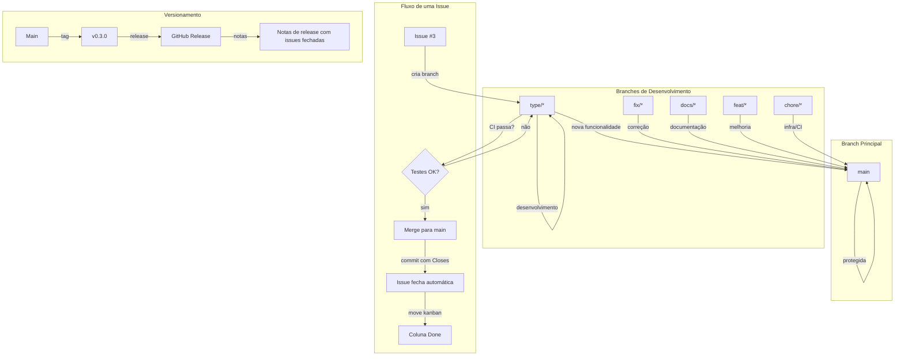

# 📚 **DOCUMENTO: GIT FLOW ADAPTADO - SHOWTRIALS**

<div align="center">

**Estratégia completa de gerenciamento de branches, versões e releases integrada com nosso fluxo de trabalho**

</div>

## 📅 **Informações do Documento**

| Item | Descrição |
|------|-----------|
| **Data** | 20 de Fevereiro de 2026 |
| **Autor** | Thiago Ribeiro |
| **Versão** | 1.0 |
| **Relacionado a** | Fases 1-16, Issues, Milestones, Kanban |

---

## 🎯 **OBJETIVO**

Formalizar e padronizar o fluxo de trabalho com Git, integrando:
- ✅ Nosso padrão já consolidado de branches `type/*`
- ✅ Issues e Milestones (gerenciamento de tarefas)
- ✅ Kanban (visualização do fluxo)
- ✅ Versionamento semântico (tags)
- ✅ Releases documentadas
- ✅ CI/CD com GitHub Actions
- ✅ Taskipy para automação local

---

## 📊 **NOSSO CONTEXTO ATUAL**

### **O que já funciona**

| Aspecto | Status | Como fazemos |
|---------|--------|--------------|
| **Branches de features** | ✅ Consolidado | `type/nome-arquivo` |
| **Branches de correção** | ✅ Consolidado | `fix/descricao` |
| **Branches de documentação** | ✅ Consolidado | `docs/descricao` |
| **Commits semânticos** | ✅ Padronizado | `feat:`, `fix:`, `docs:`, `test:`, `chore:` |
| **CI** | ✅ Funcionando | GitHub Actions |
| **Taskipy** | ✅ Configurado | `task lint`, `task test`, etc. |
| **Issues** | ✅ Criadas | #1 até #8 |
| **Milestones** | ✅ Criados | Fases Imediatas, Melhorias, Inovação, Documentação |
| **Kanban** | ✅ Configurado | Backlog → Ready → In Progress → In Review → Done |

### **O que vamos adicionar**

| Aspecto | Por que | Como faremos |
|---------|---------|--------------|
| **Proteção da branch `main`** | Evitar merges acidentais | Regras no GitHub |
| **Versionamento semântico** | Documentar evolução | Tags `v0.1.0`, `v0.2.0`, `v1.0.0` |
| **Releases no GitHub** | Documentar entregas | `gh release create` |
| **Política de merges** | Padronizar integração | CI obrigatório + rebase |
| **Script de release** | Automatizar versões | Taskipy + script Python |

---

## 🔄 **NOSSO GIT FLOW ADAPTADO**



---

## 🌿 **ESTRUTURA DE BRANCHES**

### **Padrões de Nomenclatura**

| Tipo | Padrão | Exemplo | Quando usar |
|------|--------|---------|-------------|
| **Fase do projeto** | `type/[nome-arquivo]` | `type/classificar-documento` | Implementar telemetria e testes em um arquivo |
| **Correção de bug** | `fix/[descricao]` | `fix/tipo-documento-keyerror` | Corrigir um problema específico |
| **Documentação** | `docs/[descricao]` | `docs/atualizar-readme` | Atualizar documentação |
| **Melhoria** | `feat/[descricao]` | `feat/modo-escuro-cli` | Nova funcionalidade (não fase) |
| **Infra/CI/Chore** | `chore/[descricao]` | `chore/atualizar-dependencias` | Tarefas de manutenção |

### **Fluxo de Vida de uma Branch**

```bash
# 1. Criar a branch a partir da main
git checkout main
git pull origin main
git checkout -b type/classificar-documento

# 2. Desenvolver (commits intermediários)
git add .
git commit -m "wip: adiciona estrutura básica de testes"

# 3. Manter sincronizada (rebase, não merge)
git fetch origin
git rebase origin/main

# 4. Finalizar com commit semântico
git add .
git commit -m "feat: adiciona telemetria e testes em classificar_documento.py

- Adiciona padrão de telemetria
- Cria testes de lógica (8) e telemetria (5)
- Cobertura: 65% → 85%

Closes #3"

# 5. Push e merge
git push origin type/classificar-documento
# (merge via site ou CLI após CI passar)
```

---

## 🛡️ **PROTEÇÃO DA BRANCH MAIN**

### **Regras configuradas no GitHub**

Acesse: `https://github.com/rib-thiago/showtrials-tcc/settings/branches`

```yaml
# Configuração ideal
Branch name pattern: main

✅ Require a pull request before merging
  - [opcional, podemos mergir direto]

✅ Require status checks to pass before merging
  - CI / test (3.12)  # nosso workflow

✅ Require branches to be up to date before merging
  - [garante que não tem conflitos]

✅ Include administrators
  - [aplica as regras até para você]

✅ Allow force pushes
  - [❌ desabilitado]

✅ Allow deletions
  - [❌ desabilitado]
```

### **Comandos para verificar proteção**
```bash
# Ver regras da branch
gh api repos/rib-thiago/showtrials-tcc/branches/main/protection
```

---

## 🏷️ **VERSIONAMENTO SEMÂNTICO**

### **O que é Semantic Versioning**

```
v0.2.0
  ↑  ↑  ↑
  │  │  └── patch (correções)
  │  └───── minor (novas funcionalidades)
  └──────── major (mudanças que quebram compatibilidade)
```

### **Nossa Estratégia de Versões**

| Versão | Quando criar | Exemplo |
|--------|--------------|---------|
| **v0.1.0** | ✅ Já existe | Versão inicial |
| **v0.2.0** | ✅ Já existe | Após primeiras fases |
| **v0.3.0** | Após concluir Fases 17-20 | classificar, obter, estatisticas, mypy |
| **v0.4.0** | Após melhorias | modo escuro, gráficos, NLP Poetry |
| **v1.0.0** | Entrega do TCC | Versão final |

### **Criando uma tag**

```bash
# Listar tags existentes
git tag -l

# Criar tag anotada (recomendado)
git tag -a v0.3.0 -m "Versão 0.3.0 - Telemetria em classificar_documento, obter_documento, estatisticas"

# Enviar tag para o GitHub
git push origin v0.3.0

# Ver tags no remote
git ls-remote --tags origin
```

---

## 🚀 **RELEASES NO GITHUB**

### **Criando uma release manualmente**

```bash
# Após criar a tag, criar release
gh release create v0.3.0 \
  --title "v0.3.0" \
  --notes "## ✅ Fases concluídas
- FASE 17: classificar_documento.py (65% → 85%)
- FASE 18: obter_documento.py (57% → 85%)
- FASE 19: estatisticas.py (15% → 80%)
- FASE 20: Correção MyPy global

## 📊 Métricas
- Cobertura global: 75%
- Testes totais: ~250
- Issues fechadas: #3, #4, #5, #6"
```

### **Ver releases**
```bash
gh release list
gh release view v0.3.0
```

---

## 🤖 **AUTOMAÇÃO COM TASKIPY**

### **Comandos adicionados ao `pyproject.toml`**

```toml
[tool.taskipy.tasks]
# ... comandos existentes ...

# ===== Versionamento =====
version-show = "git describe --tags --abbrev=0"
version-list = "git tag -l"
version-create = "python scripts/criar_release.py"

# ===== Releases =====
release-create = "gh release create $(git describe --tags --abbrev=0) --title $(git describe --tags --abbrev=0) --notes-file RELEASE_NOTES.md"
release-list = "gh release list"

# ===== Status do Projeto =====
status-issues = "gh issue list --assignee @me"
status-milestone = "gh issue list --milestone 'Fases Imediatas (Semanas 1-2)'"
status-project = "open https://github.com/users/rib-thiago/projects/1"
```

### **Script de release automático**

Crie `scripts/criar_release.py`:

```python
#!/usr/bin/env python
"""
Script para criar versões e releases automaticamente.
Uso: poetry run task version-create
"""

import subprocess
import re
from datetime import datetime
from typing import Optional, List, Tuple

def get_last_tag() -> str:
    """Retorna a última tag do repositório."""
    try:
        return subprocess.getoutput("git describe --tags --abbrev=0 2>/dev/null || echo 'v0.0.0'")
    except:
        return "v0.0.0"

def suggest_next_version(last_tag: str) -> str:
    """Sugere a próxima versão baseado na última."""
    match = re.match(r"v(\d+)\.(\d+)\.(\d+)", last_tag)
    if not match:
        return "v0.1.0"

    major, minor, patch = map(int, match.groups())
    return f"v{major}.{minor + 1}.0"  # incrementa minor

def get_issues_since_last_tag(last_tag: str) -> List[Tuple[str, str]]:
    """Lista issues fechadas desde a última tag."""
    log = subprocess.getoutput(f"git log {last_tag}..HEAD --oneline | grep -i 'closes'")
    issues = []
    for line in log.split('\n'):
        if not line:
            continue
        # Procura por padrão "Closes #N"
        match = re.search(r"closes #(\d+)", line.lower())
        if match:
            issues.append((match.group(1), line))
    return issues

def create_release_notes(last_tag: str, new_version: str, issues: List[Tuple[str, str]]) -> str:
    """Gera notas de release."""
    notes = []
    notes.append(f"# Release {new_version}")
    notes.append(f"Data: {datetime.now().strftime('%d/%m/%Y')}")
    notes.append("")

    if issues:
        notes.append("## ✅ Issues fechadas")
        for issue_num, commit_msg in issues:
            notes.append(f"- #{issue_num}: {commit_msg}")
    else:
        notes.append("## ✅ Melhorias")
        notes.append("- Nenhuma issue específica fechada")

    notes.append("")
    notes.append("## 📊 Métricas")
    notes.append("- Cobertura global: (rode `poetry run pytest --cov=src | grep TOTAL`)")
    notes.append("- Testes totais: (rode `poetry run pytest --collect-only | grep collected`)")

    return '\n'.join(notes)

def main():
    print("🚀 Criador de Release - ShowTrials")
    print("=" * 40)

    # Última tag
    last_tag = get_last_tag()
    print(f"📌 Última tag: {last_tag}")

    # Sugerir próxima versão
    suggested = suggest_next_version(last_tag)
    print(f"💡 Sugestão: {suggested}")

    # Perguntar versão
    new_version = input(f"Versão (Enter para '{suggested}'): ").strip()
    if not new_version:
        new_version = suggested

    # Buscar issues fechadas
    issues = get_issues_since_last_tag(last_tag)
    if issues:
        print(f"\n🔍 Issues fechadas desde {last_tag}:")
        for issue_num, commit_msg in issues:
            print(f"  • #{issue_num}")

    # Perguntar notas
    print("\n📝 Gerando notas de release automaticamente...")
    notes = create_release_notes(last_tag, new_version, issues)

    # Salvar notas em arquivo
    with open("RELEASE_NOTES.md", "w") as f:
        f.write(notes)

    print(f"✅ Notas salvas em RELEASE_NOTES.md")
    print("\n" + notes)

    # Confirmar
    confirm = input(f"\nCriar tag {new_version} e release? (s/N): ").strip().lower()
    if confirm != 's':
        print("❌ Cancelado")
        return

    # Criar tag
    print(f"\n🏷️  Criando tag {new_version}...")
    subprocess.run(f"git tag -a {new_version} -F RELEASE_NOTES.md", shell=True)
    subprocess.run(f"git push origin {new_version}", shell=True)

    # Criar release
    print(f"🚀 Criando release no GitHub...")
    subprocess.run(f"gh release create {new_version} --title '{new_version}' --notes-file RELEASE_NOTES.md", shell=True)

    print(f"✅ Release {new_version} criada com sucesso!")
    print(f"📎 Acesse: https://github.com/rib-thiago/showtrials-tcc/releases/tag/{new_version}")

if __name__ == "__main__":
    main()
```

---

## 📋 **POLÍTICA DE MERGES**

### **Regras para merge na `main`**

```bash
# ANTES do merge, verificar:
✅ Tests passam localmente (task test)
✅ Lint ok (task lint)
✅ MyPy ok (task type)
✅ Cobertura >= 45% (task test-cov)
✅ Branch está atualizada com main
✅ CI passou no GitHub
```

### **Fluxo de merge recomendado**

```bash
# 1. Atualizar branch
git checkout type/classificar-documento
git fetch origin
git rebase origin/main

# 2. Verificar tudo
task check

# 3. Push final
git push origin type/classificar-documento

# 4. Merge (pelo site ou CLI)
# Opção A: via GitHub (recomendado)
#   - Acesse a branch no GitHub
#   - Clique em "Compare & pull request"
#   - Se não houver PR, crie um
#   - Após CI passar, faça merge

# Opção B: via CLI (mais rápido)
git checkout main
git merge --ff-only type/classificar-documento  # fast-forward apenas
git push origin main
```

### **Por que fast-forward?**

```bash
# Com fast-forward (recomendado)
A---B---C  main
     \
      D---E  type/*
          ↓
A---B---C---D---E  main (histórico linear)

# Sem fast-forward (cria merge commit)
A---B---C-----------F  main
     \             /
      D-----------E  type/*
```

**Fast-forward mantém o histórico limpo e linear.** Como trabalhamos sozinhos, não precisamos de merge commits.

---

## 🔄 **FLUXO COMPLETO (ISSUE → BRANCH → RELEASE)**

### **Exemplo prático: FASE 17**

```bash
# 1. Issue #3 está em "Ready" no Kanban

# 2. Mover para "In Progress" (no site)

# 3. Criar branch
git checkout -b type/classificar-documento

# 4. Desenvolver (commits intermediários)
git add .
git commit -m "wip: estrutura de testes"

# 5. Manter sincronizado
git fetch origin
git rebase origin/main

# 6. Testar localmente
task test
task lint
task type
task test-cov

# 7. Commit final com fechamento da issue
git add .
git commit -m "feat: adiciona telemetria e testes em classificar_documento.py

- Adiciona padrão de telemetria
- Cria testes de lógica (8) e telemetria (5)
- Cobertura: 65% → 85%

Closes #3"

# 8. Push
git push origin type/classificar-documento

# 9. Verificar CI no GitHub
gh run list

# 10. Merge (após CI passar)
git checkout main
git pull origin main
git merge --ff-only type/classificar-documento
git push origin main

# 11. Issue fecha automaticamente (pelo commit)
# 12. Mover issue para "Done" no Kanban

# 13. Quando várias fases estiverem prontas, criar release
task version-create
```

---

## 📊 **TABELA DE COMANDOS ÚTEIS**

| O que fazer | Comando |
|-------------|---------|
| **Ver branch atual** | `git branch` |
| **Criar nova branch** | `git checkout -b type/nome` |
| **Atualizar branch** | `git fetch origin && git rebase origin/main` |
| **Ver status** | `git status` |
| **Commit semântico** | `git commit -m "tipo: mensagem"` |
| **Commit com Closes** | `git commit -m "feat: ... Closes #3"` |
| **Push** | `git push origin type/nome` |
| **Merge (fast-forward)** | `git merge --ff-only type/nome` |
| **Deletar branch local** | `git branch -d type/nome` |
| **Deletar branch remota** | `git push origin --delete type/nome` |
| **Ver tags** | `git tag -l` |
| **Criar tag** | `git tag -a v0.3.0 -m "versão"` |
| **Push tag** | `git push origin v0.3.0` |
| **Ver releases** | `gh release list` |
| **Criar release** | `gh release create v0.3.0 --notes-file RELEASE_NOTES.md` |
| **Ver issues** | `gh issue list --assignee @me` |
| **Ver milestone** | `gh issue list --milestone "Fases Imediatas"` |
| **Ver project** | `open https://github.com/users/rib-thiago/projects/1` |

---

## ✅ **CHECKLIST DE IMPLEMENTAÇÃO**

### **Configuração Inicial (uma vez)**

- [ ] Proteger branch `main` no GitHub
- [ ] Adicionar script `scripts/criar_release.py`
- [ ] Atualizar `pyproject.toml` com novos comandos taskipy
- [ ] Testar `task version-create`

### **Para cada nova fase**

- [ ] Issue criada com template
- [ ] Label de prioridade definida
- [ ] Milestone associado
- [ ] Issue no Kanban (coluna Ready)

### **Durante o desenvolvimento**

- [ ] Branch criada no padrão
- [ ] Commits intermediários (opcionais)
- [ ] Rebase frequente com main
- [ ] Testes passando localmente

### **Ao finalizar**

- [ ] Commit final com `Closes #N`
- [ ] CI verde no GitHub
- [ ] Merge (fast-forward)
- [ ] Issue fecha automaticamente
- [ ] Mover no Kanban para Done

### **Para releases**

- [ ] Agrupar issues fechadas desde última tag
- [ ] Executar `task version-create`
- [ ] Verificar release no GitHub
- [ ] Atualizar documentação se necessário

---

## 🏆 **BENEFÍCIOS DESTE FLUXO**

| Antes | Depois |
|-------|--------|
| ❌ Versões no "olhômetro" | ✅ Tags semânticas documentadas |
| ❌ Histórico solto | ✅ Commits linkados a issues |
| ❌ Progresso invisível | ✅ Kanban atualizado |
| ❌ Merges manuais sem padrão | ✅ Política clara (fast-forward) |
| ❌ Releases manuais | ✅ Script automatizado |
| ❌ Dúvida sobre o que foi feito | ✅ Release notes com issues fechadas |

---

## 📚 **REFERÊNCIAS**

- [GitHub Flow](https://guides.github.com/introduction/flow/)
- [Semantic Versioning](https://semver.org/)
- [Conventional Commits](https://www.conventionalcommits.org/)
- [Taskipy Documentation](https://github.com/taskipy/taskipy)
- [GitHub CLI Manual](https://cli.github.com/manual/)

---

## 👤 **AUTOR**

**Thiago Ribeiro** - Projeto de TCC

---

<div align="center">
  <sub>Git Flow Adaptado - ShowTrials</sub>
  <br>
  <sub>Versão 1.0 - 20 de Fevereiro de 2026</sub>
  <br>
  <sub>✅ Pronto para implementação</sub>
</div>
```
