# 📚 **DOCUMENTO: QUALITY ASSURANCE FLOW - SHOWTRIALS**

<div align="center">

**Estratégia completa de lint, type checking, testes e cobertura integrada com nosso fluxo de desenvolvimento**

</div>

## 📅 **Informações do Documento**

| Item | Descrição |
|------|-----------|
| **Data** | 20 de Fevereiro de 2026 |
| **Autor** | Thiago Ribeiro |
| **Versão** | 1.0 |
| **Relacionado a** | Git Flow, CI/CD, Taskipy, Fases 1-16 |

---

## 🎯 **OBJETIVO**

Formalizar e padronizar o processo de garantia de qualidade do código, integrando:
- ✅ Linting com Ruff
- ✅ Type checking com MyPy
- ✅ Testes com Pytest
- ✅ Cobertura de testes
- ✅ Automação com Taskipy
- ✅ CI/CD com GitHub Actions
- ✅ Nosso padrão de commits atômicos

---

## 📊 **NOSSO CONTEXTO ATUAL**

### **O que já funciona**

| Ferramenta | Status | O que faz |
|------------|--------|-----------|
| **Ruff** | ✅ Configurado | Linting e formatação |
| **Black** | ✅ Configurado | Formatação automática |
| **isort** | ✅ Configurado | Organização de imports |
| **MyPy** | ✅ Configurado | Type checking (parcial) |
| **Pytest** | ✅ Configurado | Testes unitários |
| **Pytest-cov** | ✅ Configurado | Medição de cobertura |
| **Taskipy** | ✅ Configurado | Automação local |
| **GitHub Actions** | ✅ Funcionando | CI automatizado |
| **Pre-commit** | ✅ Configurado | Hooks locais |

### **Métricas Atuais**

```
📊 COBERTURA GLOBAL: 75% (meta 45%)
🧪 TESTES TOTAIS: ~250
🔤 ERROS MYPY: 6 (em outros arquivos)
⚡ LINT: 0 erros
```

---

## 🔧 **FERRAMENTAS E CONFIGURAÇÕES**

### **1. Ruff (Linting)**

Arquivo: `.ruff.toml`

```toml
# .ruff.toml - Configuração do Ruff

# Ignorar certos tipos de erro
ignore = [
    "E402",  # Module level import not at top of file (sys.path.insert é necessário)
    "F841",  # Local variable assigned but never used (variáveis intencionalmente não usadas)
]

# Linha muito longa (aumentar tolerância)
line-length = 120

# Excluir pastas que não precisam ser verificadas
exclude = [
    "legacy/*",
    "backup_*",
    "diagnostico_*",
    ".git",
    "__pycache__",
]
```

### **2. Black (Formatação)**

No `pyproject.toml`:
```toml
[tool.black]
line-length = 100
target-version = ['py312']
```

### **3. isort (Imports)**

No `pyproject.toml`:
```toml
[tool.isort]
profile = "black"
line_length = 100
```

### **4. MyPy (Type Checking)**

```bash
# Configuração via pyproject.toml
[tool.mypy]
python_version = "3.12"
warn_return_any = true
warn_unused_configs = true
ignore_missing_imports = true  # temporário
```

### **5. Pytest (Testes)**

No `pyproject.toml`:
```toml
[tool.pytest.ini_options]
pythonpath = ["src"]
addopts = "-v --cov=src --cov-report=term-missing"
```

---

## 📋 **COMANDOS TASKIPY (NOSSA AUTOMAÇÃO)**

No `pyproject.toml`:

```toml
[tool.taskipy.tasks]
# === QUALIDADE (executar sempre) ===
lint = "ruff check src"
format = "black src && isort src"
type = "mypy src"
quality = "task lint && task type"

# === TESTES ===
test = "pytest src/tests -v"
test-cov = "pytest src/tests --cov=src --cov-report=term-missing --cov-fail-under=45"
test-html = "pytest src/tests --cov=src --cov-report=html"
test-file = "pytest {path} -v"  # uso: task test-file --path src/tests/test_arquivo.py

# === TELEMETRIA ===
metrics = "python -c 'from src.infrastructure.telemetry import telemetry; telemetry.flush()'"
monitor = "task test && task metrics"

# === EXECUÇÃO ===
run-cli = "python run.py"
run-web = "python web_run.py"

# === MANUTENÇÃO ===
clean = "find . -type d -name __pycache__ -exec rm -rf {} + && find . -name '*.pyc' -delete"
docs = "mkdocs serve"

# === TUDO JUNTO (pré-commit) ===
check = "task lint && task type && task test"
pre-push = "task check && task test-cov"

# === NOVOS COMANDOS ===
# Qualidade focada em um arquivo
lint-file = "ruff check {path}"
type-file = "mypy {path}"
test-file = "pytest {path} -v"
cov-file = "pytest --cov={path} --cov-report=term-missing"

# Resumo rápido
summary = "echo '📊 Cobertura:' && pytest --cov=src --cov-report=term-missing | grep TOTAL && echo '🔤 MyPy:' && mypy src/ | grep error | wc -l | xargs echo '   Erros:'"
```

---

## 🔄 **FLUXO DE QUALIDADE POR FASE**

### **Nosso Padrão (já consolidado)**

```mermaid
graph TD
    subgraph "Antes de Começar"
        A[Arquivo alvo] -->|cobertura atual| AC[poetry run pytest --cov=arquivo]
        A -->|myPy atual| AM[poetry run mypy arquivo]
    end

    subgraph "Durante o Desenvolvimento"
        D[Editar código] -->|adicionar telemetria| D
        D -->|criar testes| D
        D -->|checkpoints| T{task check-file}
        T -->|falhou| D
        T -->|passou| P[Próximo passo]
    end

    subgraph "Antes do Commit"
        C1[task lint-file] -->|ok| C2[task type-file]
        C2 -->|ok| C3[task test-file]
        C3 -->|ok| C4[task cov-file]
        C4 -->|cobertura >=85%| Commit[git commit]
    end

    subgraph "Depois do Commit"
        Push[git push] --> CI[GitHub Actions]
        CI -->|task check| CI
        CI -->|task test-cov| CI
        CI -->|CI verde| Merge[git merge]
    end
```



---

## 📋 **CHECKLIST DE QUALIDADE POR ARQUIVO**

### **Antes de iniciar uma fase**

```bash
# 1. Ver cobertura atual do arquivo
poetry run pytest --cov=src/application/use_cases/classificar_documento.py

# 2. Ver MyPy atual
poetry run mypy src/application/use_cases/classificar_documento.py

# 3. Ver lint atual
poetry run ruff check src/application/use_cases/classificar_documento.py

# 4. Registrar métricas iniciais na issue
```

### **Durante o desenvolvimento**

```bash
# Checkpoint rápido (lint + type)
task lint-file --path src/application/use_cases/classificar_documento.py
task type-file --path src/application/use_cases/classificar_documento.py

# Rodar testes específicos
task test-file --path src/tests/test_classificar_documento.py

# Ver cobertura parcial
task cov-file --path src/application/use_cases/classificar_documento.py
```

### **Antes do commit final**

```bash
# 1. Lint (deve passar)
poetry run ruff check src/application/use_cases/classificar_documento.py

# 2. Type checking (deve passar)
poetry run mypy src/application/use_cases/classificar_documento.py

# 3. Testes do arquivo (devem passar)
poetry run pytest src/tests/test_classificar_documento.py -v
poetry run pytest src/tests/test_classificar_documento_telemetry.py -v

# 4. Cobertura final (deve ser >=85%)
poetry run pytest --cov=src/application/use_cases/classificar_documento.py

# 5. Tudo junto (opcional)
task check-file --path src/application/use_cases/classificar_documento.py
```

### **Depois do commit**

```bash
# 1. Push
git push origin type/classificar-documento

# 2. Acompanhar CI
gh run list
gh run watch

# 3. Verificar cobertura global
task summary
```

---

## 🧪 **ESTRATÉGIA DE TESTES**

### **Tipos de Testes que Escrevemos**

| Tipo | Onde | Exemplo | Quantidade |
|------|------|---------|------------|
| **Testes de lógica** | `test_*.py` | `test_exportar_documento.py` | 12-15 por fase |
| **Testes de telemetria** | `test_*_telemetry.py` | `test_exportar_documento_telemetry.py` | 6-8 por fase |
| **Testes de integração** | `test_infrastructure/` | `test_sqlite_repository.py` | 20+ |
| **Testes de regressão** | `test_use_cases.py` | `test_classificar_documento` | 4 |

### **Padrão para Testes de Lógica**

```python
# test_classificar_documento.py
class TestClassificarDocumento:
    """Testes para a lógica de classificação."""

    @pytest.fixture
    def repo_mock(self):
        """Fixture para mock do repositório."""
        return Mock()

    def test_classificar_interrogatorio(self, repo_mock):
        """Deve classificar interrogatório corretamente."""
        # Arrange
        doc = Documento(titulo="Протокол допроса")
        repo_mock.buscar_por_id.return_value = doc
        use_case = ClassificarDocumento(repo_mock)

        # Act
        resultado = use_case.executar(1)

        # Assert
        assert resultado.tipo == "interrogatorio"
```

### **Padrão para Testes de Telemetria**

```python
# test_classificar_documento_telemetry.py
class TestClassificarDocumentoTelemetry:
    """Testes para telemetria."""

    def setup_method(self):
        """Reconfigura o módulo antes de cada teste."""
        uc_module._telemetry = None

    def test_telemetria_sucesso(self):
        """Telemetria deve registrar classificação bem-sucedida."""
        mock_telemetry = MagicMock()
        uc_module.configure_telemetry(telemetry_instance=mock_telemetry)

        # ... teste ...

        mock_telemetry.increment.assert_any_call("classificar_documento.sucesso")
```

---

## 📊 **MÉTRICAS E METAS**

### **Metas por Fase**

| Métrica | Mínimo | Bom | Excelente |
|---------|--------|-----|-----------|
| **Cobertura do arquivo** | 80% | 85% | 90%+ |
| **Testes de lógica** | 8 | 12 | 15+ |
| **Testes de telemetria** | 4 | 6 | 8+ |
| **MyPy no arquivo** | 0 erros | 0 erros | 0 erros |
| **Lint** | 0 erros | 0 erros | 0 erros |

### **Metas Globais**

| Métrica | Atual | Meta |
|---------|-------|------|
| **Cobertura global** | 75% | 80% |
| **Erros MyPy** | 6 | 0 |
| **Testes totais** | ~250 | 300 |

---

## 🤖 **CI/CD - GITHUB ACTIONS**

### **Workflow Atual (`.github/workflows/ci.yml`)**

```yaml
name: CI

on:
  push:
    branches: [ main, develop ]
  pull_request:
    branches: [ main ]

jobs:
  test:
    runs-on: ubuntu-latest
    strategy:
      matrix:
        python-version: ["3.12"]

    steps:
    - uses: actions/checkout@v4
    - name: Set up Python
      uses: actions/setup-python@v5
      with:
        python-version: ${{ matrix.python-version }}

    - name: Install Poetry
      run: |
        curl -sSL https://install.python-poetry.org | python3 -
        echo "$HOME/.local/bin" >> $GITHUB_PATH

    - name: Install dependencies
      run: poetry install --no-interaction

    # === NLP dependencies (pip) - Temporário até migrar para Poetry ===
    - name: Install NLP dependencies
      run: |
        poetry run pip install numpy==1.26.0
        poetry run pip install spacy==3.7.5
        poetry run pip install textblob nltk wordcloud matplotlib
        poetry run python -m spacy download en_core_web_sm
        poetry run python -m spacy download ru_core_news_sm

    - name: Lint with ruff
      run: poetry run ruff check src/

    - name: Type check with mypy
      run: poetry run mypy src/ || echo "⚠️ MyPy warnings (ignorado por enquanto)"

    - name: Test with pytest
      run: poetry run pytest src/tests/ -v --cov=src --cov-report=xml --cov-fail-under=45

    - name: Upload coverage to Codecov
      uses: codecov/codecov-action@v4
      with:
        file: ./coverage.xml
        fail_ci_if_error: false
        token: ${{ secrets.CODECOV_TOKEN }}
```

---

## 📋 **COMANDOS RÁPIDOS (COLA)**

```bash
# === QUALIDADE GERAL ===
task lint        # Ruff em todo src
task type        # MyPy em todo src
task test        # Todos os testes
task test-cov    # Testes com cobertura
task check       # lint + type + test
task pre-push    # check + test-cov

# === QUALIDADE POR ARQUIVO ===
task lint-file --path src/application/use_cases/classificar_documento.py
task type-file --path src/application/use_cases/classificar_documento.py
task test-file --path src/tests/test_classificar_documento.py
task cov-file --path src/application/use_cases/classificar_documento.py
task check-file --path src/application/use_cases/classificar_documento.py

# === MÉTRICAS ===
task summary      # Resumo de cobertura e MyPy

# === LIMPEZA ===
task clean        # Remove __pycache__ e .pyc

# === EXECUÇÃO ===
task run-cli      # Roda CLI
task run-web      # Roda servidor web
```

---

## 🔄 **FLUXO COMPLETO (QUALIDADE + GIT + ISSUES)**

```mermaid
graph TD
    subgraph "Issue no Kanban"
        A[Issue #3 - Ready] -->|Iniciar| B[Issue #3 - In Progress]
    end

    subgraph "Desenvolvimento Local"
        B --> C[git checkout -b type/classificar-documento]
        C --> D[Editar código + testes]
        D --> E{task check-file}
        E -->|falhou| D
        E -->|passou| F[task cov-file >=85%]
    end

    subgraph "Commit e Push"
        F --> G[git commit -m "feat: ... Closes #3"]
        G --> H[git push]
    end

    subgraph "CI"
        H --> I[GitHub Actions]
        I --> J[task lint]
        I --> K[task type (ignorando erros)]
        I --> L[task test-cov]
        L --> M{coverage >=45%?}
        M -->|sim| N[CI Verde]
        M -->|não| O[CI Falha]
    end

    subgraph "Finalização"
        N --> P[git merge]
        P --> Q[Issue #3 fecha automática]
        Q --> R[Mover para Done no Kanban]
    end
```

---

## ✅ **CHECKLIST DE QUALIDADE POR FASE**

### **Antes de começar**
- [ ] Verificar cobertura atual do arquivo
- [ ] Verificar MyPy atual
- [ ] Registrar na issue

### **Durante desenvolvimento**
- [ ] Checkpoints frequentes com `task check-file`
- [ ] Testes passando localmente
- [ ] Lint zero

### **Antes do commit**
- [ ] `task lint-file` → 0 erros
- [ ] `task type-file` → 0 erros
- [ ] `task test-file` → todos passando
- [ ] `task cov-file` → cobertura ≥85%
- [ ] `task check-file` → tudo ok

### **Depois do commit**
- [ ] CI verde
- [ ] Cobertura global mantida
- [ ] Issue fechada

---

## 📊 **TABELA DE COMANDOS DETALHADA**

| Comando | O que faz | Quando usar |
|---------|-----------|-------------|
| `task lint` | Ruff em todo projeto | Antes de push |
| `task lint-file --path X` | Ruff em um arquivo | Durante desenvolvimento |
| `task type` | MyPy em todo projeto | Antes de push |
| `task type-file --path X` | MyPy em um arquivo | Durante desenvolvimento |
| `task test` | Todos os testes | Antes de push |
| `task test-file --path X` | Testes de um arquivo | Durante desenvolvimento |
| `task test-cov` | Testes com cobertura | Antes de push |
| `task cov-file --path X` | Cobertura de um arquivo | Antes do commit |
| `task check` | lint + type + test | Antes de push |
| `task check-file --path X` | lint + type + test-file | Durante desenvolvimento |
| `task pre-push` | check + test-cov | Antes de push |
| `task summary` | Resumo de métricas | Qualquer momento |
| `task clean` | Limpa caches | Quando necessário |

---

## 🏆 **BENEFÍCIOS DESTE FLUXO**

| Antes | Depois |
|-------|--------|
| ❌ Qualidade variável por arquivo | ✅ Padrão consistente |
| ❌ Esquecia de rodar mypy | ✅ `task check-file` obrigatório |
| ❌ Cobertura caía sem perceber | ✅ `task cov-file` antes do commit |
| ❌ CI quebrava por erros bobos | ✅ Verificação local antes do push |
| ❌ Dúvida sobre o que testar | ✅ Checklist claro por fase |
| ❌ MyPy acumulava erros | ✅ Corrigido antes do merge |

---

## 📚 **REFERÊNCIAS**

- [Ruff Documentation](https://beta.ruff.rs/docs/)
- [Black Documentation](https://black.readthedocs.io/)
- [MyPy Documentation](https://mypy.readthedocs.io/)
- [Pytest Documentation](https://docs.pytest.org/)
- [Taskipy Documentation](https://github.com/taskipy/taskipy)

---

## 👤 **AUTOR**

**Thiago Ribeiro** - Projeto de TCC

---

<div align="center">
  <sub>Quality Assurance Flow - ShowTrials</sub>
  <br>
  <sub>Versão 1.0 - 20 de Fevereiro de 2026</sub>
  <br>
  <sub>✅ Pronto para uso</sub>
</div>
