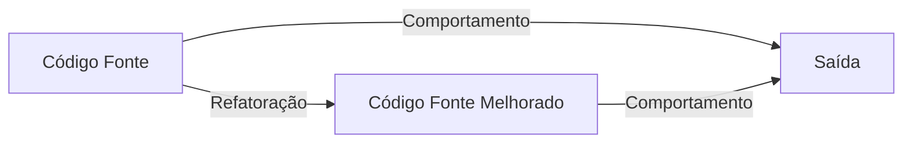
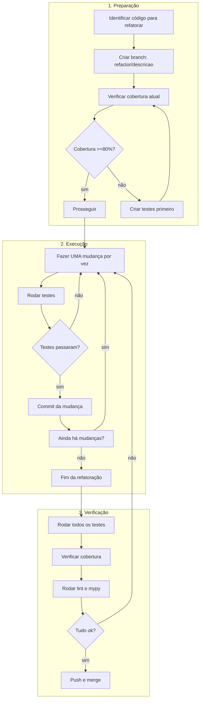

## 📚 **FLOW 6: REFACTORING FLOW - SHOWTRIALS**

<div align="center">

**Guia completo para refatoração segura e sistemática do código**

</div>

## 📅 **Informações do Documento**

| Item | Descrição |
|------|-----------|
| **Data** | 20 de Fevereiro de 2026 |
| **Autor** | Thiago Ribeiro |
| **Versão** | 1.0 |
| **Relacionado a** | Quality Flow, Testes, Git Flow, Code Review Flow |

---

## 🎯 **OBJETIVO**

Estabelecer uma metodologia segura para refatorar código, garantindo que:

- ✅ Melhorias não introduzam bugs
- ✅ Comportamento externo permaneça idêntico
- ✅ Cobertura de testes não diminua
- ✅ Refatorações sejam atômicas e rastreáveis
- ✅ O código fique mais limpo, não mais complexo

---

## 📊 **O QUE É REFATORAÇÃO?**

### **Definição**

> Refatoração é o processo de modificar a estrutura interna do código **sem alterar seu comportamento externo**.



### **O que é e o que NÃO é refatoração**

| É Refatoração | NÃO é Refatoração |
|---------------|-------------------|
| Renomear variáveis | Adicionar nova funcionalidade |
| Extrair método | Corrigir bug |
| Mover função para outro módulo | Mudar API pública |
| Simplificar condicional | Otimizar performance (pode mudar comportamento) |
| Remover código duplicado | Mudar formato de saída |

---

## 🔍 **QUANDO REFATORAR**

### **Sinais de que o código precisa de refatoração**

```python
# 1. Método muito longo (>50 linhas)
def processar_tudo():  # 200 linhas 😱
    # faz coisa 1
    # faz coisa 2
    # faz coisa 3
    # ...

# 2. Código duplicado (DRY violado)
def funcao1():
    # mesmo bloco da funcao2
    x = a + b
    y = x * 2
    return y

def funcao2():
    # mesmo bloco da funcao1
    x = a + b
    y = x * 2
    return y * 3

# 3. Condicionais complexas
if (a and b) or (c and not d) or (e and f and g):
    # difícil de entender

# 4. Nomes ruins
def fx(a, b):
    return a.process(b)

# 5. Classe fazendo demais (God Class)
class GerenciadorTudo:
    def processar_documento(self): ...
    def enviar_email(self): ...
    def gerar_relatorio(self): ...
    def conectar_banco(self): ...
    # 30 métodos diferentes
```

### **Melhores momentos para refatorar**

- [ ] **Antes** de adicionar uma nova funcionalidade
- [ ] **Depois** de entender um trecho de código confuso
- [ ] **Durante** code review (se identificar problemas)
- [ ] **NUNCA** junto com nova funcionalidade no mesmo commit

---

## ⚠️ **REGRAS DE OURO DA REFATORAÇÃO**

### **Regra #1: Testes primeiro, sempre!**

```bash
# Antes de qualquer refatoração, verifique:
task cov-file --path src/application/use_cases/alvo.py
# Cobertura deve ser >= 80%

# Se for menor, crie testes ANTES de refatorar
```

### **Regra #2: Um passo de cada vez**

```python
# RUIM (várias mudanças de uma vez)
def calcular_total( itens):
    # renomeou parâmetro, mudou lógica, extraiu método, tudo junto
    total = 0
    for i in itens:
        total += i.preco * i.quantidade
    return total + calcular_taxa(itens)

# BOM (passo a passo)
# Passo 1: Renomear parâmetro
def calcular_total(itens):

# Passo 2: Extrair cálculo de subtotal
def calcular_subtotal(itens):
    return sum(i.preco * i.quantidade for i in itens)

def calcular_total(itens):
    return calcular_subtotal(itens) + calcular_taxa(itens)
```

### **Regra #3: Commit por mudança atômica**

```bash
# Cada refatoração pequena = um commit
git commit -m "refactor: renomeia parâmetro 'x' para 'itens' em calcular_total"
git commit -m "refactor: extrai método calcular_subtotal"
git commit -m "refactor: simplifica loop com sum()"
```

### **Regra #4: Nunca mude comportamento e refatore junto**

```python
# RUIM (refatorou e mudou lógica)
def calcular_total(itens):
    # ANTES: total = 0; for i in itens: total += i.preco
    # DEPOIS: mudou para incluir desconto (comportamento diferente!)
    return sum(i.preco * (1 - i.desconto) for i in itens)
```

---

## 🛠️ **TÉCNICAS DE REFATORAÇÃO**

### **1. Renomear (Renaming)**

```python
# ANTES
def calc(a, b):
    return a + b

# DEPOIS
def calcular_soma(parcela1: float, parcela2: float) -> float:
    return parcela1 + parcela2
```

### **2. Extrair Método (Extract Method)**

```python
# ANTES
def processar_pedido(pedido):
    # 20 linhas calculando imposto
    if pedido.pais == "BR":
        imposto = pedido.total * 0.18
    elif pedido.pais == "US":
        imposto = pedido.total * 0.10
    else:
        imposto = pedido.total * 0.15

    # 30 linhas processando pagamento
    # ...

# DEPOIS
def processar_pedido(pedido):
    imposto = _calcular_imposto(pedido)
    _processar_pagamento(pedido, imposto)

def _calcular_imposto(pedido):
    """Calcula imposto baseado no país."""
    if pedido.pais == "BR":
        return pedido.total * 0.18
    elif pedido.pais == "US":
        return pedido.total * 0.10
    return pedido.total * 0.15

def _processar_pagamento(pedido, imposto):
    # lógica do pagamento
    pass
```

### **3. Extrair Variável (Extract Variable)**

```python
# ANTES
if (cliente.idade > 60 and cliente.renda > 5000 and
    cliente.tempo_casa > 5):
    oferecer_desconto(cliente)

# DEPOIS
elegivel_desconto = (
    cliente.idade > 60 and
    cliente.renda > 5000 and
    cliente.tempo_casa > 5
)
if elegivel_desconto:
    oferecer_desconto(cliente)
```

### **4. Simplificar Condicionais**

```python
# ANTES
if status == "APROVADO":
    return True
else:
    return False

# DEPOIS
return status == "APROVADO"
```

### **5. Introduzir Objeto Parâmetro**

```python
# ANTES
def processar_pedido(cliente_id, cliente_nome, cliente_email,
                     endereco_rua, endereco_cidade, endereco_cep,
                     itens):
    # ...

# DEPOIS
class Cliente:
    def __init__(self, id, nome, email):
        self.id = id
        self.nome = nome
        self.email = email

class Endereco:
    def __init__(self, rua, cidade, cep):
        self.rua = rua
        self.cidade = cidade
        self.cep = cep

def processar_pedido(cliente: Cliente, endereco: Endereco, itens):
    # ...
```

---

## 🔄 **FLUXO COMPLETO DE REFATORAÇÃO**



---

## ✅ **CHECKLIST DE REFATORAÇÃO**

### **Antes de começar**

- [ ] Criei branch `refactor/descricao`?
- [ ] Cobertura do arquivo >=80%?
- [ ] Se não, criei testes primeiro?

### **Durante a refatoração**

- [ ] Estou fazendo **uma** mudança por vez?
- [ ] Testes passam após cada mudança?
- [ ] Commit por mudança atômica?

### **Depois de cada commit**

- [ ] Mensagem de commit no padrão `refactor: descrição`
- [ ] Testes locais passam
- [ ] Lint e MyPy ok

### **Antes do merge**

- [ ] Todos os testes passam (`task test`)
- [ ] Cobertura não caiu (`task test-cov`)
- [ ] Código ficou mais limpo (não mais complexo)
- [ ] Branch atualizada com `main`

---

## 📋 **EXEMPLO PRÁTICO: REFATORANDO UM MÉTODO LONGO**

### **Código original (ruim)**

```python
# src/application/use_cases/processar_pedido.py

def executar(self, pedido):
    # Validar pedido
    if not pedido.itens:
        raise ValueError("Pedido sem itens")
    if pedido.total <= 0:
        raise ValueError("Total inválido")

    # Calcular imposto
    if pedido.pais == "BR":
        imposto = pedido.total * 0.18
    elif pedido.pais == "US":
        imposto = pedido.total * 0.10
    elif pedido.pais == "JP":
        imposto = pedido.total * 0.08
    else:
        imposto = pedido.total * 0.15

    # Aplicar desconto
    if pedido.cliente_vip:
        desconto = pedido.total * 0.05
        total_com_imposto = pedido.total + imposto - desconto
    else:
        total_com_imposto = pedido.total + imposto

    # Processar pagamento
    if pedido.forma_pagamento == "cartao":
        self._processar_cartao(pedido, total_com_imposto)
    elif pedido.forma_pagamento == "boleto":
        self._gerar_boleto(pedido, total_com_imposto)
    else:
        raise ValueError("Forma de pagamento inválida")

    # Registrar no banco
    self.repo.salvar(pedido)

    return {"status": "sucesso", "total": total_com_imposto}
```

### **Passo 1: Verificar cobertura**

```bash
task cov-file --path src/application/use_cases/processar_pedido.py
# 90% ✅
```

### **Passo 2: Criar branch**

```bash
git checkout -b refactor/processar-pedido
```

### **Passo 3: Extrair validação**

```python
def _validar_pedido(self, pedido):
    """Valida os dados do pedido antes do processamento."""
    if not pedido.itens:
        raise ValueError("Pedido sem itens")
    if pedido.total <= 0:
        raise ValueError("Total inválido")
```

```bash
git add .
git commit -m "refactor: extrai método _validar_pedido"
```

### **Passo 4: Extrair cálculo de imposto**

```python
def _calcular_imposto(self, pedido) -> float:
    """Calcula imposto baseado no país do pedido."""
    taxas = {
        "BR": 0.18,
        "US": 0.10,
        "JP": 0.08,
    }
    taxa = taxas.get(pedido.pais, 0.15)
    return pedido.total * taxa
```

```bash
git commit -m "refactor: extrai método _calcular_imposto com dicionário de taxas"
```

### **Passo 5: Extrair cálculo de desconto**

```python
def _aplicar_desconto(self, pedido, valor_base: float) -> float:
    """Aplica desconto se cliente for VIP."""
    if pedido.cliente_vip:
        desconto = pedido.total * 0.05
        return valor_base - desconto
    return valor_base
```

```bash
git commit -m "refactor: extrai método _aplicar_desconto"
```

### **Passo 6: Extrair processamento de pagamento**

```python
def _processar_pagamento_por_forma(self, pedido, total: float):
    """Processa pagamento de acordo com a forma escolhida."""
    processadores = {
        "cartao": self._processar_cartao,
        "boleto": self._gerar_boleto,
    }
    processador = processadores.get(pedido.forma_pagamento)
    if not processador:
        raise ValueError("Forma de pagamento inválida")
    processador(pedido, total)
```

```bash
git commit -m "refactor: extrai _processar_pagamento_por_forma com dicionário"
```

### **Passo 7: Código refatorado**

```python
def executar(self, pedido):
    """Processa um pedido completo."""
    self._validar_pedido(pedido)

    imposto = self._calcular_imposto(pedido)
    total_com_imposto = pedido.total + imposto
    total_final = self._aplicar_desconto(pedido, total_com_imposto)

    self._processar_pagamento_por_forma(pedido, total_final)
    self.repo.salvar(pedido)

    return {"status": "sucesso", "total": total_final}
```

```bash
git commit -m "refactor: simplifica método principal usando métodos auxiliares"
```

### **Passo 8: Verificar tudo**

```bash
task test
task test-cov  # cobertura deve permanecer 90%
task lint
task type
```

### **Passo 9: Push e merge**

```bash
git push origin refactor/processar-pedido
# CI deve passar
git checkout main
git merge --ff-only refactor/processar-pedido
git push origin main
```

---

## 📊 **COMPARAÇÃO ANTES E DEPOIS**

| Métrica | Antes | Depois |
|---------|-------|--------|
| **Linhas do método principal** | 35 | 8 |
| **Métodos auxiliares** | 0 | 4 |
| **Complexidade** | Alta | Baixa |
| **Testabilidade** | Difícil | Fácil |
| **Reuso** | Nenhum | Métodos podem ser reutilizados |
| **Legibilidade** | Ruim | Clara |

---

## 🚨 **PROBLEMAS COMUNS E SOLUÇÕES**

| Problema | Causa | Solução |
|----------|-------|---------|
| **Testes quebram após refatoração** | Mudou comportamento | Reverter ou ajustar (se comportamento era bug) |
| **Cobertura caiu** | Removeu código sem testes | Adicionar testes antes |
| **Mudança muito grande** | Várias refatorações juntas | Separar em commits menores |
| **Merge conflitante** | Refatorou arquivo que outros mexeram | Comunicar antes ou fazer em horário adequado |
| **"Melhorei" mas código ficou pior** | Refatoração inadequada | Reverter e repensar abordagem |

---

## 📋 **COMANDOS ÚTEIS**

```bash
# Verificar cobertura antes
task cov-file --path src/application/use_cases/alvo.py

# Ver complexidade (opcional)
poetry run radon cc src/application/use_cases/alvo.py -s

# Ver métodos longos (opcional)
poetry run pylint --max-line-length=100 src/ | grep "too-many-lines"

# Verificar se tudo continua funcionando
task check
task test-cov
```

---

## 🏆 **BENEFÍCIOS DESTE FLUXO**

| Antes | Depois |
|-------|--------|
| ❌ Refatoração "achista" | ✅ Metodologia sistemática |
| ❌ Quebrava sem perceber | ✅ Testes garantem |
| ❌ Código ficava pior às vezes | ✅ Objetivo claro: melhorar |
| ❌ Commit gigante e confuso | ✅ Commits atômicos |
| ❌ Difícil reverter | ✅ Cada passo é reversível |

---

## 📚 **REFERÊNCIAS**

- [Refactoring (Martin Fowler)](https://refactoring.com/)
- [Clean Code (Robert Martin)](https://www.amazon.com/Clean-Code-Handbook-Software-Craftsmanship/dp/0132350882)
- [Source Making - Refactoring](https://sourcemaking.com/refactoring)

---

## 👤 **AUTOR**

**Thiago Ribeiro** - Projeto de TCC

---

<div align="center">
  <sub>Refactoring Flow - ShowTrials</sub>
  <br>
  <sub>Versão 1.0 - 20 de Fevereiro de 2026</sub>
  <br>
  <sub>✅ Pronto para uso</sub>
</div>

---

## 📋 **PRÓXIMO FLOW**

**Emergency Flow (Hotfix)** será o próximo! 🚨
