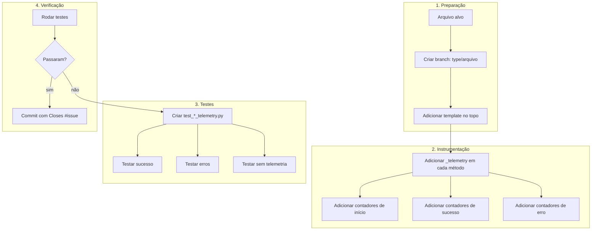

## 📚 **FLOW 1: TELEMETRY FLOW - SHOWTRIALS**

<div align="center">

**Guia completo para instrumentação de código com telemetria**

</div>

## 📅 **Informações do Documento**

| Item | Descrição |
|------|-----------|
| **Data** | 20 de Fevereiro de 2026 |
| **Autor** | Thiago Ribeiro |
| **Versão** | 1.0 |
| **Relacionado a** | Fases 5, 8, 12, 14, 15, 16 |

---

## 🎯 **OBJETIVO**

Padronizar a implementação de telemetria em todos os arquivos do projeto, garantindo:
- ✅ Consistência entre os módulos
- ✅ Facilidade de teste
- ✅ Rastreabilidade de uso
- ✅ Baixo acoplamento
- ✅ Fallback seguro quando desabilitada

---

## 📊 **POR QUE TELEMETRIA?**

### **O que ganhamos**

| Benefício | Exemplo |
|-----------|---------|
| **Entender uso** | Quantas vezes cada caso de uso é executado |
| **Detectar erros** | Frequência de falhas por operação |
| **Otimizar performance** | Onde estão os gargalos |
| **Tomar decisões** | Quais funcionalidades são mais usadas |
| **Debug** | Rastrear fluxo de execução |

### **Nossa abordagem**

```python
# Leve, desacoplada e testável
if _telemetry:
    _telemetry.increment("modulo.operacao.status")
```

---

## 🏗️ **ARQUITETURA DA TELEMETRIA**

```mermaid
graph TD
    subgraph "Módulo Qualquer"
        A[Código] -->|if _telemetry| B{Telemetria configurada?}
        B -->|sim| C[_telemetry.increment()]
        B -->|não| D[Ignora]
    end

    subgraph "Arquivo de teste"
        E[MockTelemetry] -->|configure_telemetry| F[Módulo usa mock]
        F -->|verifica chamadas| G[assert_any_call]
    end

    subgraph "Arquivo principal"
        H[from .telemetry import telemetry] -->|configure_telemetry| I[Módulo usa real]
        I -->|increment| J[(Métricas)]
    end
```

---

## 📋 **PADRÃO DE IMPLEMENTAÇÃO**

### **Template para qualquer arquivo**

```python
"""
Descrição do módulo.
"""

# ... outros imports ...

# ===== TELEMETRIA =====
_telemetry = None

def configure_telemetry(telemetry_instance=None):
    """
    Configura telemetria para este módulo.

    Args:
        telemetry_instance: Instância do objeto de telemetria
                           (usado apenas em testes)
    """
    global _telemetry
    _telemetry = telemetry_instance
# =====================

class MinhaClasse:
    # ... código ...
```

### **Onde colocar**

Sempre no **topo do arquivo**, logo após os imports, antes das classes.

---

## 📊 **PADRÃO DE NOMENCLATURA**

### **Estrutura dos contadores**

```
modulo.submodulo.operacao.estado
```

| Parte | Descrição | Exemplo |
|-------|-----------|---------|
| **modulo** | Domínio principal | `exportar_documento` |
| **submodulo** | (opcional) Subdivisão | `buscar_documento` |
| **operacao** | Ação sendo executada | `executar` |
| **estado** | Resultado/status | `iniciado`, `concluido`, `erro.tipo` |

### **Exemplos reais do projeto**

```python
# ExportarDocumento
_telemetry.increment("exportar_documento.executar.iniciado")
_telemetry.increment("exportar_documento.executar.formato.txt")
_telemetry.increment("exportar_documento.executar.sucesso_txt")
_telemetry.increment("exportar_documento.erro.formato_invalido")

# GerarRelatorio
_telemetry.increment("gerar_relatorio.coletar_dados.iniciado")
_telemetry.increment("gerar_relatorio.documentos_processados", value=len(documentos))
_telemetry.increment("gerar_relatorio.salvar.sucesso_txt")
```

---

## ✅ **CHECKLIST POR MÉTODO**

### **Para cada método público**

```python
def meu_metodo(self, parametro):
    """Descrição do método."""

    # 1. INÍCIO - sempre registrar
    if _telemetry:
        _telemetry.increment("modulo.meu_metodo.iniciado")
        if parametro:
            _telemetry.increment(f"modulo.meu_metodo.parametro.{parametro}")

    try:
        # ... lógica ...

        # 2. SUCESSO - registrar quando apropriado
        if _telemetry:
            _telemetry.increment("modulo.meu_metodo.concluido")
            if hasattr(resultado, 'tamanho'):
                _telemetry.increment("modulo.meu_metodo.caracteres", value=len(resultado))

        return resultado

    except ValueError as e:
        # 3. ERRO ESPERADO - registrar e propagar ou tratar
        if _telemetry:
            _telemetry.increment("modulo.meu_metodo.erro.valor_invalido")
        raise

    except Exception as e:
        # 4. ERRO INESPERADO - registrar, mas pode propagar
        if _telemetry:
            _telemetry.increment("modulo.meu_metodo.erro.interno")
        raise
```

### **Contadores obrigatórios por método**

| Tipo | Quando | Exemplo |
|------|--------|---------|
| **iniciado** | Primeira linha | `metodo.iniciado` |
| **concluido** | Antes do return | `metodo.concluido` |
| **erro.tipo** | No bloco except | `metodo.erro.tipo_especifico` |
| **valor** | Quando processar dados | `metodo.caracteres`, `metodo.itens` |

---

## 🧪 **TESTES DE TELEMETRIA**

### **Estrutura do arquivo de teste**

Sempre criar `test_nome_do_arquivo_telemetry.py`:

```python
# src/tests/test_exportar_documento_telemetry.py
"""
Testes de telemetria para o caso de uso ExportarDocumento.
"""

from unittest.mock import Mock, MagicMock
import pytest

import src.application.use_cases.exportar_documento as uc_module
from src.application.use_cases.exportar_documento import ExportarDocumento


class TestExportarDocumentoTelemetry:
    """Testes para telemetria do ExportarDocumento."""

    def setup_method(self):
        """Reconfigura o módulo antes de cada teste (CRÍTICO!)."""
        uc_module._telemetry = None

    def test_telemetria_sucesso(self):
        """Telemetria deve registrar execução bem-sucedida."""
        # 1. Configurar mock
        mock_telemetry = MagicMock()
        uc_module.configure_telemetry(telemetry_instance=mock_telemetry)

        # 2. Configurar mocks das dependências
        mock_repo = Mock()
        mock_repo.buscar_por_id.return_value = Mock(id=1, texto="teste")

        # 3. Executar
        use_case = ExportarDocumento(mock_repo)
        with tempfile.TemporaryDirectory() as tmpdir:
            resultado = use_case.executar(documento_id=1, diretorio=tmpdir)

        # 4. Verificar resultado
        assert resultado["sucesso"] is True

        # 5. Verificar chamadas de telemetria
        mock_telemetry.increment.assert_any_call("exportar_documento.executar.iniciado")
        mock_telemetry.increment.assert_any_call("exportar_documento.executar.concluido")
```

### **O que testar em cada arquivo**

| Tipo de teste | O que verificar | Exemplo |
|---------------|-----------------|---------|
| **Sucesso** | Contadores principais | `iniciado`, `concluido` |
| **Erro esperado** | Contador de erro específico | `erro.formato_invalido` |
| **Erro inesperado** | Contador de erro genérico | `erro.execucao` |
| **Sem telemetria** | Nada quebra | `configure_telemetry(None)` |

---

## 🔄 **FLUXO COMPLETO (ADICIONAR TELEMETRIA EM UM NOVO ARQUIVO)**



---

## ✅ **CHECKLIST PARA ADICIONAR TELEMETRIA**

### **1. No arquivo principal**

- [ ] Adicionar variável global `_telemetry = None`
- [ ] Adicionar função `configure_telemetry`
- [ ] Em cada método público:
  - [ ] `if _telemetry:` no início
  - [ ] Contador de `iniciado`
  - [ ] Contador de parâmetros relevantes (opcional)
  - [ ] Contador de `concluido` antes do return
  - [ ] Contadores de erro nos excepts

### **2. No arquivo de teste**

- [ ] Criar `test_nome_telemetry.py`
- [ ] Importar o módulo como `uc_module`
- [ ] Classe de teste com `setup_method` zerando `_telemetry`
- [ ] Teste de sucesso verificando contadores principais
- [ ] Teste de cada erro esperado
- [ ] Teste de erro inesperado (se aplicável)
- [ ] Teste "sem telemetria não quebra"

### **3. Exemplo completo (para copiar)**

**No arquivo principal:**
```python
# Telemetria opcional
_telemetry = None

def configure_telemetry(telemetry_instance=None):
    """Configura telemetria para este módulo (usado apenas em testes)."""
    global _telemetry
    _telemetry = telemetry_instance
```

**No arquivo de teste:**
```python
import src.application.use_cases.meu_modulo as uc_module

class TestMeuModuloTelemetry:
    def setup_method(self):
        uc_module._telemetry = None

    def test_telemetria_sucesso(self):
        mock_telemetry = MagicMock()
        uc_module.configure_telemetry(telemetry_instance=mock_telemetry)

        # ... teste ...

        mock_telemetry.increment.assert_any_call("modulo.metodo.iniciado")
```

---

## 📊 **EXEMPLOS REAIS DO PROJETO**

### **ExportarDocumento (FASE 14)**

```python
# src/application/use_cases/exportar_documento.py

_telemetry = None

def configure_telemetry(telemetry_instance=None):
    global _telemetry
    _telemetry = telemetry_instance

class ExportarDocumento:
    def executar(self, documento_id, formato="txt", ...):
        if _telemetry:
            _telemetry.increment("exportar_documento.executar.iniciado")
            _telemetry.increment(f"exportar_documento.executar.formato.{formato}")

        # ... lógica ...

        if _telemetry:
            _telemetry.increment("exportar_documento.executar.concluido")
```

### **GerarRelatorio (FASE 15)**

```python
# src/application/use_cases/gerar_relatorio.py

_telemetry = None

def configure_telemetry(telemetry_instance=None):
    global _telemetry
    _telemetry = telemetry_instance

class GerarRelatorio:
    def _coletar_dados(self):
        if _telemetry:
            _telemetry.increment("gerar_relatorio.coletar_dados.iniciado")

        # ... lógica ...

        if _telemetry:
            _telemetry.increment("gerar_relatorio.coletar_dados.concluido")
            _telemetry.increment("gerar_relatorio.documentos_processados", value=len(documentos))
```

---

## 🚨 **ERROS COMUNS E SOLUÇÕES**

| Erro | Causa | Solução |
|------|-------|---------|
| `AttributeError: 'NoneType' object has no attribute 'increment'` | Esqueceu de verificar `if _telemetry:` | Adicionar `if _telemetry:` antes de usar |
| Testes de telemetria falham com chamadas não encontradas | Mock não configurado ou caminho diferente | Use `assert_any_call` em vez de `assert_called_with` |
| `_telemetry` persistindo entre testes | Não zerou no `setup_method` | Adicionar `uc_module._telemetry = None` |
| Contadores com nomes inconsistentes | Não seguiu o padrão | Use `modulo.operacao.estado` |

---

## 📋 **COMANDOS ÚTEIS**

```bash
# Ver telemetria em ação (se tiver visualização)
poetry run task monitor

# Testar telemetria de um arquivo específico
poetry run pytest src/tests/test_*_telemetry.py -v

# Ver cobertura incluindo telemetria
poetry run pytest --cov=src/application/use_cases --cov-report=term-missing
```

---

## ✅ **RESUMO - O QUE NÃO ESQUECER**

```python
# 1. Template no topo
_telemetry = None
def configure_telemetry(telemetry_instance=None):
    global _telemetry
    _telemetry = telemetry_instance

# 2. Uso em métodos
if _telemetry:
    _telemetry.increment("modulo.metodo.iniciado")

# 3. Testes
def setup_method(self):
    uc_module._telemetry = None
```

---

## 📚 **REFERÊNCIAS**

- [FASE 14 - ExportarDocumento](docs/FASE14_EXPORTAR_DOCUMENTO.md)
- [FASE 15 - GerarRelatorio](docs/FASE15_GERAR_RELATORIO.md)
- [FASE 16 - ListarDocumentos](docs/FASE16_LISTAR_DOCUMENTOS.md)

---

## 👤 **AUTOR**

**Thiago Ribeiro** - Projeto de TCC

---

<div align="center">
  <sub>Telemetry Flow - ShowTrials</sub>
  <br>
  <sub>Versão 1.0 - 20 de Fevereiro de 2026</sub>
  <br>
  <sub>✅ Pronto para uso</sub>
</div>

---

## 📋 **PRÓXIMO FLOW**

**Code Review Flow** será o próximo! 🚀
