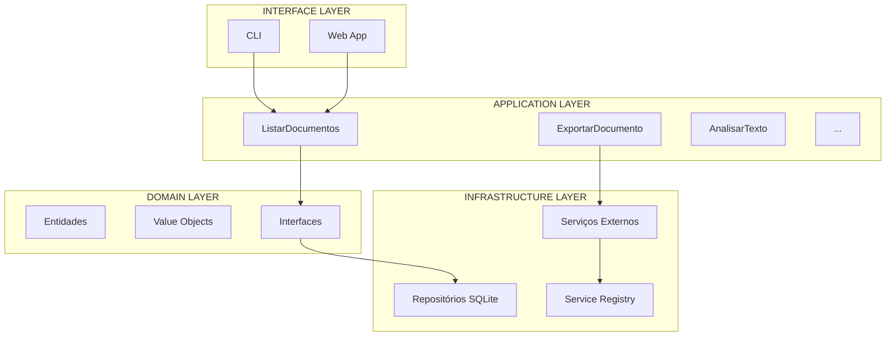
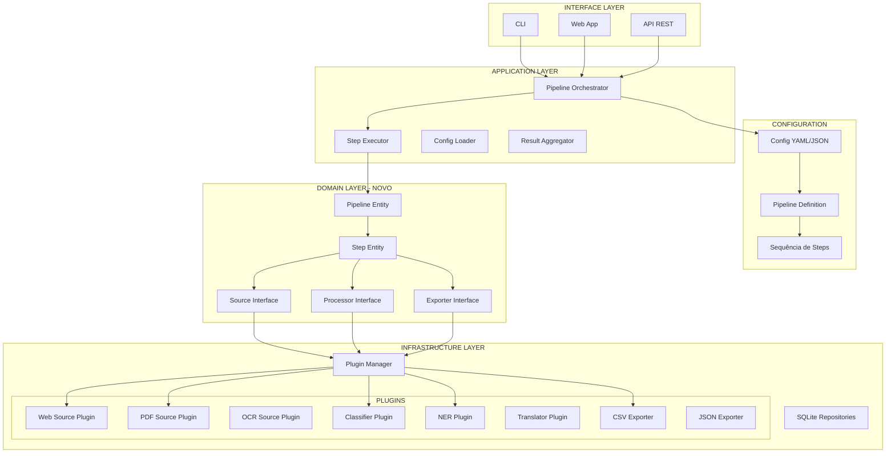

## 📚 **ANÁLISE ARQUITETURAL - SHOWTRIALS COMO PLATAFORMA**

<div align="center">

**Preservando os pontos fortes enquanto expandimos o escopo**

</div>

## 🎯 **VOCÊ ESTÁ ABSOLUTAMENTE CERTO**

O ponto mais elogiado do seu projeto é a **arquitetura limpa**. Não podemos perder isso. A pergunta certa é:

> **"Como expandir o escopo SEM violar os princípios que tornaram o projeto excelente?"**

---

## 🏛️ **REVISÃO: NOSSA ARQUITETURA ATUAL**



### **O que torna essa arquitetura forte:**

| Princípio | Implementação |
|-----------|---------------|
| **Dependência invertida** | Casos de uso dependem de interfaces, não de implementações |
| **Domínio puro** | Nenhum import de frameworks no domain layer |
| **Testabilidade** | Cada camada pode ser testada isoladamente |
| **Service Registry** | Lazy loading, configuração centralizada |
| **Separação clara** | Responsabilidades bem definidas |

---

## 🔄 **O QUE MUDA COM A VISÃO DE PLATAFORMA?**

### **Hoje (Específico)**
```
Fonte: Fixa (showtrials.ru)
Processadores: Fixos (classificador específico)
Entidades: Fixas (nomes russos)
Pipeline: Fixo (coleta → classifica → traduz → analisa)
```

### **Amanhã (Plataforma)**
```
Fonte: Configurável (web, pdf, pasta, api)
Processadores: Selecionáveis (classificador, extrator, tradutor)
Entidades: Genéricas (PERSON, ORG, LOC, DATE)
Pipeline: Customizável (usuário escolhe ordem)
```

---

## 🏗️ **ARQUITETURA PROPOSTA PARA A PLATAFORMA**



---

## 📦 **NOVAS ENTIDADES DE DOMÍNIO**

### **1. Pipeline (Entidade)**

```python
# src/domain/entities/pipeline.py
@dataclass
class Pipeline:
    """Representa um pipeline de processamento configurado pelo usuário."""

    id: Optional[int]
    nome: str
    descricao: Optional[str]
    steps: List[PipelineStep]
    created_at: datetime
    updated_at: datetime

    def executar(self, contexto: Dict) -> Dict:
        """Orquestra a execução dos steps em ordem."""
        resultado = {}
        for step in self.steps:
            resultado = step.processar(contexto, resultado)
        return resultado
```

### **2. PipelineStep (Value Object)**

```python
# src/domain/value_objects/pipeline_step.py
@dataclass
class PipelineStep:
    """Um passo individual no pipeline."""

    ordem: int
    tipo: str  # 'source', 'processor', 'exporter'
    plugin: str  # nome do plugin a ser usado
    config: Dict  # configuração específica do passo

    def processar(self, contexto: Dict, resultado_anterior: Dict) -> Dict:
        """Executa este passo."""
        # lógica será implementada pelos plugins
        pass
```

### **3. Interfaces para Plugins**

```python
# src/domain/interfaces/plugin.py
class SourcePlugin(ABC):
    """Interface para plugins de fonte de dados."""

    @abstractmethod
    def nome(self) -> str:
        """Nome único do plugin."""
        pass

    @abstractmethod
    def descricao(self) -> str:
        """Descrição para interface do usuário."""
        pass

    @abstractmethod
    def config_schema(self) -> Dict:
        """Schema JSON para validação da configuração."""
        pass

    @abstractmethod
    def coletar(self, config: Dict) -> List[Documento]:
        """Coleta documentos conforme configuração."""
        pass

class ProcessorPlugin(ABC):
    """Interface para plugins de processamento."""

    @abstractmethod
    def processar(self, documento: Documento, config: Dict) -> Documento:
        """Processa um documento."""
        pass

class ExporterPlugin(ABC):
    """Interface para plugins de exportação."""

    @abstractmethod
    def exportar(self, documentos: List[Documento], config: Dict) -> str:
        """Exporta documentos para formato específico."""
        pass
```

---

## 🔧 **COMO ISSO SE INTEGRA COM NOSSA ARQUITETURA ATUAL**

### **Camada de Domínio (NOVO)**

```python
# src/domain/ - NOVOS ARQUIVOS
├── entities/
│   ├── pipeline.py        # NOVO
│   └── documento.py       # EXISTENTE (adaptado)
├── value_objects/
│   ├── pipeline_step.py    # NOVO
│   └── tipo_documento.py   # EXISTENTE
└── interfaces/
    ├── plugin.py           # NOVO
    ├── repositories.py     # EXISTENTE
    └── repositorio_traducao.py  # EXISTENTE
```

### **Camada de Aplicação (ADAPTADA)**

```python
# src/application/use_cases/
├── pipeline/
│   ├── executar_pipeline.py    # NOVO (orquestrador)
│   ├── criar_pipeline.py       # NOVO
│   ├── listar_pipelines.py     # NOVO
│   └── ...
├── documentos/
│   ├── listar_documentos.py    # EXISTENTE
│   ├── exportar_documento.py   # EXISTENTE (vira um plugin)
│   └── ...
└── analise/
    ├── analisar_texto.py       # EXISTENTE (vira um plugin)
    └── ...
```

### **Camada de Infraestrutura (ESTENDIDA)**

```python
# src/infrastructure/
├── plugins/                     # NOVA PASTA
│   ├── __init__.py
│   ├── manager.py              # Gerenciador de plugins
│   ├── sources/
│   │   ├── web_source.py       # NOVO (baseado no scraper atual)
│   │   ├── pdf_source.py       # NOVO
│   │   └── folder_source.py    # NOVO
│   ├── processors/
│   │   ├── classifier.py       # ADAPTADO (classificador atual)
│   │   ├── ner.py              # ADAPTADO (spacy)
│   │   └── translator.py       # ADAPTADO (google translate)
│   └── exporters/
│       ├── csv_exporter.py     # NOVO
│       ├── json_exporter.py    # NOVO
│       └── txt_exporter.py     # EXISTENTE (vira plugin)
├── persistence/                 # EXISTENTE
└── config/                      # EXISTENTE
```

---

## 📋 **EXEMPLO DE PIPELINE CONFIGURADO**

### **Configuração YAML**

```yaml
nome: "Processo ShowTrials"
descricao: "Pipeline original do TCC"

steps:
  - ordem: 1
    tipo: source
    plugin: web_scraper
    config:
      url: "http://showtrials.ru"
      pagination: true
      selector_titulo: "h1"
      selector_texto: ".content"

  - ordem: 2
    tipo: processor
    plugin: classificador_showtrials
    config:
      mapping:
        "Протокол допроса": "interrogatorio"
        "Письмо": "carta"

  - ordem: 3
    tipo: processor
    plugin: extrator_pessoas
    config:
      modelo: "ru_core_news_sm"

  - ordem: 4
    tipo: processor
    plugin: tradutor
    config:
      destino: "pt"
      api: "google"

  - ordem: 5
    tipo: exporter
    plugin: sqlite
    config:
      banco: "resultados.db"

  - ordem: 6
    tipo: exporter
    plugin: csv
    config:
      arquivo: "analise.csv"
      colunas: ["id", "titulo", "tipo", "pessoas"]
```

### **Pipeline Customizado para Outro Domínio**

```yaml
nome: "Análise de Discursos Políticos"
steps:
  - ordem: 1
    plugin: pdf_source
    config:
      pasta: "./discursos/"

  - ordem: 2
    plugin: extrator_entidades
    config:
      tipos: ["PERSON", "ORG", "GPE"]

  - ordem: 3
    plugin: analise_sentimento
    config:
      idioma: "pt"

  - ordem: 4
    plugin: json_exporter
```

---

## 🏆 **O QUE PERMANECE IGUAL (NOSSOS PONTOS FORTES)**

| Característica | Permanece | Como |
|----------------|-----------|------|
| **Clean Architecture** | ✅ | Camadas continuam separadas |
| **Domain puro** | ✅ | Entidades de pipeline também são puras |
| **Testabilidade** | ✅ | Cada plugin testável isoladamente |
| **Service Registry** | ✅ | Plugins registrados via registry |
| **Injeção de dependência** | ✅ | Plugins injetados nos casos de uso |
| **CLI existente** | ✅ | Continua funcionando para pipeline fixo |
| **Web existente** | ✅ | Continua funcionando |

---

## 🆕 **O QUE MUDA (NOSSAS EXTENSÕES)**

| Mudança | Impacto | Benefício |
|---------|---------|-----------|
| **Plugins** | Arquitetura extensível | Qualquer fonte/processador pode ser adicionado |
| **Pipeline como entidade** | Domínio enriquecido | Usuário pode salvar e reutilizar configurações |
| **Configuração YAML** | Interface declarativa | Reprodutibilidade e compartilhamento |
| **Plugin Manager** | Nova infraestrutura | Descoberta automática de plugins |
| **Casos de uso de pipeline** | Application layer estendida | Orquestração flexível |

---

## 📊 **COMPARAÇÃO: ANTES E DEPOIS**

| Aspecto | Antes (Específico) | Depois (Plataforma) |
|---------|---------------------|---------------------|
| **Fontes** | Fixa (web) | Múltiplas (web, pdf, pasta, api) |
| **Processadores** | Fixos | Plugins selecionáveis |
| **Pipeline** | Hard-coded | Configurável via YAML |
| **Entidades** | Fixas (nomes russos) | Genéricas (PERSON, ORG, etc.) |
| **Exportação** | TXT, SQLite | Qualquer plugin (CSV, JSON, etc.) |
| **Complexidade** | Média | Maior, mas bem organizada |
| **Reuso** | Baixo | Alto (plugins podem ser compartilhados) |

---

## 🎯 **IMPACTO NO CÓDIGO EXISTENTE**

### **O que vira plugin:**

```python
# EXISTENTE: src/application/use_cases/exportar_documento.py
# NOVO: src/infrastructure/plugins/exporters/txt_exporter.py

class TxtExporterPlugin(ExporterPlugin):
    def nome(self):
        return "txt_exporter"

    def exportar(self, documentos, config):
        # lógica existente do ExportarDocumento
        for doc in documentos:
            with open(f"{doc.id}.txt", "w") as f:
                f.write(doc.texto)
        return "exportados/"
```

### **O que permanece como caso de uso:**

```python
# NOVO: src/application/use_cases/pipeline/executar_pipeline.py
class ExecutarPipeline:
    """Caso de uso que orquestra a execução de um pipeline."""

    def __init__(self, repo_pipeline, plugin_manager):
        self.repo_pipeline = repo_pipeline
        self.plugin_manager = plugin_manager

    def executar(self, pipeline_id: int) -> Dict:
        pipeline = self.repo_pipeline.buscar_por_id(pipeline_id)
        contexto = {"inicio": datetime.now()}

        for step in pipeline.steps:
            plugin = self.plugin_manager.get(step.plugin)
            resultado = plugin.processar(contexto, step.config)
            contexto[step.ordem] = resultado

        return contexto
```

---

## 🔍 **PERGUNTAS PARA REFINARMOS**

1. **O nível de abstração atual está bom?** (plugins vs casos de uso)

2. **Devemos manter os casos de uso específicos (ex: ListarDocumentos) para compatibilidade?**

3. **A interface de plugin está simples o suficiente?**

4. **Como lidar com estado entre steps?** (compartilhamento de dados)

5. **Precisamos de versionamento de pipelines?**

6. **A configuração YAML é suficiente ou precisamos de UI?**

---

## 📝 **PRÓXIMOS PASSOS ARQUITETURAIS**

1. ✅ Discutir esta proposta
2. ⬜ Prototipar um plugin simples (ex: txt_exporter)
3. ⬜ Testar com pipeline de dois steps
4. ⬜ Validar se a arquitetura se mantém limpa
5. ⬜ Refinar baseado nos testes

---

## 👤 **AUTOR**

**Thiago Ribeiro** - Projeto de TCC

---

<div align="center">
  <sub>Análise Arquitetural - ShowTrials como Plataforma</sub>
  <br>
  <sub>Versão 0.1 - 20 de Fevereiro de 2026</sub>
  <br>
  <sub>✅ Aguardando seus comentários</sub>
</div>
