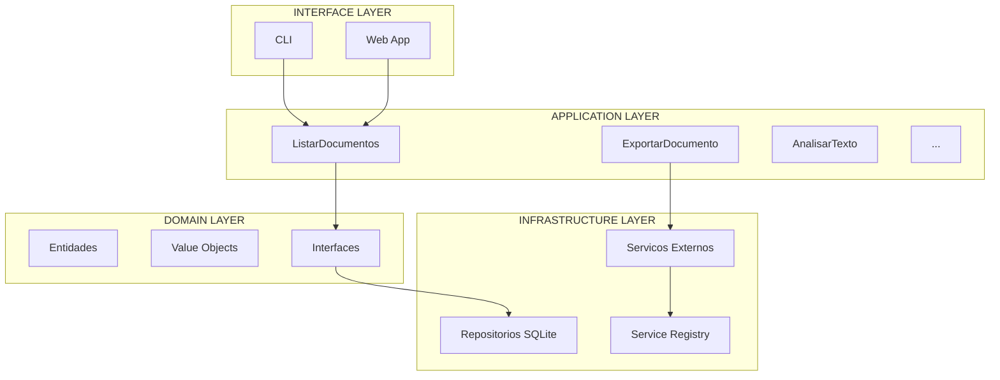
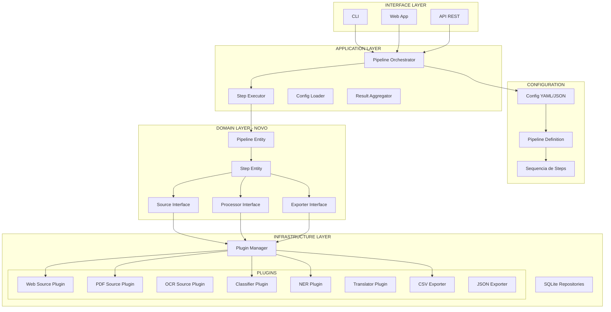

# Analise Arquitetural da Transicao para a Engine

## Objetivo

Este documento preserva uma analise arquitetural intermediaria da transicao do ShowTrials atual para uma engine mais configuravel e extensivel.

Seu papel atual e:

- registrar a tensao entre preservacao da arquitetura existente e ampliacao de escopo;
- explicitar por que a arquitetura atual era forte;
- mostrar uma formulacao de transicao anterior ao direcionamento MVP consolidado;
- servir como ponte historico-analitica entre visao ampla, roadmap e direcionamento arquitetural.

## Contexto Historico

Esta analise foi produzida em um momento em que o projeto ainda elaborava, com mais liberdade, como transformar uma aplicacao especifica em uma plataforma mais ampla.

Por isso, o documento ocupa uma posicao intermediaria:

- mais concreto do que a visao ampla do projeto;
- menos consolidado do que o direcionamento arquitetural do MVP;
- mais exploratorio do que normativo.

Hoje ele deve ser lido como documento de transicao arquitetural, e nao como desenho final da engine.

## Pontos Fortes da Arquitetura Atual

O nucleo da analise continua valido ao reconhecer que a arquitetura atual do projeto possui pontos fortes reais:

- separacao em camadas;
- dependencia invertida;
- dominio relativamente puro;
- testabilidade;
- uso de `ServiceRegistry`;
- responsabilidades relativamente bem separadas.


```mermaid
graph TD
    subgraph "INTERFACE LAYER"
        CLI[CLI]
        WEB[Web App]
    end

    subgraph "APPLICATION LAYER"
        UC1[ListarDocumentos]
        UC2[ExportarDocumento]
        UC3[AnalisarTexto]
        UC[...]
    end

    subgraph "DOMAIN LAYER"
        ENT[Entidades]
        VO[Value Objects]
        INT[Interfaces]
    end

    subgraph "INFRASTRUCTURE LAYER"
        REP[Repositorios SQLite]
        EXT[Servicos Externos]
        REG[Service Registry]
    end

    CLI --> UC1
    WEB --> UC1
    UC1 --> INT
    INT --> REP
    UC2 --> EXT
    EXT --> REG
```

O ponto central preservado aqui e:

- a evolucao arquitetural precisa preservar esses ganhos, e nao destruí-los em nome de uma generalizacao apressada.

## Tensao Arquitetural da Evolucao

O documento continua util ao explicitar a mudanca de eixo:

### Sistema atual

```text
Fonte: fixa
Processadores: fixos
Entidades: fortemente ligadas ao dominio atual
Pipeline: implicito e orientado a casos de uso especificos
```

### Estrutura futura imaginada

```text
Fonte: configuravel
Processadores: selecionaveis
Entidades: mais genericas
Pipeline: configuravel e explicitamente definido
```

Essa tensao continua sendo uma boa forma de ler a transicao:

- preservar o valor do sistema atual;
- sem impedir a abertura para uma engine mais geral.

## Estrutura de Transicao Proposta

Como analise de transicao, o documento preserva uma proposta de arquitetura mais extensivel:


```mermaid
graph TD
    subgraph "CONFIGURATION"
        Config[Config YAML/JSON] --> PipelineDef[Pipeline Definition]
        PipelineDef --> Steps[Sequencia de Steps]
    end

    subgraph "INTERFACE LAYER"
        CLI[CLI]
        WEB[Web App]
        API[API REST]
    end

    subgraph "APPLICATION LAYER"
        Orchestrator[Pipeline Orchestrator]
        UC1[Step Executor]
        UC2[Config Loader]
        UC3[Result Aggregator]
    end

    subgraph "DOMAIN LAYER - NOVO"
        Pipeline[Pipeline Entity]
        Step[Step Entity]
        Source[Source Interface]
        Processor[Processor Interface]
        Exporter[Exporter Interface]
    end

    subgraph "INFRASTRUCTURE LAYER"
        SQLite[SQLite Repositories]
        PluginManager[Plugin Manager]

        subgraph "PLUGINS"
            WebSource[Web Source Plugin]
            PDFSource[PDF Source Plugin]
            OCRSource[OCR Source Plugin]

            Classifier[Classifier Plugin]
            NER[NER Plugin]
            Translator[Translator Plugin]

            CSVExporter[CSV Exporter]
            JSONExporter[JSON Exporter]
        end
    end

    CLI --> Orchestrator
    WEB --> Orchestrator
    API --> Orchestrator

    Orchestrator --> UC1
    Orchestrator --> Config

    UC1 --> Pipeline
    Pipeline --> Step
    Step --> Source
    Step --> Processor
    Step --> Exporter

    Source --> PluginManager
    Processor --> PluginManager
    Exporter --> PluginManager

    PluginManager --> WebSource
    PluginManager --> PDFSource
    PluginManager --> Classifier
    PluginManager --> NER
    PluginManager --> CSVExporter
```

Hoje, essa proposta deve ser lida com cautela:

- ela preserva uma intuicao importante sobre modularidade;
- mas ainda usa terminologia e decomposicoes mais amplas do que o direcionamento MVP consolidado depois;
- portanto, ela funciona melhor como analise de transicao do que como arquitetura final.

## Limites de Leitura no Estado Atual

Este documento nao deve ser lido como:

- direcionamento arquitetural vivo mais forte do projeto;
- desenho final da engine;
- backlog tecnico ativo;
- prova de que a estrutura acima ja foi materializada.

A leitura mais forte do estado atual e da intencao tecnica imediata deve ser feita em conjunto com:

- [direcionamento_arquitetural_engine_mvp.md](../projeto/direcionamento_arquitetural_engine_mvp.md)
- [roadmap_arquitetural.md](../projeto/roadmap_arquitetural.md)
- [visao_do_projeto.md](../projeto/visao_do_projeto.md)
- [49_conferencia_de_aderencia_ao_projeto_real.md](../modelagem/revisao/49_conferencia_de_aderencia_ao_projeto_real.md)

## Documentos Relacionados

- [visao_do_projeto.md](../projeto/visao_do_projeto.md)
- [roadmap_arquitetural.md](../projeto/roadmap_arquitetural.md)
- [direcionamento_arquitetural_engine_mvp.md](../projeto/direcionamento_arquitetural_engine_mvp.md)
- [20_decisoes_arquiteturais_iniciais.md](../modelagem/arquitetura/ponte/20_decisoes_arquiteturais_iniciais.md)
- [49_conferencia_de_aderencia_ao_projeto_real.md](../modelagem/revisao/49_conferencia_de_aderencia_ao_projeto_real.md)
