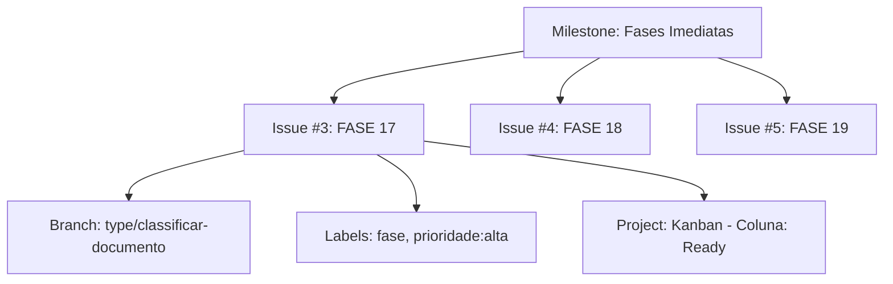
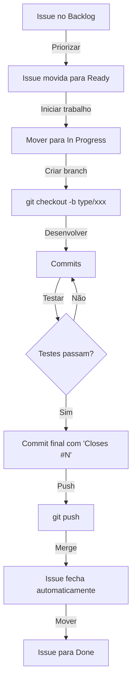
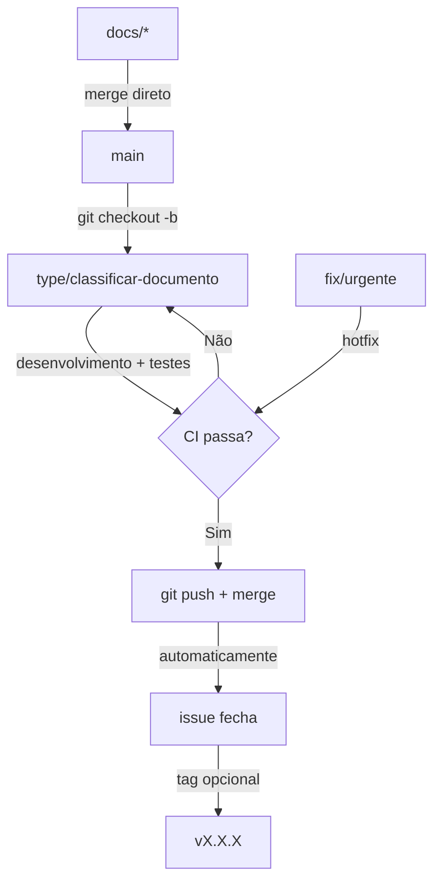

## 📚 **MANUAL COMPLETO - GESTÃO DO PROJETO SHOWTRIALS**

<div align="center">

**Todos os comandos para gerenciar issues, milestones, projects e branches pelo terminal**

</div>

---

## 📋 **ÍNDICE**
1. [Filosofia do Fluxo de Trabalho](#filosofia-do-fluxo-de-trabalho)
2. [Conceitos Fundamentais](#conceitos-fundamentais)
3. [Issues](#issues)
4. [Milestones](#milestones)
5. [Projects](#projects)
6. [Labels](#labels)
7. [Branches e Commits](#branches-e-commits)
8. [Workflows Diários](#workflows-diários)
9. [Checklists Rápidos](#checklists-rápidos)

---

## 🎯 **FILOSOFIA DO FLUXO DE TRABALHO** {#filosofia-do-fluxo-de-trabalho}

### **Por que usar Projects + Milestones + Kanban?**

Antes de mergulhar nos comandos, é importante entender **por que** escolhemos essa estrutura e como ela se alinha com nosso jeito de trabalhar.

### **O Problema que Resolvemos**

| Antes | Depois |
|-------|--------|
| ❌ Fases espalhadas na cabeça | ✅ Tudo documentado em issues |
| ❌ Sem noção de prioridade | ✅ Labels: alta/média/baixa |
| ❌ Prazos perdidos | ✅ Milestones com datas |
| ❌ Progresso invisível | ✅ Kanban visual |
| ❌ Commits sem contexto | ✅ Commits linkados às issues |
| ❌ Dificuldade de planejar | ✅ Roadmap claro |

### **Nossa Filosofia: "Commits Atômicos por Funcionalidade"**

Como você já pratica, cada branch `type/*` representa uma unidade de trabalho completa:
- ✅ Adiciona telemetria
- ✅ Cria testes de lógica
- ✅ Cria testes de telemetria
- ✅ Corrige MyPy
- ✅ Aumenta cobertura

Agora, com o GitHub Projects, cada **issue** no Kanban representa exatamente uma dessas branches.

---

## 📊 **CONCEITOS FUNDAMENTAIS** {#conceitos-fundamentais}

### **O que é cada coisa e para que serve**

| Ferramenta | O que é | Para que serve |
|------------|---------|----------------|
| **Issue** | Uma tarefa individual | Representa uma fase do projeto (ex: FASE 17) |
| **Label** | Categoria/etiqueta | Classifica por tipo, prioridade, área |
| **Milestone** | Um marco com prazo | Agrupa issues por período (Semanas 1-2, 3-4, etc.) |
| **Project** | Um quadro Kanban | Visualiza o fluxo de trabalho (Backlog → In Progress → Done) |
| **Branch** | Uma linha do tempo no Git | Onde o código é desenvolvido |

### **Como eles se relacionam**



### **Nosso Fluxo (O Ciclo de Vida de uma Fase)**

```
📋 BACKLOG → ✅ READY → ⏳ IN PROGRESS → 👀 IN REVIEW → ✅ DONE
     ↓            ↓              ↓               ↓             ↓
   Planejado   Pronto para   Desenvolvendo    Aguardando    Concluído
                começar                       merge
```

---

## 1️⃣ **ISSUES** {#issues}

### **Criar uma nova issue (fase)**

```bash
# Template completo - use sempre este padrão
gh issue create --title "FASE 17: classificar_documento.py" \
  --body "## 🎯 Objetivo
Aumentar cobertura de 65% para 85%

## 📊 Métricas Atuais
- **Cobertura:** 65%
- **Linhas não cobertas:** 18
- **Telemetria:** ❌ Ausente
- **MyPy:** ✅ OK

## 📋 Tarefas
- [ ] Adicionar padrão de telemetria
- [ ] Expandir testes existentes
- [ ] Criar testes de telemetria
- [ ] Verificar cobertura final

## ⏱️ Estimativa: 2-3 horas" \
  --label "fase,tipo/testes,prioridade:alta" \
  --milestone "Fases Imediatas (Semanas 1-2)"
```

### **Listar issues**

```bash
# Todas as issues abertas
gh issue list

# Todas (abertas e fechadas)
gh issue list --state all

# Filtrar por milestone
gh issue list --milestone "Fases Imediatas (Semanas 1-2)"

# Filtrar por label
gh issue list --label "prioridade:alta"
gh issue list --label "fase"

# Filtrar por quem está trabalhando
gh issue list --assignee "rib-thiago"

# Limitar quantidade (padrão 30)
gh issue list --limit 50
```

### **Ver detalhes de uma issue**

```bash
# Visão básica
gh issue view 3

# Com comentários
gh issue view 3 --comments

# Em formato JSON (para scripts)
gh issue view 3 --json number,title,labels,milestone
```

### **Editar uma issue**

```bash
# Adicionar labels
gh issue edit 3 --add-label "prioridade:alta"

# Remover labels
gh issue edit 3 --remove-label "prioridade:media"

# Mudar milestone
gh issue edit 3 --milestone "Fases Imediatas (Semanas 1-2)"

# Mudar título
gh issue edit 3 --title "FASE 17: classificar_documento.py (atualizado)"

# Atribuir a alguém
gh issue edit 3 --add-assignee "rib-thiago"

# Múltiplas alterações de uma vez
gh issue edit 3 --add-label "urgente" --milestone "Fases Imediatas"
```

### **Fechar e reabrir issues**

```bash
# Fechar manualmente
gh issue close 3

# Fechar com comentário
gh issue close 3 --comment "Resolvido, cobertura atingiu 85%"

# Reabrir (se necessário)
gh issue reopen 3
```

### **Comentar em issues**

```bash
# Adicionar comentário
gh issue comment 3 --body "Iniciando desenvolvimento hoje"

# Comentar e fechar (combinação útil)
gh issue comment 3 --body "Finalizado!" && gh issue close 3
```

---

## 2️⃣ **MILESTONES** {#milestones}

### **Por que usamos milestones?**

Milestones agrupam issues por **período de entrega**. Isso nos ajuda a:
- 📅 Manter o foco no que precisa ser feito agora
- 🎯 Visualizar o progresso em direção a um objetivo
- ⏱️ Estimar se estamos no prazo

Nossos milestones:
- **Fases Imediatas (Semanas 1-2)** - O que estamos fazendo AGORA
- **Melhorias (Semanas 3-4)** - Próximo bloco
- **Inovação (Semanas 5-6)** - Futuro
- **Documentação (Contínuo)** - Tarefas contínuas

### **Ver milestones (via site)**
```bash
# Abrir no navegador (milestones não têm CLI)
open https://github.com/rib-thiago/showtrials-tcc/milestones
```

### **Listar issues de um milestone**
```bash
gh issue list --milestone "Fases Imediatas (Semanas 1-2)"
```

### **Ver progresso do milestone**
```bash
# Pelo site
open https://github.com/rib-thiago/showtrials-tcc/milestones

# Percentual de conclusão aparece como barra de progresso
```

---

## 3️⃣ **PROJECTS** {#projects}

### **Por que usamos Kanban?**

O Kanban nos dá **visibilidade do fluxo**:
- 📋 **Backlog**: Ideias que não vamos fazer agora
- ✅ **Ready**: Próximas tarefas priorizadas
- ⏳ **In Progress**: O que está sendo feito
- 👀 **In Review**: Aguardando validação
- ✅ **Done**: Concluído

Isso responde a perguntas como:
- "O que está travado?" → olhe In Progress há muito tempo
- "O que vem depois?" → olhe Ready
- "O que já fizemos?" → olhe Done

### **Comandos para Projects**

```bash
# Listar seus projects
gh project list --owner rib-thiago
# Saída esperada: ID e título do project

# Ver detalhes do project (visão geral)
gh project view 1 --owner rib-thiago

# Ver itens do project (issues)
gh project item-list 1 --owner rib-thiago
```

### **Adicionar issue ao project**
```bash
# Formato: gh project item-add <issue-number> --owner <owner> --url <issue-url>
gh project item-add 3 --owner rib-thiago --url https://github.com/rib-thiago/showtrials-tcc/issues/3
```

### **Mover issue entre colunas (recomendo fazer pelo site)**

```bash
# Se você INSISTIR em fazer pelo terminal (mais complexo):

# PASSO 1: Pegar o ID do item (difícil de achar)
gh project item-list 1 --owner rib-thiago --format json

# PASSO 2: Usar o ID para mover
gh project item-edit --id <ITEM-ID> --field "Status" --value "In Progress"
```

### **Abrir project no navegador (recomendado)**
```bash
open https://github.com/users/rib-thiago/projects/1
```

---

## 4️⃣ **LABELS** {#labels}

### **Por que usamos labels?**

Labels categorizam as issues para:
- 🔴 **prioridade:alta** → O que fazer primeiro
- 🟡 **prioridade:media** → Importante, mas não urgente
- 🟢 **prioridade:baixa** → Quando sobrar tempo
- 🏷️ **fase** → É uma fase do projeto
- 🧪 **tipo/testes** → Relacionado a testes
- 🔧 **tipo/qualidade** → Melhoria de código
- 📚 **tipo/documentação** → Documentação
- ⚙️ **tipo/infra** → Infraestrutura/CI
- ✨ **melhoria** → Melhoria de funcionalidade
- 🎨 **ux** → Experiência do usuário

### **Listar todas as labels**
```bash
gh label list
```

### **Criar nova label**
```bash
# Formato: gh label create <nome> --color <cor-hex> --description <descrição>
gh label create "tipo/performance" --color "1d76db" --description "Melhorias de performance"
```

### **Editar label**
```bash
gh label edit "prioridade:alta" --color "b60205" --description "Urgente - fazer agora"
```

### **Deletar label**
```bash
gh label delete "tipo/performance"
```

---

## 5️⃣ **BRANCHES E COMMITS** {#branches-e-commits}

### **Por que o padrão type/*?**

Seguimos o padrão `type/*` porque:
- 🌿 Identifica claramente o tipo de trabalho
- 🔗 Relaciona diretamente com a issue correspondente
- 📚 Histórico organizado e pesquisável
- 🤝 Facilita revisão de código

### **Criar branch para uma fase**

```bash
# Sempre seguir o padrão: type/nome-do-arquivo
git checkout -b type/classificar-documento   # para FASE 17
git checkout -b type/obter-documento         # para FASE 18
git checkout -b type/estatisticas            # para FASE 19
```

### **Commits atômicos (seu padrão)**

```bash
# Commits intermediários (opcionais)
git add .
git commit -m "wip: adiciona estrutura básica de testes para classificar_documento"

# IMPORTANTE: Commit final com fechamento da issue
git add src/application/use_cases/classificar_documento.py
git add src/tests/test_classificar_documento.py
git add src/tests/test_classificar_documento_telemetry.py

git commit -m "feat: adiciona telemetria e testes em classificar_documento.py

- Adiciona padrão de telemetria
- Cria testes de lógica (8) e telemetria (5)
- Cobertura: 65% → 85%

Closes #3"
```

### **Push e merge**

```bash
# Enviar branch
git push origin type/classificar-documento

# Criar Pull Request (opcional, pode mergear direto)
gh pr create --title "FASE 17: classificar_documento.py" \
  --body "Closes #3" \
  --base main

# Ver PRs abertos
gh pr list

# Fazer merge (após aprovação)
gh pr merge 3 --merge
```

### **Ver branches**
```bash
git branch          # locais
git branch -a       # todas (incluindo remotas)
git branch -d type/classificar-documento  # deletar branch local após merge
```

---

## 6️⃣ **WORKFLOWS DIÁRIOS** {#workflows-diários}

### **Fluxo Completo de uma Fase (do início ao fim)**



### **Checklist: Iniciar o dia**
```bash
# 1. Ver o que está em andamento
gh issue list --assignee "@me"

# 2. Ver o que é prioridade
gh issue list --label "prioridade:alta"

# 3. Ver project status
open https://github.com/users/rib-thiago/projects/1

# 4. Ver branch atual
git branch
```

### **Checklist: Iniciar uma nova fase**

```bash
# 1. No site, mover issue de "Ready" para "In Progress"

# 2. Criar branch
git checkout -b type/classificar-documento

# 3. Verificar estado atual do arquivo
ls -la src/application/use_cases/classificar_documento.py
poetry run pytest --cov=src/application/use_cases/classificar_documento.py
poetry run mypy src/application/use_cases/classificar_documento.py
```

### **Checklist: Durante o desenvolvimento**

```bash
# Rodar testes do arquivo específico
poetry run pytest src/tests/test_classificar_documento.py -v

# Rodar MyPy no arquivo
poetry run mypy src/application/use_cases/classificar_documento.py

# Ver cobertura atual
poetry run pytest --cov=src/application/use_cases/classificar_documento.py
```

### **Checklist: Finalizar uma fase**

```bash
# 1. Verificar se tudo está verde
poetry run pytest src/tests/test_classificar_documento.py -v
poetry run mypy src/application/use_cases/classificar_documento.py

# 2. Ver cobertura final
poetry run pytest --cov=src/application/use_cases/classificar_documento.py

# 3. Commit final com "Closes"
git add .
git commit -m "feat: adiciona telemetria e testes em classificar_documento.py

- Adiciona padrão de telemetria
- Cria testes de lógica (8) e telemetria (5)
- Cobertura: 65% → 85%

Closes #3"

# 4. Push
git push origin type/classificar-documento

# 5. Fazer merge (via site ou CLI)
gh pr create --title "FASE 17" --body "Closes #3"
gh pr merge 3 --merge

# 6. No site, mover issue para "Done"

# 7. Deletar branch local (opcional)
git branch -d type/classificar-documento
```

---

## 7️⃣ **CHECKLISTS RÁPIDOS** {#checklists-rápidos}

### **Comandos mais úteis (cola rápida)**

```bash
# Issues
gh issue list                          # listar abertas
gh issue list --state all               # todas
gh issue view 3                         # ver detalhes
gh issue create                          # criar nova
gh issue edit 3 --add-label "fase"       # adicionar label
gh issue close 3                          # fechar

# Projects
gh project list                          # listar
gh project view 1 --owner rib-thiago     # ver
gh project item-add 3 --owner rib-thiago --url https://github.com/.../issues/3

# Labels
gh label list                            # listar
gh label create "tipo/ux" --color "1d76db"

# Milestones (consulta apenas)
gh issue list --milestone "Fases Imediatas"

# Git
git checkout -b type/classificar-documento
git commit -m "feat: ... Closes #3"
git push origin type/classificar-documento
```

### **Labels que usamos**

| Label | Cor | Significado |
|-------|-----|-------------|
| `fase` | 🟣 | É uma fase do projeto |
| `tipo/testes` | 🟢 | Relacionado a testes |
| `tipo/qualidade` | 🔵 | Melhoria de código |
| `tipo/documentação` | 🟤 | Documentação |
| `tipo/infra` | 🔵 | Infraestrutura/CI |
| `melhoria` | 🟡 | Melhoria de funcionalidade |
| `ux` | ⚪ | Experiência do usuário |
| `prioridade:alta` | 🔴 | Fazer agora |
| `prioridade:media` | 🟡 | Fazer em breve |
| `prioridade:baixa` | 🟢 | Quando sobrar tempo |

---

## 🎯 **EXEMPLO PRÁTICO: FASE 17 (classificar_documento.py)**

```bash
# 1. Ver issue #3
gh issue view 3

# 2. No site: mover issue #3 de "Ready" para "In Progress"

# 3. Criar branch
git checkout -b type/classificar-documento

# 4. Desenvolver (editar arquivos, criar testes)...

# 5. Testar
poetry run pytest src/tests/test_classificar_documento.py -v

# 6. Verificar MyPy
poetry run mypy src/application/use_cases/classificar_documento.py

# 7. Ver cobertura
poetry run pytest --cov=src/application/use_cases/classificar_documento.py

# 8. Commit final
git add src/application/use_cases/classificar_documento.py
git add src/tests/test_classificar_documento.py
git add src/tests/test_classificar_documento_telemetry.py

git commit -m "feat: adiciona telemetria e testes em classificar_documento.py

- Adiciona padrão de telemetria
- Cria testes de lógica (8) e telemetria (5)
- Cobertura: 65% → 85%

Closes #3"

# 9. Push
git push origin type/classificar-documento

# 10. Fazer merge (via site)

# 11. No site: mover issue #3 para "Done"

# 12. Ver progresso
gh issue list --milestone "Fases Imediatas (Semanas 1-2)"
```

---

## 📊 **RESUMO DO FLUXO (VISUAL)**

```
📋 BACKLOG → ✅ READY → ⏳ IN PROGRESS → 👀 IN REVIEW → ✅ DONE
     │           │            │               │             │
     │           │            │               │             │
     ▼           ▼            ▼               ▼             ▼
  Planejado   Pronto para   git checkout   gh pr create   Merge +
              começar       desenvolvimento                Close issue
```

---

## 🏆 **POR QUE ESSE FLUXO FUNCIONA PARA NÓS**

1. **Alinhado com seu padrão**: Cada issue = uma branch `type/*`
2. **Visibilidade**: Sabemos exatamente o que está acontecendo
3. **Priorização**: Labels e milestones mostram o que é importante
4. **Rastreabilidade**: Commits linkados às issues
5. **Progresso mensurável**: Cobertura sobe, issues fecham
6. **Documentação viva**: O histórico do projeto está todo documentado

**Agora sim, manual completo!** 🚀

---

## 🎯 **ANÁLISE: GIT FLOW PARA O SHOWTRIALS**

Thiago, excelente pergunta! Com base em tudo que construímos, vamos analisar se faz sentido e qual modelo se adequaria.

---

## 📊 **NOSSO CENÁRIO ATUAL**

### **O que já temos funcionando:**

| Aspecto | Como fazemos hoje |
|---------|-------------------|
| **Branches de features** | `type/*` (ex: `type/analisar-texto`) |
| **Branches de correção** | `fix/*` (ex: `fix/tipo-documento-keyerror`) |
| **Branches de documentação** | `docs/*` (ex: `docs/organizacao`) |
| **Branch principal** | `main` (protegida, CI obrigatório) |
| **CI** | GitHub Actions rodando em cada push |
| **Taskipy** | Automação local (`task test`, `task lint`, etc.) |
| **Issues** | Cada fase vira uma issue |
| **Milestones** | Agrupam issues por período |
| **Kanban** | Visualiza o fluxo |

### **O que falta:**

- ❌ **Padrão para versões** (tags, releases)
- ❌ **Branch de desenvolvimento** (develop) - usamos main direto
- ❌ **Política de merges** (quem, quando, como)
- ❌ **Estratégia para hotfixes** (correções urgentes em produção)
- ❌ **Versionamento semântico** (v0.2.0, v1.0.0, etc.)

---

## 🔄 **OPÇÕES DE GIT FLOW**

### **Opção 1: Git Flow Clássico**

```
main (produção)
  ↑
  └── develop (integração)
        ↑
        ├── feature/type-*   (novas funcionalidades)
        ├── fix/*            (correções)
        ├── release/*        (preparação para versão)
        └── hotfix/*         (correções urgentes na main)
```

**Prós:**
- ✅ Muito organizado
- ✅ Separa desenvolvimento de produção
- ✅ Ideal para equipes grandes
- ✅ Hotfixes isolados

**Contras:**
- ❌ Complexo para um projeto solo
- ❌ Muitos branches para gerenciar
- ❌ Overhead de merges constantes

**Para nós:** Provavelmente **exagerado** para um TCC.

---

### **Opção 2: GitHub Flow (simplificado)**

```
main (sempre pronta para deploy)
  ↑
  └── type/* (features)
  └── fix/*  (correções)
  └── docs/* (documentação)
```

**Prós:**
- ✅ Simples e direto
- ✅ Já usamos 90% disso
- ✅ CI obrigatório protege a main
- ✅ Ideal para projetos com deploy contínuo

**Contras:**
- ❌ Sem branch de desenvolvimento separada
- ❌ Menos controle sobre versões

**Para nós:** Já usamos! Só falta formalizar.

---

### **Opção 3: Trunk-based Development**

```
main (todos commitam direto)
  ↑
  └── branches curtas (horas/dias)
```

**Prós:**
- ✅ Máxima simplicidade
- ✅ Ideal para times muito maduros
- ✅ CI extremamente rigoroso

**Contras:**
- ❌ Perigoso para projetos acadêmicos
- ❌ Exige testes impecáveis
- ❌ Sem histórico de features

**Para nós:** Arriscado demais.

---

## 🏆 **RECOMENDAÇÃO: GitHub Flow Adaptado**



### **Nossa adaptação:**

| Branch | Origem | Destino | CI obrigatório? | Quando usar |
|--------|--------|---------|-----------------|-------------|
| `type/*` | `main` | `main` | ✅ | Novas funcionalidades (fases) |
| `fix/*` | `main` | `main` | ✅ | Correções de bugs |
| `docs/*` | `main` | `main` | ⚠️ (só lint) | Documentação pura |

---

## 📋 **PROPOSTA DE GIT FLOW COMPLETO PARA O PROJETO**

### **1. Estrutura de Branches**

```
main
├── type/analisar-texto
├── type/exportar-documento
├── type/gerar-relatorio
├── fix/tipo-documento-keyerror
├── docs/atualizar-readme
└── [tags] v0.1.0, v0.2.0, v1.0.0
```

### **2. Nomenclatura Padronizada**

| Tipo | Padrão | Exemplo |
|------|--------|---------|
| **Nova fase** | `type/[nome-arquivo]` | `type/classificar-documento` |
| **Correção** | `fix/[descricao]` | `fix/tipo-documento-keyerror` |
| **Documentação** | `docs/[descricao]` | `docs/atualizar-readme` |
| **Melhoria** | `feat/[descricao]` | `feat/modo-escuro-cli` |
| **Infra/CI** | `chore/[descricao]` | `chore/atualizar-dependencias` |

### **3. Política de Merges**

```bash
# 1. Branch deve estar atualizada com main
git checkout main
git pull origin main
git checkout type/classificar-documento
git rebase main  # ou git merge main

# 2. Rodar tudo localmente
task check  # lint + mypy + testes
task test-cov  # cobertura

# 3. Push
git push origin type/classificar-documento

# 4. CI deve passar (obrigatório)
# 5. Merge (pode ser direto, sem PR se quiser)
```

### **4. Versionamento Semântico**

```bash
# Versão atual: v0.2.0
# v0.3.0: quando concluir mais algumas fases
# v1.0.0: quando TCC for entregue

# Criar tag
git tag -a v0.3.0 -m "Versão 0.3.0 - Adiciona telemetria em 3 casos de uso"
git push origin v0.3.0

# Criar release no GitHub
gh release create v0.3.0 --title "v0.3.0" --notes "### Adicionado\n- Telemetria em exportar_documento\n- Telemetria em gerar_relatorio\n- Telemetria em listar_documentos"
```

### **5. Fluxo para Hotfix (correção urgente)**

```bash
# Se algo quebrar na main
git checkout -b fix/urgente
# corrige
git commit -m "fix: corrige erro crítico no exportar_documento

Closes #9"
git push origin fix/urgente
# merge direto (CI obrigatório)
git tag -a v0.2.1 -m "Hotfix: correção crítica"
```

---

## ✅ **TAREFAS PARA IMPLEMENTAR**

### **1. Proteger a branch `main` no GitHub**
- [ ] Settings → Branches → Add rule
- [ ] Require status checks to pass before merging
- [ ] Require branches to be up to date

### **2. Adicionar script de release no Taskipy**

No `pyproject.toml`:
```toml
[tool.taskipy.tasks]
# ... existentes ...

release = "python scripts/criar_release.py"
tag = "git tag -a v${VERSION} -m 'Versão ${VERSION}' && git push origin v${VERSION}"
```

Criar `scripts/criar_release.py`:
```python
#!/usr/bin/env python
"""Script para criar release automaticamente."""
import subprocess
from datetime import datetime

# Pega última tag
last_tag = subprocess.getoutput("git describe --tags --abbrev=0 2>/dev/null || echo 'v0.0.0'")
print(f"Última tag: {last_tag}")

# Sugere próxima versão (v0.2.0 → v0.3.0)
major, minor, patch = last_tag[1:].split('.')
next_version = f"v{major}.{int(minor)+1}.0"

print(f"Sugestão: {next_version}")
version = input("Versão (ou Enter para sugestão): ") or next_version

# Coleta notas de release
print("\nIssues fechadas desde a última tag:")
subprocess.run(f"git log {last_tag}..HEAD --oneline | grep -i 'closes'", shell=True)

notes = input("\nNotas da release (descrição): ")

# Cria tag
subprocess.run(f"git tag -a {version} -m '{notes}'", shell=True)
subprocess.run(f"git push origin {version}", shell=True)

# Cria release no GitHub
subprocess.run(f"gh release create {version} --title '{version}' --notes '{notes}'", shell=True)
```

### **3. Atualizar template de issue**

Adicionar campo de versão:
```markdown
## 📦 Versão
Quando concluída, esta fase fará parte da versão: **v0.3.0**
```

---

## 📊 **RESUMO: NOSSO GIT FLOW**

| Aspecto | Como será |
|---------|-----------|
| **Branch principal** | `main` (protegida) |
| **Branches de desenvolvimento** | `type/*`, `fix/*`, `feat/*`, `docs/*`, `chore/*` |
| **CI obrigatório** | ✅ Sempre |
| **Merges** | Diretos (após CI passar) |
| **Versões** | Tags semânticas (`v0.3.0`, `v1.0.0`) |
| **Releases** | GitHub Releases com notas |
| **Hotfixes** | `fix/urgente` → main → nova tag |

---

## 🎯 **VALE A PENA DISCUTIR?**

**Sim, absolutamente!** Pelos seguintes motivos:

1. **Já fazemos 80% disso**, só falta formalizar
2. **Versionamento ajuda no TCC** (mostra evolução)
3. **Releases documentam o que foi entregue**
4. **Protege a main** de merges acidentais
5. **Profissionaliza o projeto** (diferencial no TCC)

---

## 📚 **ANÁLISE COMPLETA - FLOWS DO PROJETO**

Thiago, excelente pergunta! Vamos mapear **todos os flows** que temos e identificar o que ainda falta documentar.

---

## 📊 **FLOWS JÁ DOCUMENTADOS**

| Flow | Documento | Status |
|------|-----------|--------|
| **Git Flow** | `GIT_FLOW.md` | ✅ Documentado |
| **Quality Flow** | `QUALITY_FLOW.md` | ✅ Documentado |
| **Issue/Project Flow** | `MANUAL_GESTAO.md` | ✅ Documentado |
| **CI/CD Flow** | Embutido no Git Flow | ⚠️ Parcial |
| **Release Flow** | Embutido no Git Flow | ⚠️ Parcial |

---

## 🔍 **FLOWS AINDA NÃO DOCUMENTADOS (MAS IMPORTANTES)**

### **1. 📦 Dependencies Flow (Gestão de Dependências)**
Como adicionar, atualizar e remover dependências com Poetry + pip.

### **2. 🐛 Debug Flow (Como depurar problemas)**
Estratégia sistemática para identificar e corrigir bugs.

### **3. 📝 Documentation Flow (Como documentar)**
Padrão para documentar código, criar FASEs, atualizar mkdocs.

### **4. 🔄 Telemetry Flow (Como instrumentar)**
Guia para adicionar telemetria em novos arquivos.

### **5. 🧹 Refactoring Flow (Como refatorar com segurança)**
Estratégia para melhorar código sem quebrar nada.

### **6. 🚨 Emergency Flow (Hotfix em produção)**
Como corrigir algo urgente sem atrapalhar o desenvolvimento.

### **7. 📋 Code Review Flow (Como revisar código)**
Checklist para revisão de PRs (mesmo trabalhando sozinho).

---

## 📋 **SUGESTÃO: 7 NOVOS DOCUMENTOS**

Vou detalhar cada um para você escolher por onde quer começar:

---

## 📦 **FLOW 1: DEPENDÊNCIAS**

### **Por que documentar?**
- Temos uma situação híbrida (Poetry + pip)
- Precisamos lembrar do TODO da FASE 11 (migrar NLP para Poetry)
- Evitar esquecer de atualizar o CI quando adicionar dependências

### **Estrutura proposta:**
```markdown
# Dependencies Flow - ShowTrials

## 📦 Gerenciamento com Poetry
- Adicionar dependência: `poetry add requests`
- Adicionar dev dependency: `poetry add --dev pytest`
- Atualizar: `poetry update`
- Remover: `poetry remove requests`

## ⚠️ Dependências Especiais (NLP)
Atualmente instaladas via pip (TODO: migrar para Poetry):
- numpy==1.26.0
- spacy==3.7.5
- textblob, nltk, wordcloud, matplotlib

## 🔄 Quando adicionar uma nova dependência
1. Verificar se pode ser via Poetry
2. Se for NLP, testar antes (histórico de conflitos)
3. Atualizar `pyproject.toml` e `poetry.lock`
4. Atualizar CI se necessário
5. Documentar no CHANGELOG
```

---

## 🐛 **FLOW 2: DEBUG**

### **Por que documentar?**
- Quando algo quebra, temos um método sistemático
- Evita "tentativa e erro" aleatório
- Acelera a resolução de problemas

### **Estrutura proposta:**
```markdown
# Debug Flow - ShowTrials

## 🔍 Estratégia de Debug

### 1. Reproduzir o erro
```bash
# Isolar o problema
poetry run pytest src/tests/test_arquivo.py -v -k "nome_do_teste"
```

### 2. Verificar logs
```bash
# Aumentar verbosidade
poetry run pytest -vv --log-cli-level=DEBUG
```

### 3. Usar pdb (debugger interativo)
```python
import pdb; pdb.set_trace()  # Python < 3.7
breakpoint()  # Python 3.7+
```

### 4. Verificar estado do banco
```bash
sqlite3 data/showtrials.db "SELECT * FROM documentos LIMIT 5;"
```

### 5. Verificar telemetria
```python
from src.infrastructure.telemetry import telemetry
print(telemetry._counters)  # Ver contadores atuais
```

### 6. Checklist de causas comuns
- [ ] Mock incompleto (faltou atributo `texto`?)
- [ ] Tipo errado (string vs datetime?)
- [ ] Import circular
- [ ] Banco não migrado
```

---

## 📝 **FLOW 3: DOCUMENTAÇÃO**

### **Por que documentar?**
- Temos um padrão rico (FASE*.md)
- Precisamos garantir consistência
- Evitar documentação duplicada

### **Estrutura proposta:**
```markdown
# Documentation Flow - ShowTrials

## 📚 Tipos de Documentação

### 1. Fases do Projeto (FASE*.md)
- Local: `docs/`
- Template: seguir FASE 16 como exemplo
- Quando criar: ao finalizar cada branch `type/*`

### 2. Docstrings no código
```python
def funcao(param: str) -> int:
    """
    Descrição clara do que faz.

    Args:
        param: Descrição do parâmetro

    Returns:
        Descrição do retorno

    Raises:
        ValueError: quando algo dá errado
    """
```

### 3. README.md
- Mantenha badges atualizados
- Exemplo de instalação/uso
- Links para docs

### 4. MkDocs (site)
```bash
task docs  # serve localmente
mkdocs gh-deploy  # publica no GitHub Pages
```

### 5. CHANGELOG.md
- Atualize a cada release
- Siga [Keep a Changelog](https://keepachangelog.com/)
```

---

## 🔄 **FLOW 4: TELEMETRIA**

### **Por que documentar?**
- É nosso padrão mais repetido
- Precisamos garantir que novos arquivos sigam o mesmo padrão
- Evitar esquecer contadores importantes

### **Estrutura proposta:**
```markdown
# Telemetry Flow - ShowTrials

## 🎯 Padrão de Telemetria

### 1. No início do arquivo
```python
# Telemetria opcional
_telemetry = None

def configure_telemetry(telemetry_instance=None):
    """Configura telemetria para este módulo (usado apenas em testes)."""
    global _telemetry
    _telemetry = telemetry_instance
```

### 2. Em cada método público
```python
def executar(self, ...):
    if _telemetry:
        _telemetry.increment("modulo.metodo.iniciado")

    # ... lógica ...

    if _telemetry:
        _telemetry.increment("modulo.metodo.concluido")
```

### 3. Contadores obrigatórios
- [ ] `iniciado` - no começo do método
- [ ] `concluido` - no final bem-sucedido
- [ ] `erro.tipo` - para cada erro tratado
- [ ] `caracteres` - quando processar texto (opcional)

### 4. Testes de telemetria
Sempre criar `test_*_telemetry.py` com:
- [ ] Teste de sucesso (verifica contadores)
- [ ] Teste de erro (verifica contadores de erro)
- [ ] Teste sem telemetria (garante fallback)
```

---

## 🧹 **FLOW 5: REFATORAÇÃO**

### **Por que documentar?**
- Refatorar sem quebrar é uma arte
- Precisamos de segurança (testes)
- Evitar "refatorar e esquecer de testar"

### **Estrutura proposta:**
```markdown
# Refactoring Flow - ShowTrials

## 🎯 Quando refatorar
- Código duplicado (DRY)
- Método muito longo (>50 linhas)
- Complexidade ciclomática alta
- Antes de adicionar nova funcionalidade

## 🔒 Regra de Ouro
**NUNCA refatore e adicione funcionalidade no mesmo commit.**

## 📋 Passo a Passo Seguro

### 1. Verificar cobertura atual
```bash
task cov-file --path src/application/use_cases/alvo.py
```
Se <80%, crie testes ANTES de refatorar.

### 2. Criar branch
```bash
git checkout -b refactor/descricao
```

### 3. Fazer uma mudança por vez
- Renomear variável
- Extrair método
- Mover função

### 4. Testar a cada mudança
```bash
task test-file --path src/tests/test_alvo.py
```

### 5. Commit por mudança atômica
```bash
git commit -m "refactor: extrai método _calcular_total em classificar_documento"
```

### 6. Ao final, verificar se tudo passou
```bash
task check
task test-cov  # cobertura não deve cair
```

### 7. CI e merge
```bash
git push origin refactor/descricao
# (CI deve passar)
```
```

---

## 🚨 **FLOW 6: EMERGÊNCIA (HOTFIX)**

### **Por que documentar?**
- Situações de estresse exigem procedimentos claros
- Evitar piorar o problema
- Garantir que a correção não introduza novos bugs

### **Estrutura proposta:**
```markdown
# Emergency Flow - ShowTrials

## 🚨 Quando usar
- Bug crítico em produção (main)
- Funcionalidade principal quebrada
- Dados corrompidos

## 📋 Procedimento de Hotfix

### 1. Criar branch de hotfix
```bash
git checkout main
git pull origin main
git checkout -b fix/urgente-descricao
```

### 2. Corrigir o mínimo necessário
- Apenas o necessário para resolver o problema
- NADA de refatoração
- NADA de novas funcionalidades

### 3. Testar exaustivamente
```bash
task test-file --path src/tests/test_afetado.py
task test  # todos os testes (se possível)
```

### 4. Commit e push
```bash
git add .
git commit -m "fix: corrige erro crítico no exportar_documento

- [descrição técnica do problema]
- [solução aplicada]

Closes #NUMERO_DA_ISSUE"
git push origin fix/urgente-descricao
```

### 5. Merge direto (CI obrigatório)
```bash
git checkout main
git merge --ff-only fix/urgente-descricao
git push origin main
```

### 6. Criar nova versão (patch)
```bash
git tag -a v0.2.1 -m "Hotfix: correção crítica"
git push origin v0.2.1
gh release create v0.2.1 --title "v0.2.1" --notes "Correção emergencial"
```

### 7. Comunicar
- Atualizar issue
- Comentar no Kanban
- (Opcional) atualizar documentação
```

---

## 📋 **FLOW 7: CODE REVIEW (AUTO-REVIEW)**

### **Por que documentar?**
- Mesmo trabalhando sozinho, revisar é importante
- Checklist evita esquecimentos
- Garante consistência

### **Estrutura proposta:**
```markdown
# Code Review Flow - ShowTrials

## ✅ Checklist de Auto-Review

### Antes de abrir o PR (ou fazer merge)

#### 📁 Código
- [ ] Seguiu o padrão de nomenclatura (`type/*`)
- [ ] Adicionou telemetria nos métodos públicos
- [ ] Removeu código comentado
- [ ] Removeu prints de debug
- [ ] Nomes de variáveis são claros
- [ ] Funções/métodos são pequenos (<50 linhas)

#### 🧪 Testes
- [ ] Criou `test_*.py` para lógica
- [ ] Criou `test_*_telemetry.py` para telemetria
- [ ] Testes passam localmente
- [ ] Cobertura do arquivo >=85%
- [ ] Testou casos de erro (except)

#### 🔤 Type Hints
- [ ] Todos os parâmetros têm tipo
- [ ] Retornos têm tipo
- [ ] MyPy passa no arquivo (0 erros)

#### 📚 Documentação
- [ ] Docstrings em métodos públicos
- [ ] Atualizou CHANGELOG.md (se relevante)
- [ ] Atualizou FASE*.md (se nova fase)

#### 🔧 Qualidade
- [ ] `task lint` passa (0 erros)
- [ ] `task check` passa
- [ ] CI verde

### Depois do merge
- [ ] Issue fechou automaticamente?
- [ ] Moveu no Kanban para "Done"
- [ ] Verificou cobertura global não caiu
```

---

## 📊 **RESUMO DOS FLOWS**

| Flow | Prioridade | Complexidade | Status |
|------|------------|--------------|--------|
| **Git Flow** | Alta | Média | ✅ Documentado |
| **Quality Flow** | Alta | Média | ✅ Documentado |
| **Dependencies Flow** | Média | Baixa | ⏳ Pendente |
| **Debug Flow** | Média | Média | ⏳ Pendente |
| **Documentation Flow** | Média | Baixa | ⏳ Pendente |
| **Telemetry Flow** | Alta | Baixa | ⏳ Pendente |
| **Refactoring Flow** | Baixa | Média | ⏳ Pendente |
| **Emergency Flow** | Baixa | Baixa | ⏳ Pendente |
| **Code Review Flow** | Alta | Baixa | ⏳ Pendente |

---

## 🎯 **RECOMENDAÇÃO DE PRIORIDADE**

### **Fazer agora (prioridade alta)**
1. **Telemetry Flow** - É nosso padrão mais usado
2. **Code Review Flow** - Garante consistência
3. **Dependencies Flow** - Evita problemas com NLP

### **Fazer em breve (prioridade média)**
4. **Debug Flow** - Útil quando algo quebra
5. **Documentation Flow** - Mantém docs organizados

### **Fazer quando sobrar tempo (prioridade baixa)**
6. **Refactoring Flow** - Para melhorias futuras
7. **Emergency Flow** - Espero nunca precisar

---

## 📋 **PRÓXIMO PASSO**

Qual desses flows você quer que eu documente primeiro? 🎯
