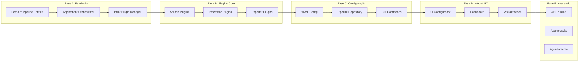
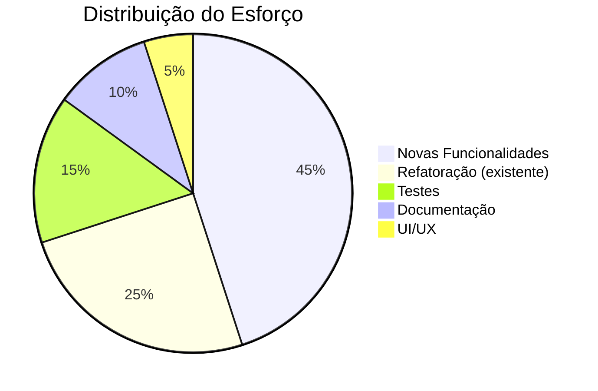

## 📚 **DOCUMENTO: ROADMAP ARQUITETURAL - SHOWTRIALS COMO PLATAFORMA**

**Milestones, Issues e Backlog para a evolução da arquitetura**

## 📅 **Informações do Documento**

| Item | Descrição |
|------|-----------|
| **Data** | 20 de Fevereiro de 2026 |
| **Autor** | Thiago Ribeiro |
| **Versão** | 1.0 |
| **Baseado em** | Análise arquitetural e visão de plataforma |

---

## 🎯 **VISÃO GERAL DA EVOLUÇÃO ARQUITETURAL**

---

## 📊 **MILESTONE A: FUNDAÇÃO DA ARQUITETURA DE PLUGINS**

*Objetivo: Estabelecer as bases para tornar a aplicação extensível*

**Duração estimada:** 4 semanas
**Dependências:** Nenhuma (começa do zero)

| # | Issue | Tipo | Descrição | Estimativa |
|---|-------|------|-----------|------------|
| **A1** | Criar entidades de domínio para Pipeline | `feat` | Implementar `Pipeline` (entidade) e `PipelineStep` (value object) | 8h |
| **A2** | Definir interfaces de plugins | `feat` | Criar `SourcePlugin`, `ProcessorPlugin`, `ExporterPlugin` no domain | 6h |
| **A3** | Implementar Plugin Manager | `feat` | Service registry especializado para plugins (carregamento, cache) | 10h |
| **A4** | Criar caso de uso `ExecutarPipeline` | `feat` | Orquestrador que executa steps em ordem | 8h |
| **A5** | Adaptar Service Registry existente | `refactor` | Estender registry para suportar plugins | 4h |
| **A6** | Testes de integração do pipeline | `test` | Testar pipeline com steps mockados | 6h |

**Total:** ~42h

---

## 🔧 **MILESTONE B: PLUGINS CORE (ADAPTAÇÃO DO EXISTENTE)**

*Objetivo: Transformar funcionalidades existentes em plugins*

**Duração estimada:** 6 semanas
**Dependências:** Milestone A

### **B.1 - Source Plugins**

| # | Issue | Tipo | Descrição | Estimativa |
|---|-------|------|-----------|------------|
| **B1** | Adaptar Web Scraper existente como plugin | `refactor` | Mover lógica de `coleta.py` para `WebSourcePlugin` | 6h |
| **B2** | Criar Source Plugin para PDF | `feat` | Extrair texto de PDFs (PyPDF2) | 8h |
| **B3** | Criar Source Plugin para pasta local | `feat` | Ler arquivos .txt, .md de diretório | 4h |
| **B4** | Testes para Source Plugins | `test` | Garantir funcionamento de cada fonte | 6h |

**Total B.1:** ~24h

### **B.2 - Processor Plugins**

| # | Issue | Tipo | Descrição | Estimativa |
|---|-------|------|-----------|------------|
| **B5** | Adaptar Classificador como plugin | `refactor` | Mover `classificar_documento.py` para `ClassifierPlugin` | 6h |
| **B6** | Adaptar Extrator de Entidades como plugin | `refactor` | Mover `spacy_analyzer.py` para `NERPlugin` | 6h |
| **B7** | Adaptar Tradutor como plugin | `refactor` | Mover `google_translator.py` para `TranslatorPlugin` | 6h |
| **B8** | Criar Extrator de Entidades genérico | `feat` | Suporte a PERSON, ORG, LOC, DATE (modelos spaCy) | 8h |
| **B9** | Criar plugin de Análise de Sentimento | `feat` | Usar TextBlob para análise | 4h |
| **B10** | Testes para Processor Plugins | `test` | Validar cada processador | 8h |

**Total B.2:** ~38h

### **B.3 - Exporter Plugins**

| # | Issue | Tipo | Descrição | Estimativa |
|---|-------|------|-----------|------------|
| **B11** | Adaptar TXT Exporter como plugin | `refactor` | Mover `exportar_documento.py` para `TxtExporterPlugin` | 4h |
| **B12** | Criar CSV Exporter | `feat` | Exportar documentos para planilha | 6h |
| **B13** | Criar JSON Exporter | `feat` | Exportar dados estruturados | 4h |
| **B14** | Adaptar SQLite Repository como plugin | `refactor` | Persistência como plugin de saída | 8h |
| **B15** | Testes para Exporter Plugins | `test` | Validar cada formato | 6h |

**Total B.3:** ~28h

**Total Milestone B:** ~90h

---

## ⚙️ **MILESTONE C: CONFIGURAÇÃO E PIPELINES**

*Objetivo: Permitir que usuários definam seus próprios pipelines*

**Duração estimada:** 4 semanas
**Dependências:** Milestone B

| # | Issue | Tipo | Descrição | Estimativa |
|---|-------|------|-----------|------------|
| **C1** | Criar loader de configuração YAML | `feat` | Parse de YAML para objeto Pipeline | 8h |
| **C2** | Criar repositório de pipelines | `feat` | Salvar/carregar pipelines no banco | 6h |
| **C3** | Caso de uso `CriarPipeline` | `feat` | Criar pipeline a partir de config | 4h |
| **C4** | Caso de uso `ListarPipelines` | `feat` | Listar pipelines salvos | 2h |
| **C5** | Caso de uso `ExecutarPipelinePorID` | `feat` | Executar pipeline salvo | 4h |
| **C6** | Comandos CLI para pipelines | `feat` | `pipeline run`, `pipeline list`, `pipeline create` | 8h |
| **C7** | Validação de configuração | `feat` | Validar steps e plugins existentes | 4h |
| **C8** | Documentação de configuração YAML | `docs` | Exemplos e schema | 4h |

**Total:** ~40h

---

## 🌐 **MILESTONE D: INTERFACE WEB E UX**

*Objetivo: Facilitar a criação visual de pipelines*

**Duração estimada:** 6 semanas
**Dependências:** Milestone C

| # | Issue | Tipo | Descrição | Estimativa |
|---|-------|------|-----------|------------|
| **D1** | API endpoints para pipelines | `feat` | CRUD de pipelines via REST | 10h |
| **D2** | UI - Lista de pipelines | `feat` | Visualizar pipelines salvos | 6h |
| **D3** | UI - Criar pipeline (formulário) | `feat` | Interface para configurar steps | 12h |
| **D4** | UI - Editor visual drag-and-drop | `feat` | Montar pipeline arrastando blocos | 20h |
| **D5** | UI - Execução e logs | `feat` | Acompanhar execução em tempo real | 8h |
| **D6** | Dashboard de resultados | `feat` | Visualizar estatísticas das execuções | 10h |
| **D7** | Exportar configuração YAML | `feat` | Gerar YAML a partir da UI | 4h |
| **D8** | Importar configuração YAML | `feat` | Carregar YAML na UI | 4h |

**Total:** ~74h

---

## 🚀 **MILESTONE E: RECURSOS AVANÇADOS**

*Objetivo: Expandir capacidades para pesquisadores avançados*

**Duração estimada:** 8 semanas
**Dependências:** Milestone D

| # | Issue | Tipo | Descrição | Estimativa |
|---|-------|------|-----------|------------|
| **E1** | OCR para imagens (Tesseract) | `feat` | Plugin para extrair texto de imagens | 12h |
| **E2** | Plugin de sumarização | `feat` | Resumir documentos longos | 8h |
| **E3** | Plugin de rede de relacionamentos | `feat` | Gerar grafos de co-ocorrência | 12h |
| **E4** | Linha do tempo interativa | `feat` | Visualização temporal dos documentos | 10h |
| **E5** | API pública documentada | `feat` | Swagger/OpenAPI para integração | 8h |
| **E6** | Autenticação e múltiplos usuários | `feat` | Login, perfis, pipelines por usuário | 12h |
| **E7** | Agendamento de execuções | `feat` | Cron jobs para pipelines | 8h |
| **E8** | Notificações (email/webhook) | `feat` | Alertas sobre execuções | 6h |

**Total:** ~76h

---

## 🧪 **MILESTONE T: TESTES E QUALIDADE (CONTÍNUO)**

*Objetivo: Garantir qualidade em todas as camadas*

**Duração:** Paralelo aos outros milestones

| # | Issue | Tipo | Descrição | Estimativa |
|---|-------|------|-----------|------------|
| **T1** | Testes unitários para entidades de pipeline | `test` | Pipeline, PipelineStep | 4h |
| **T2** | Testes de integração para Plugin Manager | `test` | Carregamento e execução de plugins mock | 6h |
| **T3** | Testes para cada plugin implementado | `test` | Cobertura mínima 85% | 20h |
| **T4** | Testes de configuração YAML | `test` | Validação de diferentes formatos | 4h |
| **T5** | Testes de API | `test` | Endpoints de pipeline | 6h |
| **T6** | Testes de UI (se aplicável) | `test` | Playwright/Cypress | 12h |

**Total:** ~52h

---

## 📋 **BACKLOG COMPLETO (TODAS AS ISSUES)**

| Milestone | # Issues | Estimativa total |
|-----------|----------|------------------|
| **A - Fundação** | 6 | 42h |
| **B - Plugins Core** | 15 | 90h |
| **C - Configuração** | 8 | 40h |
| **D - Web/UX** | 8 | 74h |
| **E - Avançado** | 8 | 76h |
| **T - Testes** | 6 | 52h |
| **TOTAL** | **51 issues** | **~374h** |

---

## 📊 **DISTRIBUIÇÃO POR TIPO DE TAREFA**

---

## 🎯 **PRIORIZAÇÃO SUGERIDA**

### **Fase 1 (MVP da Plataforma) - 3 meses**
- [ ] Milestone A completo (fundação)
- [ ] Milestone B.1 (source plugins básicos)
- [ ] Milestone B.3 (exporter plugins básicos)
- [ ] Milestone C.1-C.3 (configuração básica)
- [ ] Testes essenciais

**Entregável:** Plataforma funcional com pipeline configurável via YAML, fontes web/pasta, exportação TXT/CSV.

### **Fase 2 (Expansão) - 3 meses**
- [ ] Restante do Milestone B (todos os plugins)
- [ ] Milestone C completo (todos os casos de uso)
- [ ] CLI avançada
- [ ] Testes completos

**Entregável:** Todos os plugins funcionando, múltiplos pipelines, CLI completa.

### **Fase 3 (Web e UX) - 2 meses**
- [ ] Milestone D (web interface)
- [ ] Integração com API
- [ ] Testes de UI

**Entregável:** Interface web para criar/executar pipelines.

### **Fase 4 (Avançado) - 2 meses**
- [ ] Milestone E (recursos avançados)
- [ ] Otimizações
- [ ] Documentação final

**Entregável:** Plataforma completa para TCC.

---

## 📝 **PRÓXIMOS PASSOS**

1. ✅ Discutir esta proposta
2. ⬜ Ajustar baseado em suas respostas ao questionário
3. ⬜ Criar issues no GitHub (podemos usar o script adaptado)
4. ⬜ Começar pelo Milestone A

---

## 👤 **AUTOR**

**Thiago Ribeiro** - Projeto de TCC

---

  Roadmap Arquitetural - ShowTrials como Plataforma
   
  Versão 1.0 - 20 de Fevereiro de 2026
   
  ✅ Aguardando sua validação

