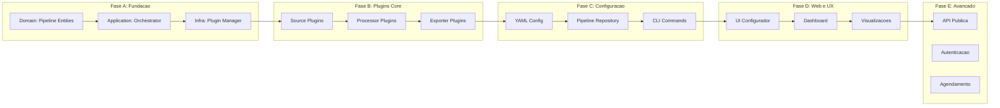

# Roadmap Arquitetural Amplo

## Objetivo

Este documento preserva uma formulacao ampla da evolucao arquitetural desejada para o ShowTrials.

Seu papel atual e:

- registrar um horizonte arquitetural mais ambicioso;
- organizar blocos de evolucao propostos para alem do MVP imediato;
- preservar uma leitura expandida de capacidades futuras;
- evitar que essa visao ampla se confunda com backlog tecnico ja consolidado.

## Contexto Historico

O roadmap foi produzido em um momento em que a evolucao do projeto era descrita em termos amplos de plataforma, com:

- milestones arquiteturais extensos;
- backlog estimado em alto nivel;
- forte orientacao a plugins, configuracao, UX visual e recursos avancados.

Depois disso, a documentacao arquitetural e a frente de modelagem consolidaram uma leitura mais prudente:

- o backlog tecnico ativo da engine esta mais concentrado;
- o MVP da engine possui direcionamento proprio;
- o roadmap amplo funciona melhor como horizonte propositivo do que como plano operacional vigente.

## Visao Geral da Evolucao

```mermaid
graph LR
    subgraph "Fase A: Fundacao"
        A1[Domain: Pipeline Entities]
        A2[Application: Orchestrator]
        A3[Infra: Plugin Manager]
    end

    subgraph "Fase B: Plugins Core"
        B1[Source Plugins]
        B2[Processor Plugins]
        B3[Exporter Plugins]
    end

    subgraph "Fase C: Configuracao"
        C1[YAML Config]
        C2[Pipeline Repository]
        C3[CLI Commands]
    end

    subgraph "Fase D: Web e UX"
        D1[UI Configurador]
        D2[Dashboard]
        D3[Visualizacoes]
    end

    subgraph "Fase E: Avancado"
        E1[API Publica]
        E2[Autenticacao]
        E3[Agendamento]
    end

    A1 --> A2 --> A3 --> B1
    B1 --> B2 --> B3 --> C1
    C1 --> C2 --> C3 --> D1
    D1 --> D2 --> D3 --> E1
```

## Blocos de Evolucao Propostos

### Fundacao da arquitetura de pipeline

Este bloco representa a base conceitual e estrutural da engine:

- entidades e contratos centrais;
- executor minimo;
- mecanismo inicial de extensibilidade;
- testes estruturais basicos.

### Plugins core

Este bloco projeta a migracao de capacidades existentes e novas para estruturas mais reutilizaveis de entrada, processamento e saida.

Ele continua util como visao de modularizacao, ainda que sua terminologia historica precise ser lida com cautela frente ao vocabulário mais recente da modelagem.

### Configuracao e pipelines

Aqui aparece a ideia de:

- pipelines declarativos;
- carregamento por YAML;
- repositorio de pipelines;
- comandos dedicados de execucao.

Este bloco conversa diretamente com a formulacao mais atual do MVP, embora o roadmap o descreva em escopo mais amplo.

### Web, UX e recursos avancados

Os blocos de interface visual, API publica, autenticacao, agendamento e recursos analiticos avancados devem ser lidos como horizonte expandido, nao como prioridade tecnica imediata ja backlogizada.

## Relacao com o MVP da Engine

O direcionamento tecnico imediato da engine nao esta definido por este documento isoladamente.

Hoje, a leitura mais forte do caminho imediato passa por:

- [direcionamento_arquitetural_engine_mvp.md](../projeto/direcionamento_arquitetural_engine_mvp.md)
- backlog ativo da milestone `MVP - Engine de Pipeline`
- [49_conferencia_de_aderencia_ao_projeto_real.md](../modelagem/revisao/49_conferencia_de_aderencia_ao_projeto_real.md)

Assim, este roadmap deve ser lido como camada mais ampla e propositiva, enquanto o direcionamento MVP funciona como camada mais forte da intencao tecnica imediata.

## Limites de Leitura no Estado Atual

Este documento nao deve ser lido como:

- backlog tecnico integralmente ativo;
- plano operacional ratificado de execucao;
- conjunto de milestones ja aprovados para implementacao;
- prova de que todos os blocos aqui descritos estejam sustentados por codigo ou issues proprias.

Ele deve ser lido como:

- horizonte arquitetural amplo;
- fonte historica e propositiva de evolucao;
- apoio para discussao futura de backlog e estrategia.

## Documentos Relacionados

- [direcionamento_arquitetural_engine_mvp.md](../projeto/direcionamento_arquitetural_engine_mvp.md)
- [analise_arquitetural.md](../projeto/analise_arquitetural.md)
- [visao_do_projeto.md](../projeto/visao_do_projeto.md)
- [49_conferencia_de_aderencia_ao_projeto_real.md](../modelagem/revisao/49_conferencia_de_aderencia_ao_projeto_real.md)
- [46_sintese_executiva_da_frente.md](../modelagem/revisao/46_sintese_executiva_da_frente.md)
