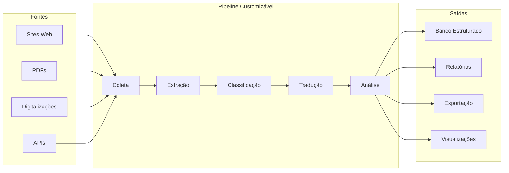
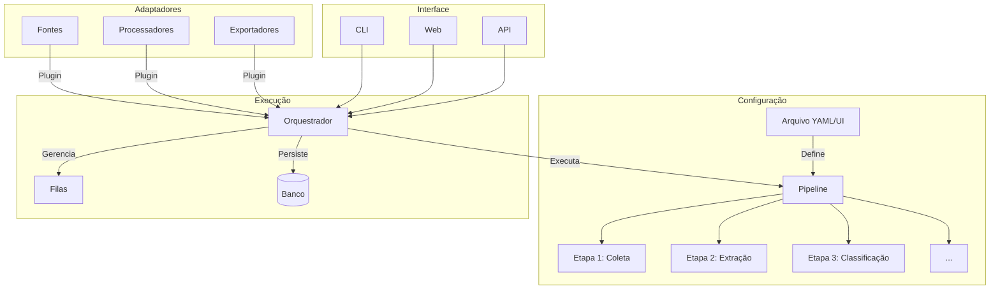
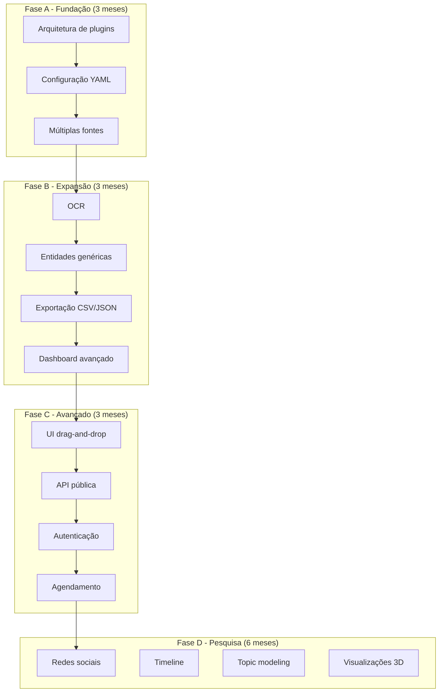

## 📚 **DOCUMENTO 1: VISÃO DO PROJETO - SHOWTRIALS COMO PLATAFORMA**

<div align="center">

**Evoluindo de uma aplicação específica para uma plataforma customizável de pesquisa documental**

</div>

## 📅 **Informações do Documento**

| Item | Descrição |
|------|-----------|
| **Data** | 20 de Fevereiro de 2026 |
| **Autor** | Thiago Ribeiro |
| **Versão** | 0.1 (Rascunho inicial) |
| **Propósito** | Explorar a visão do projeto como plataforma customizável |

---

## 🎯 **VISÃO GERAL**

### **O Problema**

Pesquisadores (historiadores, jornalistas, cientistas sociais) frequentemente precisam:

1. **Coletar** documentos de diversas fontes (sites, PDFs, digitalizações)
2. **Organizar** e estruturar esses documentos
3. **Enriquecer** com metadados (classificação, extração de entidades)
4. **Traduzir** para idiomas de trabalho
5. **Analisar** conteúdo (estatísticas, entidades, sentimentos)
6. **Exportar** resultados para uso em artigos/pesquisas

Atualmente, isso é feito com ferramentas desconexas ou scripts ad-hoc.

### **Nossa Proposta**

Uma **plataforma configurável** onde o pesquisador pode **definir seu próprio pipeline** de ações, e a aplicação executa de forma consistente e reproduzível.



---

## 📊 **ESTADO ATUAL VS VISÃO FUTURA**

### **Hoje (ShowTrials específico)**

| Aspecto | Implementação |
|---------|---------------|
| **Fonte** | Fixa: showtrials.ru |
| **Documentos** | Processos de Moscou/Leningrado |
| **Idiomas** | Russo (original) + 4 traduções |
| **Classificação** | 9 tipos pré-definidos |
| **Entidades** | Pessoas (nomes russos) |
| **Pipeline** | Fixo: coleta → classifica → traduz → analisa |

### **Amanhã (Plataforma genérica)**

| Aspecto | Customizável pelo usuário |
|---------|---------------------------|
| **Fonte** | URLs, PDFs, digitalizações, APIs |
| **Documentos** | Qualquer domínio (histórico, jurídico, jornalístico) |
| **Idiomas** | Configuráveis por fonte |
| **Classificação** | Regras definidas pelo usuário |
| **Entidades** | PESSOA, ORG, LOC, DATA, etc. |
| **Pipeline** | Ordem e etapas configuráveis |

---

## 🏗️ **ARQUITETURA PROPOSTA**



---

## 🔧 **COMPONENTES DA PLATAFORMA**

### **1. Fontes (Sources)**

| Tipo | Descrição | Exemplo de uso |
|------|-----------|----------------|
| **Web Scraper** | Coleta de sites estruturados | showtrials.ru, arquivos públicos |
| **PDF Processor** | Extração de texto de PDFs | Documentos digitalizados |
| **OCR Engine** | Reconhecimento de texto em imagens | Fotos de documentos históricos |
| **API Connector** | Integração com APIs públicas | Arquivos nacionais, bibliotecas |
| **Local Folder** | Leitura de arquivos locais | Backups, coleções pessoais |

### **2. Processadores (Processors)**

| Tipo | Descrição | Configurável |
|------|-----------|--------------|
| **Extrator de metadados** | Título, data, autor, etc. | Regras regex, XPath |
| **Classificador** | Categorização automática | Palavras-chave, modelos ML |
| **Extrator de entidades** | Pessoas, locais, organizações | Modelos spaCy customizados |
| **Tradutor** | Conversão entre idiomas | API keys, modelos locais |
| **Analisador de sentimento** | Polaridade e subjetividade | Modelos pré-treinados |
| **Sumarizador** | Resumo automático | Tamanho configurável |

### **3. Exportadores (Exporters)**

| Tipo | Formato | Uso |
|------|---------|-----|
| **Banco de dados** | SQLite, PostgreSQL | Análise posterior |
| **CSV/Excel** | Planilhas | Importação em outras ferramentas |
| **JSON** | Dados estruturados | APIs, integrações |
| **PDF** | Documentos formatados | Publicação |
| **Gráficos** | PNG, SVG | Visualização |

### **4. Interfaces**

| Interface | Funcionalidades |
|-----------|-----------------|
| **CLI Avançada** | Comandos para pipeline completo, debugging |
| **Web App** | Configuração visual, execução, resultados |
| **API REST** | Integração com outras ferramentas |
| **Notebooks Jupyter** | Análise exploratória dos dados coletados |

---

## 📋 **EXEMPLO DE PIPELINE CONFIGURÁVEL**

### **Configuração em YAML**

```yaml
# pipeline_config.yaml
nome: "Processo ShowTrials"
descricao: "Pipeline para análise dos processos de Moscou"

fontes:
  - tipo: web_scraper
    url: "http://showtrials.ru"
    paginacao:
      tipo: "sequencial"
      start: 1
      end: 500
    extracao:
      titulo: "h1.document-title"
      texto: ".document-content"
      data: ".document-date"

processadores:
  - etapa: 1
    tipo: classificador
    regras:
      - "Протокол допроса" -> "interrogatorio"
      - "Письмо" -> "carta"
      - "Спецсообщение" -> "relatorio"

  - etapa: 2
    tipo: extrator_entidades
    modelo: "ru_core_news_sm"
    tipos: ["PERSON", "ORG", "DATE"]

  - etapa: 3
    tipo: tradutor
    idioma_destino: "pt"
    api: "google"

  - etapa: 4
    tipo: analise_sentimento
    idioma: "pt"

exportacao:
  - tipo: banco
    formato: "sqlite"
    destino: "resultados.db"

  - tipo: relatorio
    formato: "csv"
    destino: "analises/"
    agregacoes:
      - "contagem_por_tipo"
      - "pessoas_mais_frequentes"
```

### **Uso na CLI**

```bash
# Executar pipeline configurado
python run.py pipeline --config pipeline_config.yaml

# Listar pipelines disponíveis
python run.py pipeline list

# Criar novo pipeline interativamente
python run.py pipeline create --interactive
```

---

## 🎯 **CASOS DE USO EXPANDIDOS**

### **Pesquisador A: História Contemporânea**

```yaml
nome: "Análise de Discursos Políticos"
fontes:
  - tipo: web_scraper
    url: "http://arquivo.gov.br/discursos"

processadores:
  - classificador: ["discurso", "entrevista", "nota"]
  - extrator: ["PERSON", "ORG", "GPE"]
  - sentimento
  - sumarizador (5 frases)
```

### **Pesquisador B: Jornalismo Investigativo**

```yaml
nome: "Investigação de Documentos Vazados"
fontes:
  - tipo: pasta_local
    caminho: "./documentos/"
    formato: ["pdf", "jpg"]

processadores:
  - ocr (para imagens)
  - extrator_entidades
  - tradutor (en → pt)
  - analise_sentimento
  - rede_relacoes (quem cita quem)
```

### **Pesquisador C: Linguística**

```yaml
nome: "Análise de Corpus Textual"
fontes:
  - tipo: api
    endpoint: "https://api.corpus.ufsc.br"

processadores:
  - tokenizador
  - pos_tagger
  - ner
  - analise_frequencia
```

---

## 📊 **FUNCIONALIDADES PROPOSTAS POR PRIORIDADE**

### **Prioridade 1 (Core - já temos)**

- [x] Coleta de páginas web
- [x] Armazenamento estruturado
- [x] Classificação por regras
- [x] Extração de entidades (nomes)
- [x] Tradução automática
- [x] Interface CLI
- [x] Interface Web básica
- [x] Exportação TXT

### **Prioridade 2 (Expansão da plataforma)**

- [ ] **Configuração via YAML** de pipelines
- [ ] **Múltiplas fontes** (PDF, pasta local)
- [ ] **OCR** para imagens (Tesseract)
- [ ] **Extração de entidades genérica** (LOC, ORG, DATE)
- [ ] **Classificação customizável** (regras do usuário)
- [ ] **Exportação CSV/JSON**
- [ ] **Dashboard web interativo**

### **Prioridade 3 (Recursos avançados)**

- [ ] **Interface gráfica para configurar pipeline** (drag-and-drop)
- [ ] **Modelos de ML customizados** (treinar com dados do usuário)
- [ ] **API pública** para integrações
- [ ] **Autenticação e múltiplos usuários**
- [ ] **Versionamento de pipelines** (git-like)
- [ ] **Agendamento de execuções** (cron)
- [ ] **Notificações** (email, webhook)

### **Prioridade 4 (Pesquisa e experimentação)**

- [ ] **Análise de redes sociais** (grafos de relacionamentos)
- [ ] **Linha do tempo interativa**
- [ ] **Detecção de emoções** (além de sentimento)
- [ ] **Similaridade entre documentos**
- [ ] **Topic modeling** (LDA)
- [ ] **Visualizações 3D** de dados

---

## 🏗️ **ARQUITETURA DE PLUGINS**

```python
# plugin_interface.py
from abc import ABC, abstractmethod

class FontePlugin(ABC):
    """Interface para fontes de dados."""

    @abstractmethod
    def coletar(self, config: dict) -> list[Documento]:
        pass

    @abstractmethod
    def nome(self) -> str:
        pass

class ProcessadorPlugin(ABC):
    """Interface para processadores."""

    @abstractmethod
    def processar(self, documento: Documento, config: dict) -> Documento:
        pass

    @abstractmethod
    def nome(self) -> str:
        pass

class ExportadorPlugin(ABC):
    """Interface para exportadores."""

    @abstractmethod
    def exportar(self, documentos: list[Documento], config: dict) -> str:
        pass
```

```python
# exemplo_plugin.py
class MeuProcessadorCustomizado(ProcessadorPlugin):
    def nome(self):
        return "meu_processador"

    def processar(self, documento, config):
        # lógica customizada
        documento.metadados["custom"] = "valor"
        return documento
```

---

## 📈 **ROADMAP SUGERIDO**



---

## 🤔 **QUESTÕES EM ABERTO**

1. **Quão genérico deve ser?** (trade-off flexibilidade vs complexidade)
2. **Quem é o usuário-alvo?** (pesquisador técnico ou usuário final?)
3. **Modelo de negócio?** (acadêmico, open source, comercial?)
4. **Escalabilidade?** (milhares de documentos, múltiplos usuários)
5. **Integração com outras ferramentas?** (Zotero, Mendeley, NVivo)

---

## 📝 **PRÓXIMOS PASSOS**

1. ✅ Entender melhor suas ideias (questionário)
2. ⬜ Documento de requisitos detalhado
3. ⬜ Protótipo de arquitetura de plugins
4. ⬜ MVP da plataforma (uma fonte configurável)
5. ⬜ Teste com pesquisadores reais

---

## 👤 **AUTOR**

**Thiago Ribeiro** - Projeto de TCC

---

<div align="center">
  <sub>Documento de Visão - ShowTrials como Plataforma</sub>
  <br>
  <sub>Versão 0.1 - 20 de Fevereiro de 2026</sub>
  <br>
  <sub>✅ Aguardando seus inputs para refinar</sub>
</div>

---
