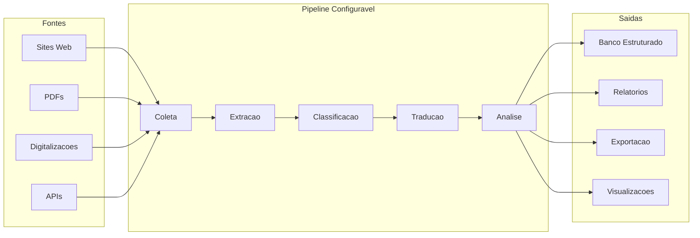

# Visao Ampla do Projeto

## Objetivo

Este documento preserva a formulacao ampla do ShowTrials como projeto com potencial de evolucao de aplicacao especializada para plataforma configuravel de pesquisa documental.

Seu papel atual e:

- registrar a ambicao mais ampla do projeto;
- explicitar o problema que essa visao procura resolver;
- distinguir sistema atual e horizonte de evolucao;
- preservar uma formulacao estrategica que nao deve ser confundida com estado implementado.

## Contexto Historico

Esta visao foi formulada em um momento inicial de ampliacao conceitual do projeto, quando ainda se buscava descrever ShowTrials como plataforma potencialmente configuravel para pipelines documentais.

Desde entao, a frente de modelagem e a documentacao arquitetural posterior trouxeram uma leitura mais precisa do que:

- ja existe no sistema atual;
- esta sustentado por backlog tecnico ativo;
- permanece como visao ampla ou hipotese arquitetural.

Por isso, este documento deve ser lido hoje como visao historico-prospectiva ampla, e nao como retrato fiel da implementacao atual.

## Problema que o Projeto Procura Resolver

Pesquisadores e analistas frequentemente precisam:

1. coletar documentos de fontes diversas;
2. organizar e estruturar esse material;
3. enriquecer os dados com metadados e classificacoes;
4. traduzir para idiomas de trabalho;
5. analisar o conteudo;
6. exportar resultados para pesquisa, memoria ou publicacao.

A visao ampla do projeto parte da ideia de que esse fluxo nao deveria depender apenas de scripts ad hoc e ferramentas desconexas.

## Visao Ampla de Evolucao

A formulacao central preservada neste documento e a seguinte:

- ShowTrials pode ser lido, em sua visao mais ampla, como base para uma plataforma configuravel;
- essa plataforma permitiria definir pipelines de coleta, transformacao, enriquecimento, traducao, analise e exportacao;
- o foco deixaria de ser apenas um recorte documental especifico e passaria a incluir estruturas mais gerais de processamento documental.

```mermaid
graph LR
    subgraph "Fontes"
        A[Sites Web]
        B[PDFs]
        C[Digitalizacoes]
        D[APIs]
    end

    subgraph "Pipeline Configuravel"
        E[Coleta]
        F[Extracao]
        G[Classificacao]
        H[Traducao]
        I[Analise]
    end

    subgraph "Saidas"
        J[Banco Estruturado]
        K[Relatorios]
        L[Exportacao]
        M[Visualizacoes]
    end

    A --> E
    B --> E
    C --> E
    D --> E

    E --> F --> G --> H --> I

    I --> J
    I --> K
    I --> L
    I --> M
```

## Relacao entre Sistema Atual e Plataforma Futura

### Sistema atual

O sistema atual permanece fortemente ligado a:

- fonte documental especifica;
- processamento documental orientado ao dominio atual;
- casos de uso concretos ja implementados;
- interfaces e fluxos efetivamente existentes no codigo.

### Plataforma futura

A plataforma futura, por sua vez, aparece aqui como formulacao mais ampla, envolvendo:

- multiplas fontes;
- pipeline configuravel;
- processadores reutilizaveis;
- exportadores variados;
- interfaces mais gerais de operacao.

Essa formulacao continua util como visao de horizonte, mas nao deve ser lida como implementacao consolidada nem como backlog tecnico integralmente ativo.

## Componentes Conceituais da Visao

Os blocos conceituais principais preservados desta visao sao:

- fontes de entrada;
- processadores de transformacao e enriquecimento;
- exportadores e persistencia de resultados;
- interfaces de operacao e consulta.

Esses blocos continuam uteis para leitura estrategica do projeto, mesmo quando a forma exata de materializa-los ainda depende de backlog, modelagem e implementacao posterior.

## Limites de Leitura no Estado Atual

Este documento nao deve ser lido como:

- descricao do estado implementado atual;
- direcionamento tecnico imediato do MVP da engine;
- prova de que todos os componentes aqui citados ja existem no codigo;
- backlog tecnico ja consolidado.

A leitura mais forte do estado atual e da intencao tecnica imediata deve ser feita em conjunto com:

- [direcionamento_arquitetural_engine_mvp.md](/home/thiago/coleta_showtrials/docs/projeto/direcionamento_arquitetural_engine_mvp.md)
- [roadmap_arquitetural.md](/home/thiago/coleta_showtrials/docs/projeto/roadmap_arquitetural.md), com leitura cautelosa
- [49_conferencia_de_aderencia_ao_projeto_real.md](/home/thiago/coleta_showtrials/docs/modelagem/revisao/49_conferencia_de_aderencia_ao_projeto_real.md)
- [46_sintese_executiva_da_frente.md](/home/thiago/coleta_showtrials/docs/modelagem/revisao/46_sintese_executiva_da_frente.md)

## Documentos Relacionados

- [direcionamento_arquitetural_engine_mvp.md](/home/thiago/coleta_showtrials/docs/projeto/direcionamento_arquitetural_engine_mvp.md)
- [roadmap_arquitetural.md](/home/thiago/coleta_showtrials/docs/projeto/roadmap_arquitetural.md)
- [49_conferencia_de_aderencia_ao_projeto_real.md](/home/thiago/coleta_showtrials/docs/modelagem/revisao/49_conferencia_de_aderencia_ao_projeto_real.md)
- [46_sintese_executiva_da_frente.md](/home/thiago/coleta_showtrials/docs/modelagem/revisao/46_sintese_executiva_da_frente.md)
